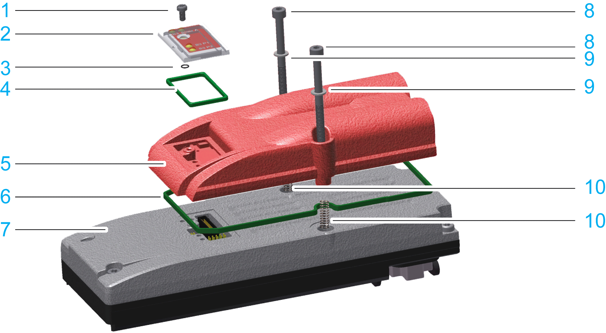
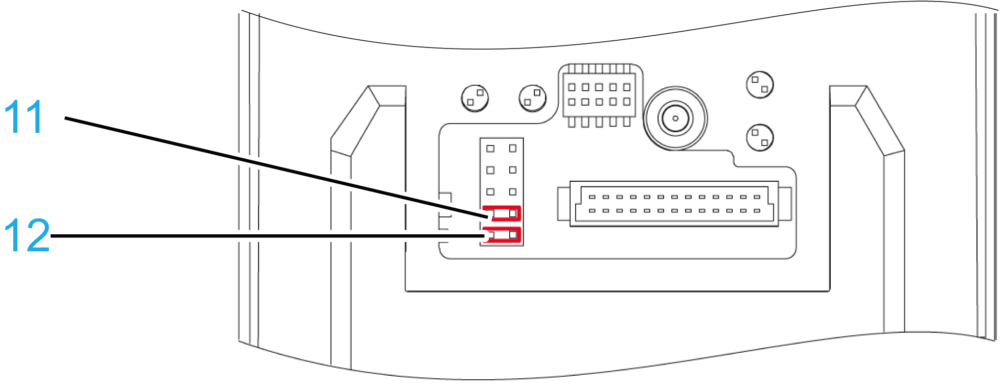

# Lexium 62 ILM Safety Module - Installation

## Overview

Mounting of the Lexium 62 ILM Safety Module on the Lexium 62 ILM:

**1** Torx M3x6 screw

**2** Protective cover

**3** Insulating washer, 2.5 x 0.6 mm (0.1 x 0.02 in)

**4** Protective cover gasket

**5** Lexium 62 ILM Safety Module

**6** Sealing ring for the Lexium 62 ILM Safety Module

**7** Lexium 62 ILM Integrated Servo Drive

**8** Hexagon socket screw M4x50

**9** Serrated lock washers M4

**10** Mounting holes of the Lexium 62 ILM; pressure springs with inner diameter 5 mm (0.20 in) / outer diameter 8 mm (0.31 in) / height 8 mm (0.31 in)

**11** Jumper J2

**12** Jumper J1

Before beginning the replacement of specific components, read thoroughly the section [*Replacing Components and Cables*](D-SE-0049351.html#D-SE-0049351) for important safety information and general instructions.

## How to Mount the Lexium 62 ILM Safety Module

Required tool:

* Hexagon socket screwdriver 3.0 with adjustable tightening torque
* Torx TX10 screwdriver with adjustable tightening torque

Check delivery for completeness:

* Lexium 62 ILM Safety Module
* 1 x sealing ring
* 2 x hexagon socket screw M4x50
* 2 x serrated lock washers M4
* 2 x pressure spring

NOTE: **Hardware Compatibility**

Only use the Lexium 62 ILM Safety Module when the Lexium 62 ILM has the hardware code x2x5xxxxxxxx or a later hardware code.

The dates of manufacturing must be:

* ILM070xxxxxxxxx: as of 14/09/2015
* ILM100xxxxxxxxx: as of 19/08/2015
* ILM140xxxxxxxxx: as of 24/08/2015

## ESD Protection

Observe the following instructions to help prevent damages due to electrostatic discharge.

| NOTICE | |
| --- | --- |
|  | ELECTROSTATIC DISCHARGE  * Do not touch any of the electrical connections or components. * Touch circuit boards only on the edges. * Take the necessary protective measures against electrostatic discharges.  Failure to follow these instructions can result in equipment damage. |

## Prepare Installation

| DANGER | |
| --- | --- |
|  | DEACTIVATED SAFETY FUNCTION  Remove the jumpers J1 and J2 before mounting the Lexium 62 ILM Safety Module, so that the Safety Module for Lexium 62 ILM is active.  Failure to follow these instructions will result in death or serious injury. |

| NOTICE | |
| --- | --- |
|  | INSUFFICIENT SHIELDING/GROUNDING/Tightness  The serrated lock washers must be removed from their original position (10) when removing screws.  Failure to follow these instructions can result in equipment damage. |

| Step | Action |
| --- | --- |
| 1 | Loosen the screw (1) with the screwdriver (Torx). |
| 2 | Remove screw (1) with insulating washer (3) and protective cover (2) and protective cover gasket (4) from Lexium 62 ILM. |
| 3 | Loosen the screws in the mounting holes (10) (M4x28) with the screwdriver (hexagon socket). |
| 4 | Remove the screws and serrated lock washers. |
| 5 | Remove the jumpers J1 (12) and J2 (11) from the Lexium 62 ILM (see previous figure). |

## Execute Installation

| Step | Action |
| --- | --- |
| 1 | Insert the sealing ring (6) into the groove of the Lexium 62 ILM Safety Module. |
| 2 | Insert each pressure spring (10) in vertical position into the respective mounting hole (10) of the Lexium 62 ILM. |
| 3 | Place the Lexium 62 ILM Safety Module on the Lexium 62 ILM. |
| 4 | Insert screws (8) (M4x50) with serrated lock washers (9) through the mounting holes of the Lexium 62 ILM Safety Module and through the aperture of the pressure springs (10) into the mounting holes (10) of the Lexium 62 ILM. |
| 5 | First turn the screw (8) clockwise with a screwdriver (hexagon socket) until screw is snug but not tightened. |
| 6 | Then tighten incrementally the screws (8) with 2 Nm (17.70 lbf in) torque. |
| 7 | Finally tighten the screws (8) to the target torque value of 3 Nm (26.55 lbf in). |
| 8 | Fit protective cover (2) together with protective cover gasket (4) onto Lexium 62 ILM Safety Module. |
| 9 | Screw the protective cover on (to 1 Nm/ 0.74 lbf) with the screw (1) and the insulating washer (3) by using a Torx screwdriver. |

| NOTICE | |
| --- | --- |
|  | LOSS OF IP67 RATING  * Align the Lexium 62 ILM Safety Module with the three fixing pins. * Be sure that the sealing ring of the Lexium 62 ILM Safety Module is completely inserted into the groove of the Lexium 62 ILM.  Failure to follow these instructions can result in equipment damage. |

EIO0000001351.08

© 2022

Schneider Electric.

All rights reserved.