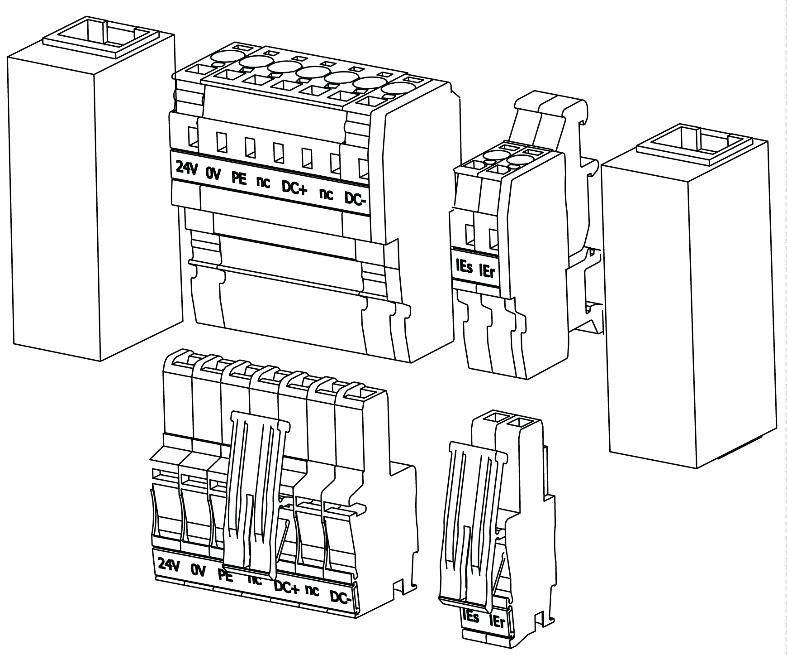

# Hybrid Connector HCN-2 Adapter - Description

## Overview

The HCN-2 can be used to connect hybrid cables from the Lexium 62 Connection Module to the Lexium 62 Distribution Box or between two Lexium 62 Distribution Box.

## Reference

| Product | Reference |
| --- | --- |
| Hybrid Connector HCN-2 Adapter | VW3E6026 |

EIO0000001351.08

© 2022

Schneider Electric.

All rights reserved.