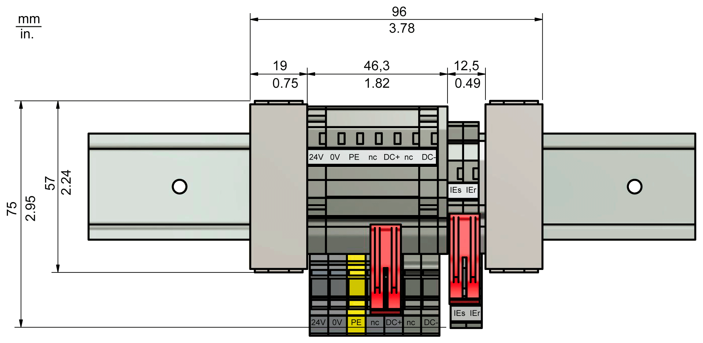

# Hybrid Connector HCN-2 Adapter - Technical Data

## Ambient Conditions

Ambient conditions for HCN-2:

| Procedure | Parameter | Value | Basis |
| --- | --- | --- | --- |
| **Operation** | **Class 3K3** | | IEC/EN 60721-3-3 |
| Degree of protection | IP20 |
| Pollution degree | 2 |
| Ambient temperature | +5 °C...+ 55 °C / +41...131 °F |
| **Relative humidity** | 5 %...85 % |
| Condensation | No |
| Formation of ice | No |
| **Class 3M3** | |
| Vibration | 10 m/s2 |
| Shock | 100 m/s2 |
| **Transport** | **Class 2K3** | | IEC/EN 60721-3-2 |
| Ambient temperature | -25...+70 °C/ -13... +158 °F |
| **Relative humidity** | 5 %...95 % |
| Condensation | No |
| Formation of ice | No |
| **Class 2M2** | |
| Vibration | 10 m/s2 |
| Shock | 100 m/s2 |
| **Long-term storage in transport packaging** | **Class 1K4** | | IEC/EN 60721-3-1 |
| Ambient temperature | -25...+55 °C/ -13...+131 °F |
| Ambient temperature variations | 0.5 °C/min |
| **Relative humidity** | 10 %...100 % |
| Condensation | No |
| Formation of ice | No |

## Mechanical and Electrical Data

Technical data for HCN-2

| Parameters | Value |
| --- | --- |
| **Control voltage (24 V / 0 V)** | |
| Control voltage | 24 Vdc |
| Permanent current | 12 A |
| **DC bus (DC+ / DC-)** | |
| DC bus voltage | 250...700 Vdc |
| DC bus permanent current | 20 A |
| DC bus peak current (1s) | 40 A |
| **Inverter Enable (IEs / IEr)** | |
| Voltage | AC 40 V rms |
| Current | AC 2 A rms |
| Signal frequency | 100 kHz |
| **Sercos** | |
| Data rate | 100 Mbit/s |
| **Overvoltage category** | III |
| Weight | 0.125 kg (4.4 oz) |
| Pollution degree | 2 (IEC/EN 61800-5-1) |

## HCN-2 - Dimensions

EIO0000001351.08

© 2022

Schneider Electric.

All rights reserved.