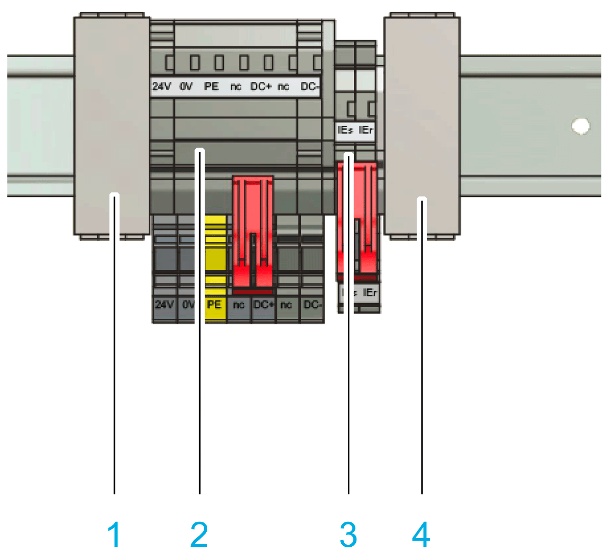

# Hybrid Connector HCN-2 Adapter- Installation

## Overview

HCN-2 - Components

**1** Sercos-continuity binder, left side

**2** Power connector

**3** Inverter Enable connector

**4** Sercos-continuity binder, right side

## How to Mount the HCN-2:

Given the length of the individual Sercos lines, place the continuity binders with the Sercos connection lines at the outside. In this way, the Sercos connection lines are subject to even pull tension when the hybrid cables need to be bent.

| WARNING | |
| --- | --- |
|  | INOPERABLE INVERTER ENABLE SAFETY FUNCTION  Install the Hybrid Connector HCN-2 Adapter in a control cabinet with a degree of protection IP54 minimum.  Failure to follow these instructions can result in death, serious injury, or equipment damage. |

| Step | Action |
| --- | --- |
| 1 | Place the respective components (1) - (4) at an angle on the upper top-hat rail guide. |
| 2 | Pivot the respective components (1) - (4) completely onto the top-hat rail until the latch snaps completely into place. |

| NOTICE | |
| --- | --- |
|  | SHEARING FORCE AT THE SERCOS CONTINUITY BINDERS  * Assemble a Sercos-continuity binder (1), (4) on the right and on the left side of the Hybrid Connector HCN-2 Adapter. * Only use cables and accessories of Schneider Electric.  Failure to follow these instructions can result in equipment damage. |

EIO0000001351.08

© 2022

Schneider Electric.

All rights reserved.