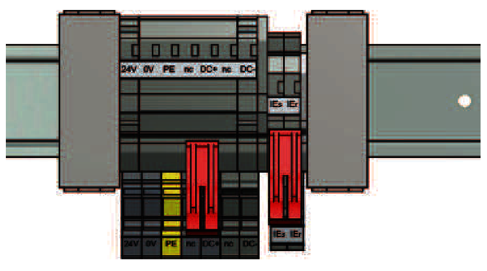
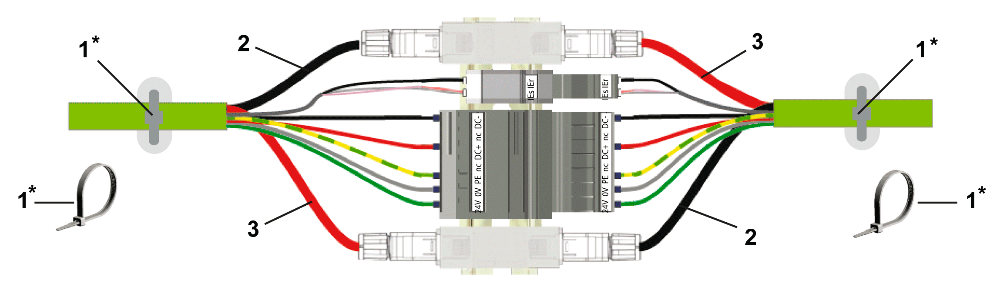

# Hybrid Connector HCN-2 Adapter - Electrical Connections

## Overview

| Designation | Meaning | Color | Cross-section (mm² / AWG) |
| --- | --- | --- | --- |
| 24 V | Control voltage | green | 2.5 / 13 |
| 0 V | Control voltage | grey | 2.5 / 13 |
| PE | Protective Earth | green/yellow | 2.5 / 13 |
| nc | Not connected | - | - |
| DC + | DC bus + | red | 2.5 / 13 |
| nc | Not connected | - | - |
| DC- | DC bus - | black | 2.5 / 13 |
| IEs | Inverter Enable signal 1 | white | 0.34 / 22 |
| IEr | Inverter Enable signal 2 | black | 0.34 / 22 |
| Sercos P1 | Sercos port 1 | - | - |
| Sercos P2 | Sercos port 2 | - | - |

NOTE: The DIN rail is not part of the HCN-2.

| NOTICE | |
| --- | --- |
|  | CONNECTOR WEAR  Do not connect / disconnect the hybrid cables more than 20 times.  Failure to follow these instructions can result in equipment damage. |

## How to Connect the HCN-2

Depending on the identification mode selected in the EcoStruxure Machine Expert Logic Builder, a reversed connection of Sercos-connecting lines can lead to unintended operation of the machine.

| WARNING | |
| --- | --- |
|  | UNINTENDED MACHINE OPERATION  Be sure the Sercos-connecting lines have a cross-over connection that is black (2) to red (3) and red (3) to black (2).  Failure to follow these instructions can result in death, serious injury, or equipment damage. |

**1** Strain relief (not part of the delivery)

**2** Sercos connection line (black)

**3** Sercos connection line (red)

| DANGER | |
| --- | --- |
|  | HAZARD OF ELECTRIC SHOCK DUE TO BROKEN, LOOSE WIRES  Use a strain relief for every hybrid cable.  Failure to follow these instructions will result in death or serious injury. |

| Step | Action |
| --- | --- |
| 1 | Connect the hybrid cables of the conductors. |
| 2 | Ensure that the hybrid cables of the conductors are not subject to pull tension. This applies particularly to the IEs/IEr-conductors (Inverter Enable). |
| 3 | Connect the Sercos-connecting lines cross-over (black (2) to red (3) and red (3) to black (2)). |
| 4 | Secure the strain relief (1) for each hybrid cable in place. |

EIO0000001351.08

© 2022

Schneider Electric.

All rights reserved.