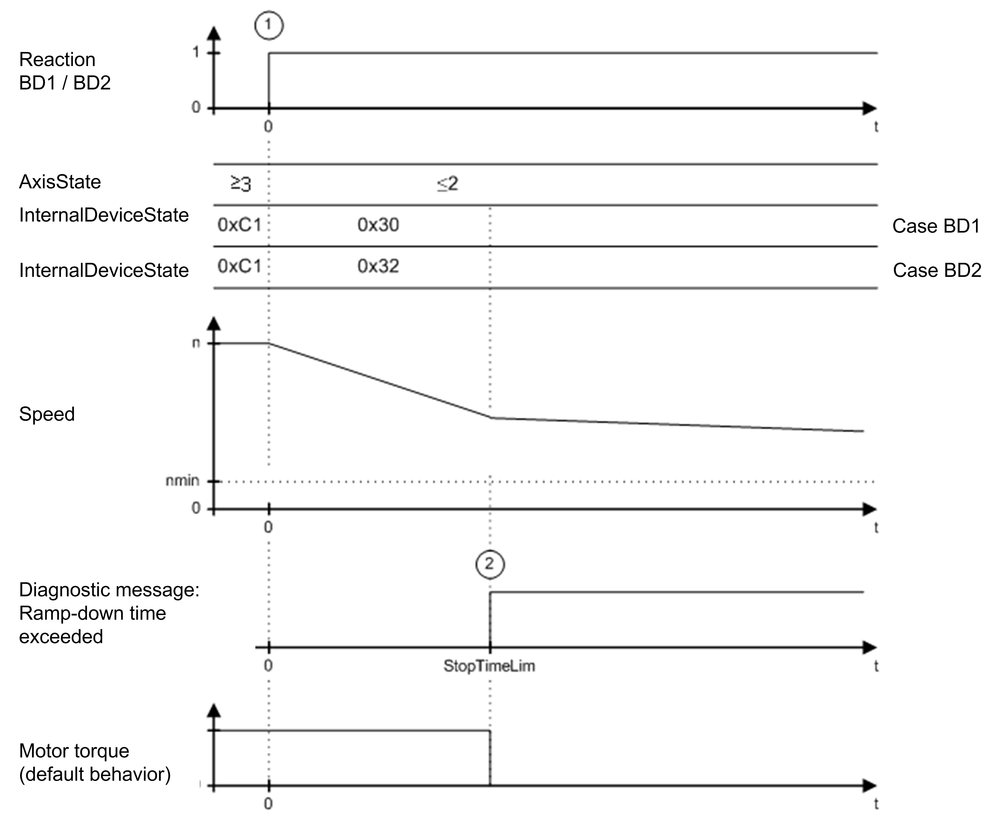

# Maximum Ramp-Down Time Exceeded

Maximum Ramp-Down Time Exceeded

General

In the case of an error with reaction BD1 (1), the axis ramps down at maximum current ([MaxDrive­PeakCurrent](../../../../../../api/crossBook?lang=en-US&virtualBookName=General_2/General_2-6.htm#XREF_D_SE_0071528_1)). In the case of an error with reaction BD2 (1), the axis ramps down according to the parameters [ControllerStopDec](../General_2/General_2-10.htm#XREF_D_SE_0071532_1) and [ControllerStopJerk](../General_2/General_2-11.htm#XREF_D_SE_0071533_1). The axis does not come to a standstill before expiration of the maximum ramp-down time (parameter StopTimeLim) (2) ( speed < nmin). Therefore, error message [8140 Motor ramp-down time exceeded](../../../PD.Diagnostic&topicID=D_SE_0063876_3) is triggered.

Time diagram for reaction BD1 / BD2 (maximum ramp down time exceeded)

EIO0000003551.01

© 2019 Schneider Electric. All rights reserved.