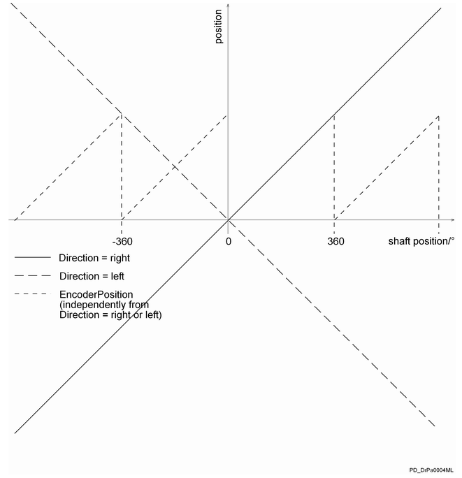

# Position

Position

General

|  |  |
| --- | --- |
| Type | AD |
| Devices supporting the parameter | Lexium LXM52 Drive, Lexium LXM52 Linear Drive,  Lexium LXM62 Drive, Lexium LXM62 Linear Drive,  Lexium ILM62 Drive Module,  Sercos Drive |
| Traceable | Yes |

Functional Description

Position represents the actual position in units, based on the coordinate system that was selected. It is indicated on the drive shaft (gear box output side). The [YOffsetPosition](../YOffsetGenerator_2/YOffsetGenerator_2-4.htm#XREF_D_SE_0071850_1) from the Y offset generator has been removed. Thus, it is not the actual position that is transferred from the drive via the Sercos bus (see [Ref-Actual Values)](RefActualValues-1.htm#XREF_D_SE_0071489_1).

After a Sercos phase up, the Position is adjusted to the EncoderPosition by taking into account the YOffsetPosition. Therefore, if the absolute value range indicated by the encoder was exceeded before the Sercos was shut down, then Position will have another value by the next phase up than before the shutdown.

The object parameter Direction and coordinate displacements with SetPos ([FC\_SetposDual()](../../../../../../api/crossBook?lang=en-US&virtualBookName=PD.Lib.SystemInterface&topicID=D_SE_0085315_1), [FC\_SetposGroup()](../../../../../../api/crossBook?lang=en-US&virtualBookName=PD.Lib.SystemInterface&topicID=D_SE_0085317_1), [FC\_SetposSingle()](../../../../../../api/crossBook?lang=en-US&virtualBookName=PD.Lib.SystemInterface&topicID=D_SE_0085319_1)) affect the Position.

Position diagram to position a drive

The value of Position is calculated once every Sercos cycle ([CycleTime](../../../../../../api/crossBook?lang=en-US&virtualBookName=PD.Parameter.LMCEco&topicID=D_SE_0073362_1)).

Relative to the position at the drive shaft, the position is delayed by the time [ShaftDelay](RefActualValues-9.htm#XREF_D_SE_0071500_1). Therefore, a position without [YOffsetPosition](../YOffsetGenerator_2/YOffsetGenerator_2-4.htm#XREF_D_SE_0071850_1) is indicated which is delayed to the drive shaft by the time ShaftDelay.

NOTE: The parameter value is calculated using the parameters that are transferred from the slave to the master via the real-time channel of the Sercos. If the Sercos bus is not in phase 4, then a default value is indicated here. If the Sercos bus is in phase 4 (operating phase), then the parameter value is calculated and indicated. This parameter has no meaning for asynchronous motors without encoder (in open-loop V / f control mode, [ControlMode](../../../../../../api/crossBook?lang=en-US&virtualBookName=PD.Parameter.LXM52Drive&topicID=D_SE_0071561_1) = open-loop control / 1).

Usage with machine encoder: When a machine encoder is used, this parameter can provide either the position of the motor encoder or the position of the machine encoder. This depends on the object parameter EncoderMode. If the machine encoder is used for position control, the position of the machine encoder is provided; otherwise, the position of the motor encoder is provided.

EIO0000003551.01

© 2019 Schneider Electric. All rights reserved.