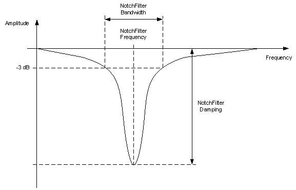

# NotchFilterBandwidth

NotchFilterBandwidth

General

|  |  |
| --- | --- |
| Type | ES |
| Offline editable | Yes |
| Available as of | V1.50.1.x |
| Devices supporting the parameter | Lexium LXM52 Drive, Lexium LXM52 Linear Drive,  Lexium LXM62 Drive, Lexium LXM62 Linear Drive,  Lexium ILM62 Drive Module |
| Traceable | Yes |

Functional Description

The parameter is used to enter the bandwidth of the NotchFilter in the velocity control loop for -3 dB in Hz (hertz).

There is a damping of at least 3 dB within the bandwidth. The [NotchFilterFrequency](ControlLoop_2-9.htm#XREF_D_SE_0071572_1), at which the maximum damping [NotchFilterDamping](ControlLoop_2-8.htm#XREF_D_SE_0071571_1) is reached, lies in the center of this spectrum.

The bandwidth can be set to values between 10...4000 Hz. The bandwidth ranges from the lowest to the highest cut-off frequency of the filter. The lowest cut-off frequency is lower than the filter frequency and indicates the frequency at which a damping of 3 dB occurs. The highest cut-off frequency is higher than the filter frequency and indicates the frequency at which a damping of 3 dB occurs also.

The notch filter is used to specifically filter a mechanical resonance frequency in order to achieve higher amplifications especially in the velocity controller but also in the position controller. In doing so, detected deviations can be corrected in a better way and tracking deviation can be reduced.

The bandwidth must be adapted to the bandwidth of the resonance. In the event of an increasing bandwidth, the phase offset also changes to a higher frequency range and increases the possibility of instabilities. Therefore, the selected bandwidth level should not be higher than necessary. In addition, the NotchFilterDamping and NotchFilterFrequency parameters must be adjusted. The optimal conditions must be determined.

NOTE: This parameter can be determined as of firmware version V01.50.x.0 by using the AutoTune automatic controller optimization.

This parameter has no effect for asynchronous motors in open-loop V / f mode ([ControlMode](../../../../../../api/crossBook?lang=en-US&virtualBookName=PD.Parameter.LXM52Drive&topicID=D_SE_0071561_1) = open-loop control / 1).

EIO0000003551.01

© 2019 Schneider Electric. All rights reserved.