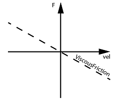

# ViscousFrictionLinear

ViscousFrictionLinear

General

|  |  |
| --- | --- |
| Type | ES |
| Offline editable | Yes |
| Devices supporting the parameter | Lexium LXM52 Linear Drive,  Lexium LXM62 Linear Drive |
| Traceable | Yes |

Functional Description

The parameter is used to enter the viscous direction-dependent friction from the motor and load Newton per 1000 units per second [N / (1000 units/s)]. The viscose friction is a force that changes proportionally to the reference velocity of the motor and works in the opposite direction of the motor movement.

NOTE: The parameter value is transferred from the master to the slave via the parameter channel of the Sercos at every access. Typically, this takes about 10 ms. However, times up to 1 s may be realized if large amounts of data are transferred on the parameter channel.

NOTE: This parameter can be determined as of firmware version V01.35.x.0 by using the AutoTune automatic controller optimization.

EIO0000003551.01

© 2019 Schneider Electric. All rights reserved.