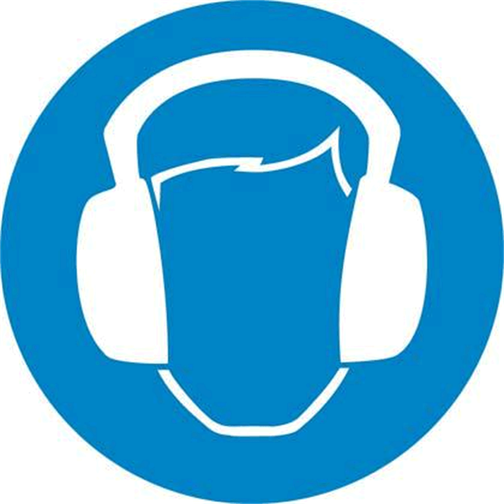

# Residual Risks

## Overview

Risks arising from the Lexium™ MC12 multi carrier have been reduced. However a residual risk remains since the equipment is moved and operated with electrical voltage and electrical currents.

If activities involve residual risks, a safety message is made at the appropriate points. This includes potential hazards that may arise, their possible consequences, and describes preventive measures to avoid the hazards.

## Electrical Parts

To operate the Lexium™ MC12 multi carrier described herein, you must connect the system to the control cabinet and the controller. As a system, there are residual risks that you must consider in your risk analysis of your application.

| DANGER | |
| --- | --- |
|  | ELECTRIC SHOCK, EXPLOSION, OR ARC FLASH  * Disconnect all power from all equipment including connected devices prior to removing any covers or doors, or installing or removing any accessories, hardware, cables, or wires except under the specific conditions specified in the appropriate hardware guide for this equipment. * Always use a properly rated voltage sensing device to confirm the power is off where and when indicated. * Operate electrical components only with a connected protective ground (earth) cable. * Verify the secure connection of the protective ground (earth) cable to all electrical devices to ensure that connection complies with the connection diagram. * Do not touch the electrical connection points of the components when the module is energized. * Provide protection against indirect contact (EN 50178). * Insulate any unused conductors on both ends of the power cable.  Failure to follow these instructions will result in death or serious injury. |

## Emergency Stop

The carriers are not equipped with a holding brake. In a de-energized state, carriers can move unintendedly when forces are applied to them (for example, gravity).

| WARNING | |
| --- | --- |
|  | ENTRAPMENT BY CARRIERS  * Provide means for ensuring that the segments can be put into a de-energized state within reach of the zone of operation. * Make available those means to allow one person to manually move the carriers.  Failure to follow these instructions can result in death, serious injury, or equipment damage. |

After the segments have been put into a de-energized state, it may take a moment for the carriers to come to a standstill. Carriers that are in a vertical movement can run downward according to the force of gravity.

| WARNING | |
| --- | --- |
|  | MOVING PARTS OF THE EQUIPMENT  Ensure that putting the segments into a de-energized state poses no subsequent risks in the zone of operation.  Failure to follow these instructions can result in death, serious injury, or equipment damage. |

NOTE: Provide separation devices for all infeed energies. It must be possible to secure the separation devices in de-energized position, for example, by locking.

## Electromagnetic Fields

* Lexium™ MC12 carriers and Lexium™ MC12 long stator motor segments generate strong local electro-magnetic fields.
* The carriers have strong drive magnets and can attract metal objects that are in their proximity.
* A carrier can move suddenly and fast due to magnetic attraction.

| WARNING | |
| --- | --- |
|  | Strong MAGNETIC FIELDS  * Keep persons with medical implants (for example, pacemakers or metal implants) or metallic body jewelry away from the carriers and segments with a minimum distance of 30 cm (11.9 in). * Always leave the protective cover of the drive magnets in place for all exposed or uninstalled carriers. * Do not put your hands or fingers between the carriers and segments. * Do not place metallic tools in the vicinity of the carriers and segments. * Do not place electromagnetically sensitive devices near the carriers and segments. * Do not place credit cards or electronic/magnetic media in the vicinity of the carriers and segments.  Failure to follow these instructions can result in death, serious injury, or equipment damage. |

**Protective cover of the drive magnets of carriers:**

NOTE: Exposed or uninstalled carriers must have the protective cover of the drive magnets installed at all times. The cover is only removed at the time of carrier installation.

**Protective packaging of carriers during transport:**

The carriers must be transported in their associated protective packaging, which helps to reduce the effects of the strong drive magnets.

NOTE: Inductive sensors, such as proximity sensors, do not function properly if they are mounted near the segment coils. You must verify whether the sensors are working properly, especially when segment coils are active.

## Assembly and Handling

| WARNING | |
| --- | --- |
|  | CRUSHING, SHEARING, CUTTING AND HITTING DURING HANDLING  * Observe the general construction and safety regulations for handling and assembly. * Use appropriate mounting and transport equipment and use appropriate tools. * Prevent clamping and crushing by taking appropriate precautions. * Cover edges and angles to protect against cutting damage. * Wear suitable protective clothing (for example, protective goggles, protective boots, protective gloves).  Failure to follow these instructions can result in death, serious injury, or equipment damage. |

## Motion in the System

Parts of the Lexium™ MC12 multi carrier can move at high speeds. In such cases, the payload weight and additionally installed tools contribute to the total kinetic energy.

Motion sequences can occur when operating with the system allowing operational staff to make misjudgments. For safety considerations (according to EN ISO 13849-1), see [Functional Safety](FunctionalSafety-6D8AD583.html#FunctionalSafety-6D8AD583) and ensure that necessary protective measures are implemented.

The safety standards and directives for the respective country where the system is in use define which protective measures are appropriate. Additionally, the system engineer who is responsible for the integration of the system must evaluate which measures have to be taken.

NOTE: The configuration of the system, the carrier velocity, as well as the additional payload have an effect on the total energy, which can potentially be a source of damage and injury. At excessive speed, extreme acceleration and heavy load, the carriers can leave the track or the products can detach from the carrier.

| WARNING | |
| --- | --- |
|  | CRUSHING, SHEARING, CUTTING AND IMPACT INJURY  * The equipment must be operated only within an enclosure. * Open or enter the enclosure for cleaning and maintenance purposes only. * Design the enclosure to safely deactivate the equipment as soon as a person enters the zone of operation of the system. * Design the enclosure to withstand and to resist ejected parts from escaping the zone of operation. * All barriers, protective doors, contact mats, light barriers, and other protective equipment, must be configured correctly and enabled whenever the equipment is under power. * Define the clearance distance to the zone of operation so that operational staff do not have access to, nor can be enclosed in the zone of operation. * Design the enclosure to account for the maximum possible travel paths of the equipment, including the maximum path until the hardware safety system limits as well as the additional run-on paths in case of a power interruption. * Avoid excessive speed and extreme acceleration of the carriers by thoroughly testing your system taking into account the anticipated mass of the payload at the configured maximum speeds and accelerations. * Verify that the distance between the mass center of gravity and the drive magnets is as small as possible. * Take into account the impact of the centrifugal force in curves and the weight force in horizontal orientation of the track.  Failure to follow these instructions can result in death, serious injury, or equipment damage. |

In the event of a power supply interruption, the Lexium™ MC12 multi carrier deviates from the specified movement. Further, in case of an emergency stop request, the same may be true if the stop is uncontrolled.

| WARNING | |
| --- | --- |
|  | DEVIATION FROM THE SPECIFIED MOVEMENT  * Ensure to take into account in your functional safety risk analysis the effect of a power interruption. * Use, in the case of a powered stop such as an emergency stop, a synchronous stop on the path to avoid collisions. * Take into account the extension of the run-on path of associated equipment, such as robots, in your functional safety risk analysis.  Failure to follow these instructions can result in death, serious injury, or equipment damage. |

## Hot Surfaces

The metal surfaces of the system may exceed 70 °C (158 °F) when subjected to heavy loads and/or high performance during operation.

| WARNING | |
| --- | --- |
|  | HOT SURFACES  * Avoid unprotected contact with hot surfaces. * Do not allow flammable or heat-sensitive parts in the immediate vicinity of hot surfaces. * Verify that the heat dissipation is sufficient by performing a test run under maximum load conditions.  Failure to follow these instructions can result in death, serious injury, or equipment damage. |

## Hazardous Movements

There can be different sources of hazardous movements:

* Wiring or cabling errors
* Errors in the application program
* Component errors
* Errors in the measured values and signal transmitters

NOTE: Provide for personal safety by primary equipment monitoring or measures. Do not rely only on the internal monitoring of the system components. Adapt the monitoring or other arrangements and measures to the specific conditions of the installation in accordance with a hazard and risk analysis.

| DANGER | |
| --- | --- |
|  | UNAVAILABLE OR INADEQUATE PROTECTION DEVICE(S)  * Prevent entry to a zone of operation with, for example, protective fencing, mesh guards, protective coverings, or light barriers. * Dimension the protective devices properly and do not remove or modify them. * Do not make any modifications that can degrade, incapacitate, or in any way invalidate protection devices. * Bring the equipment to a stop before accessing the system or entering the zone of operation. * Protect existing workstations and operating terminals against unauthorized operation. * Position emergency stop switches so that they are easily accessible and can be reached quickly. * Validate the functionality of emergency stop equipment before start-up and during maintenance periods. * Prevent unintentional start-up by disconnecting the power connection of the equipment using the emergency stop circuit or using an appropriate lock-out tag-out sequence. * Validate the system and installation before the initial start-up. * Avoid operating high-frequency, remote control, and radio devices close to the system and their feed lines. * Perform, if necessary, a special electromagnetic compatibility (EMC) verification of the system.  Failure to follow these instructions will result in death or serious injury. |

The Lexium™ MC12 multi carrier may perform unanticipated movements because of incorrect wiring, incorrect settings, incorrect data, or other errors. The encoder magnets of the carriers can be affected by external magnetic fields.

| WARNING | |
| --- | --- |
|  | UNINTENDED MOVEMENT OR CARRIER OPERATION  * Carefully install the wiring in accordance with EMC standards. * Ensure that there are no external magnetic fields present in the areas of position sensing for the carriers. * Do not operate the equipment with undetermined settings and data. * Perform comprehensive commissioning tests that include verification of configuration settings and data that determine position and movement.  Failure to follow these instructions can result in death, serious injury, or equipment damage. |

## Noise Protection

The noise level of the Lexium™ MC12 multi carrier depends on the basic cycle and the payload, as well as on further application-specific accessory parts. If noise emissions reach a value greater than those defined by locally applicable regulations, wear hearing protection.

| CAUTION | |
| --- | --- |
|  | NOISE EMISSIONS  * Wear hearing protection in accordance with the locally applicable regulations. * Attach a sign on the equipment if the noise emissions reach an excessive value.  Failure to follow these instructions can result in injury or equipment damage. |

NOTE: Attach the following symbol where it can easily be seen.

## Emissions

During operation, a small amount of lubricant can leak. The leakage of small amounts of lubricants at the Lexium™ MC12 multi carrier is not an indication of a damaged system. However, excessive lubricant emissions may be an indication of a damaged carrier.

| NOTICE | |
| --- | --- |
|  | INOPERABLE EQUIPMENT INDICATED BY CARRIER LUBRICANT EMISSIONS  * Verify the mechanics before according to the defined maintenance schedule. * Shut down the mechanics immediately if excessive lubricant emissions appear on or around the equipment or the objects being transported.  Failure to follow these instructions can result in equipment damage. |

## Heavy and/or Falling Parts

If you plan to assemble the Lexium™ MC12 multi carrier track outside of your machine, equip the mounting plate with suitable transport devices to be able to lift the mounted track into your machine.

| WARNING | |
| --- | --- |
|  | HEAVY AND/OR FALLING PARTS  * Use a suitable crane or other suitable lifting gear for mounting the system. * Use the necessary personal protective equipment (for example, protective shoes, protective glasses and protective gloves). * Mount the system so that it cannot come loose (use of securing screws with appropriate tightening torque), especially in cases of fast acceleration or continuous vibration.  Failure to follow these instructions can result in death, serious injury, or equipment damage. |

## Attachments or Modifications

You must design tools suitable for your application and install the tools on the Lexium™ MC12 carriers to transport your products within your track. In doing so, ensure that the movement is not restricted and/or that no motion errors can result from the modifications. Attachments and rebuilds must not influence the operation of the protective devices in any way and all EMERGENCY STOP buttons must be accessible and operational at all times.

| WARNING | |
| --- | --- |
|  | UNINTENDED MACHINE OPERATION  * Do not drill into or modify the delivered components. * Do not modify the cable set. * Do not modify the housing.  Failure to follow these instructions can result in death, serious injury, or equipment damage. |

EIO0000004637.09