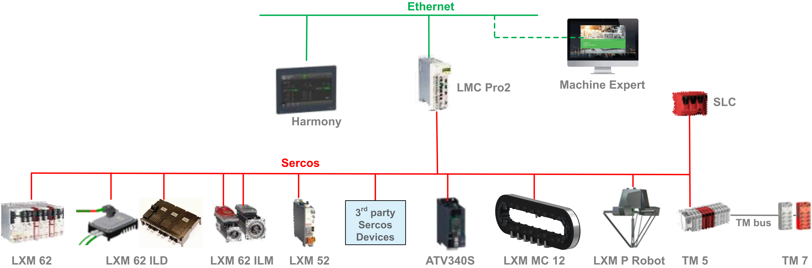

# System Architecture

## Overview

The control system consists of several components, depending on your application. The following figure presents an example of a control system.

For more information about the several components, refer to the corresponding documentation at [www.se.com/en/download/](https://www.se.com/en/download/).

EIO0000004637.09