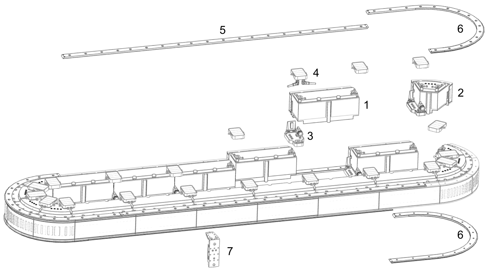

# Product Overview

## General Description of the Lexium™ MC12 multi carrier

## Components Overview

The Lexium™ MC12 multi carrier is a transport system to be used in machines. It uses linear motion technology to move products individually through the machine.

Carriers are moved on a configurable track consisting of arc and straight segments. Process steps can be decoupled and run at different velocities.

Machines can be adapted to different products and product patterns on the fly.

The transport system is built from a combination of the following components:

* Lexium™ MC12 long stator motor segments

  + Lexium™ MC12 long stator motor segment straight
  + Lexium™ MC12 long stator motor segment arc
* Lexium™ MC interconnects

  + Lexium™ MC power interconnect
  + Lexium™ MC communication interconnect
* Lexium™ MC guide rails

  + Lexium™ MC guide rail straight
  + Lexium™ MC guide rail arc
* Lexium™ MC12 carriers
* Lexium™ MC accessories

NOTE: For the number of Lexium™ MC12 long stator motor segments and Lexium™ MC12 carriers that can be used in one Lexium™ MC12 multi carrier, refer to [System Planning](SystemPlanning-6D8A3A34.html#SystemPlanning-6D8A3A34).

To run and to control the Lexium™ MC12 multi carrier you need:

* One ore more power supply/Lexium™ MC connection module combinations (depending on your system layout). The power supplies and the connection modules are installed in a control cabinet.
* One or more Lexium™ MC power cables, Sercos cables, SFO cables (for the Safe Force Off function).
* A PacDrive LMC Pro2 Motion Controller.
* EcoStruxure™ Machine Expert V2.0.3 or later.

The components of the Lexium™ MC12 multi carrier can be combined to many different layouts. The following figure presents the elements of a closed track.

**1** Lexium™ MC12 long stator motor segment straight

**2** Lexium™ MC12 long stator motor segment arc

**3** Lexium™ MC power interconnect

**4** Lexium™ MC communication interconnect

**5** Lexium™ MC guide rail straight

**6** Lexium™ MC guide rail arc

**7** Lexium™ MC12 carrier

NOTE: For greater payloads, there is also a Lexium™ MC12 Heavy-Duty guide system. It is described in [Lexium™ MC12 Heavy-Duty Guide System](MulticarrierHD-E6F80A8E.html).

## Lexium™ MC12 long stator motor segment straight

| Presentation | Segment | Reference | Description |
| --- | --- | --- | --- |
|  | Straight 300 mm (11.81 in) | LXMMC12MS06S100 | Long stator motor segment (straight) with integrated drive electronics 300 mm (11.81 in), IP65 |
| LXMMC12MS06S10L | Long stator motor segment (straight) for automated lubrication, with integrated drive electronics 300 mm (11.81 in), IP65 |

For information on references, also refer to chapter [Type Code](TypeCode-5B11CE11.html#TypeCode-5B11CE11).

## Lexium™ MC12 long stator motor segment arc

| Presentation | Segment | Reference | Description |
| --- | --- | --- | --- |
|  | Arc 45° | LXMMC12MA02S100 | Long stator motor segment (arc) with integrated drive electronics 45° arc, IP65, 100 N peak force (for carrier LXMMC12CA51S100) |

For information on references, also refer to chapter [Type Code](TypeCode-5B11CE11.html#TypeCode-5B11CE11).

## Lexium™ MC power interconnects / Power disconnector

| Presentation | Power interconnect | Reference | Description |
| --- | --- | --- | --- |
|  | Power interconnect (plain) | LXMMCBPA001S100  LXMMCBPA00XS100 | Power interconnect between segments (1 piece)  Power interconnect between segments (10 pieces) |
| Same appearance as: Power interconnect (plain) | Power disconnector | LXMMCBPAB01S100 | Power disconnect between segments  The power disconnector is used to separate the DC bus between segments if you want to realize multiple power groups. |
|  | Power interconnect with power connector (infeed) | LXMMCBPAP01S100 | Power interconnect between segments with power infeed connector |

For information on references, also refer to chapter [Type Code](TypeCode-5B11CE11.html#TypeCode-5B11CE11).

## Lexium™ MC communication interconnects

| Presentation | Communication interconnect | Reference | Description |
| --- | --- | --- | --- |
|  | Communication interconnect (plain) | LXMMCBCA001S100  LXMMCBCA00XS100 | Communication interconnect between segments (1 piece)  Communication interconnect between segments (10 pieces) |
|  | Communication interconnect (Sercos) | LXMMCBCAS01S100 | Communication interconnect between segments with two additional Sercos connectors: Sercos port P1 (infeed) and Sercos port P2 (outfeed) |
|  | Communication interconnect (SFO) | LXMMCBCAF01S100 | Communication interconnect between segments with one additional SFO connector (SFO = Safe Force Off) |
|  | Communication interconnect open track (Sercos + SFO) | LXMMCBDASF1S100 | Communication interconnect at the beginning of an open track with one additional Sercos connector (Sercos port P1 (infeed)) and one SFO connector |
|  | Communication interconnect open track (Sercos) | LXMMCBDAS01S100 | Communication interconnect at the end of an open track with one additional Sercos connector (Sercos port P2 (outfeed)) |

For information on references, also refer to chapter [Type Code](TypeCode-5B11CE11.html#TypeCode-5B11CE11).

## Lexium™ MC guide rail straight/Lexium™ MC guide rail arc

Lexium™ MC guide rail straight

| Presentation | Guide Rail | Reference | Description |
| --- | --- | --- | --- |
| Example 901.2 mm (35.48 in): | Set of straights | - | Straight top and bottom guide rail as a set in the length of: |
| LXMMCRS0A03S100 | 150.2 mm (5.91 in) = 0.5 unit length (ul) |
| LXMMCRS0A06S100 | 300.4 mm (11.83 in) = 1 ul |
| LXMMCRS0A06S10L | 300.4 mm (11.83 in) = 1 ul; for automated lubrication |
| LXMMCRS0A12S100 | 600.8 mm (23.65 in) = 2 ul |
| LXMMCRS0A18S100 | 901.2 mm (35.48 in) = 3 ul |
| LXMMCRS0A24S100 | 1201.6 mm (47.31 in) = 4 ul |
| LXMMCRS0A30S100 | 1502 mm (59.13 in) = 5 ul |
| – | Set of straights 150.2 mm (5.91 in) end of open track with arcs | LXMMCRSEA03S100 | Straight top and bottom guide rail as a set, 150.2 mm (5.91 in) straight for open track with arcs |

Lexium™ MC guide rail arc

| Presentation | Guide Rail | Reference | Description |
| --- | --- | --- | --- |
|  | Set of 45° arcs | LXMMCRABA62S100 | Arc top and bottom guide rails 45° as a set, 1/4 unit length (ul) straight at one end and 3/4 ul straight at the other end |
|  | Set of 90° arcs | LXMMCRABA64S100 | Arc top and bottom guide rails 90° as a set, 1/4 ul straight at one end and 3/4 ul straight at the other end |
|  | Set of 135° arcs | LXMMCRABA66S100 | Arc top and bottom guide rails 135° as a set, 1/4 ul straight at one end and 3/4 ul straight at the other end |
|  | Set of 180° arcs | LXMMCRABA68S100 | Arc top and bottom guide rails 180° as a set, 1/4 ul straight at one end and 3/4 ul straight at the other end |
|  | Set of 360° arcs | LXMMCRA0A00S100 | Arc top and bottom guide rails 360° as a set |

For information on references, also refer to chapter [Type Code](TypeCode-5B11CE11.html#TypeCode-5B11CE11).

## Lexium™ MC12 carrier

| Presentation | Carrier | Reference | Description |
| --- | --- | --- | --- |
|  | Basic Carrier | LXMMC12CA51S100  LXMMC12CA5XS100 | Basic Carrier, 50 mm (1.97 in) length (1 piece)  Basic Carrier, 50 mm (1.97 in) length (10 pieces) |
|  | Smart Carrier | LXMMC12CA51U100 | Smart Carrier, 52 mm (2.05 in) length (1 piece)  Carrier with additional electronics for unique identification. |

For information on references, also refer to chapter [Type Code](TypeCode-5B11CE11.html#TypeCode-5B11CE11).

## Lexium™ MC accessories

| Presentation | Accessory | Reference | Description |
| --- | --- | --- | --- |
|  | Universal Power Supply | ABLU3A48200 | Regulated Power Supply, 380...500V AC, 48V, 20A, 3 phases, Universal |
|  | Lexium™ MC connection module | LXMMCACMD02S100 | Connection module 20 A continuous power to connect track to power supply |
| – | Lexium™ MC connection module connector kit | LXMMCACMCS1S100 | Set of connectors for the connection module (CN1...CN4) |
|  | External Braking Resistor | LXMMCABR120S100 | External Braking Resistor with 2.0 m (6.56 ft) cable |
| – | Lexium™ MC power cable | - | Power cable from Lexium™ MC connection module to power connector (infeed): |
| LXMMCAPC020S100 | 2.0 m (6.56 ft) |
| LXMMCAPC040S100 | 4.0 m (13.12 ft |
| LXMMCAPC060S100 | 6.0 m (19.68 ft) |
| LXMMCAPC080S100 | 8.0 m (26.25 ft) |
| LXMMCAPC100S100 | 10.0 m (32.8 ft) |
| LXMMCAPC120S100 | 12.0 m (39.37 ft) |
| LXMMCAPC140S100 | 14.0 m (45.93 ft) |
| LXMMCAPC160S100 | 16,0 m (52.49 ft) |
| LXMMCAPC180S100 | 18.0 m (59.05 ft) |
| LXMMCAPC200S100 | 20.0 m (65.61 ft) |
| – | Sercos cable | - | Sercos cable with connectors RJ45 and M12 (angled) |
| VW3E3065R030 | 3.0 m (9.84 ft) |
| VW3E3065R050 | 5.0 m (16.4 ft) |
| VW3E3065R100 | 10.0 m (32.8 ft) |
| – | SFO cable | - | SFO cable to communication interconnect with M12 connector (angled) and open cable end with wire ferrules |
| XZCP1241L2SE | 2.0 m (6.56 ft) |
| XZCP1241L5SE | 5.0 m (16.41 ft |
| XZCP1241L10SE | 10.0 m (32.80 ft) |
| XZCP1241L15SE | 15.0 m (49.21 ft) |
| XZCP1241L20SE | 20.0 m (65.61 ft) |
| – | Lexium™ MC encoder magnet | LXMMCAMGEALS100 | Package of encoder magnets for carrier (50 pieces) |
| – | Lexium™ MC motion magnet | LXMMCAMGMALS100 | Package of motion magnets for carrier (50 pieces) |
| – | Lexium™ MC carrier handling tool | LXMMCACT0A1S100 | Handling tool to put carrier on track or to remove carrier from track |
| – | Lexium™ MC roller replacement set | LXMMCARS0AXS100 | Roller set for carrier, containing 10 x 4 rollers, 10 x 2 lubrication pads and required screws |
| – | Set of hard stops | LXMMCAHS001S00 | Set of hard stops to stop carriers at the ends of an open track |
| – | Single-hand lubrication gun | VW33MAP22 | Single-hand high pressure oil gun to fill the lubrication reservoirs |
| – | Material test kit 1 | LXMMCAMK001S100 | Material test kit 1: Material samples for resistance tests |

For information on references, also refer to chapter [Type Code](TypeCode-5B11CE11.html#TypeCode-5B11CE11).

EIO0000004637.09