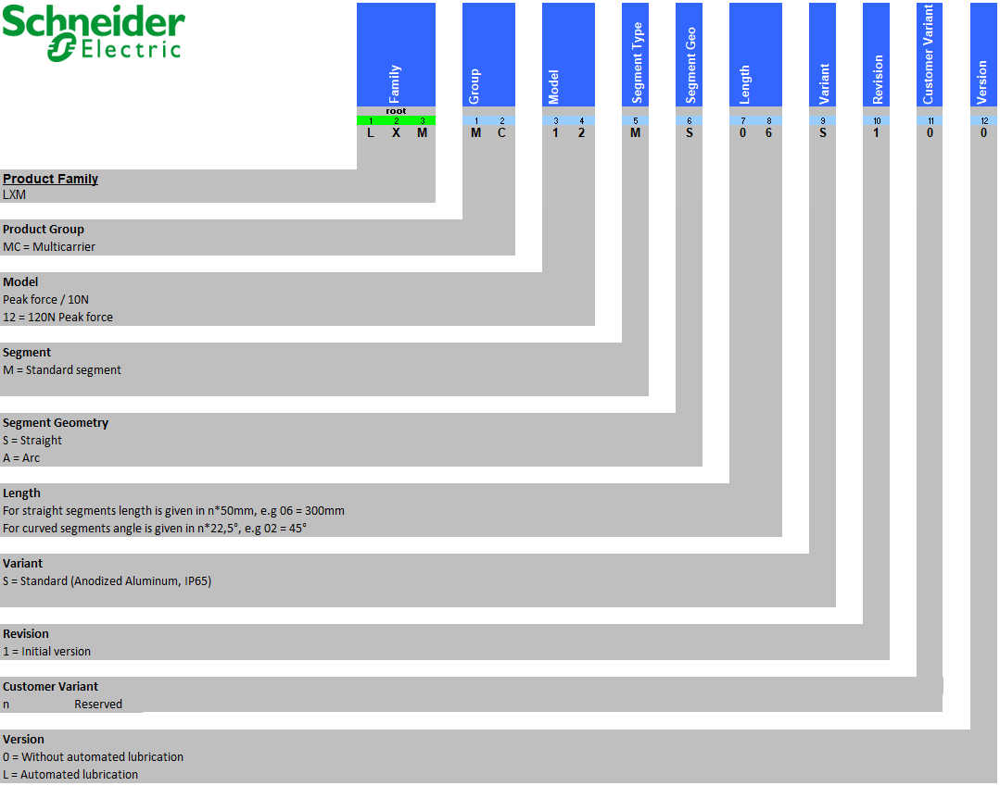
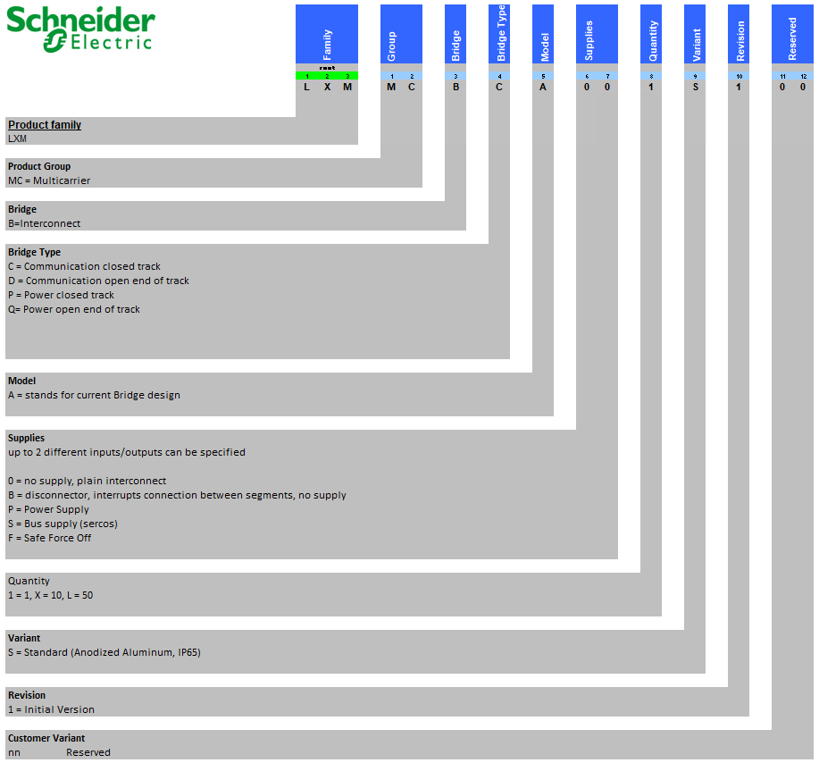
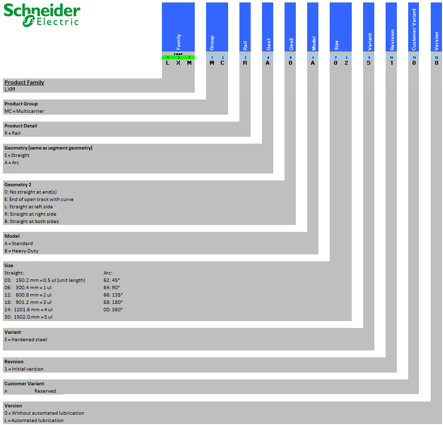
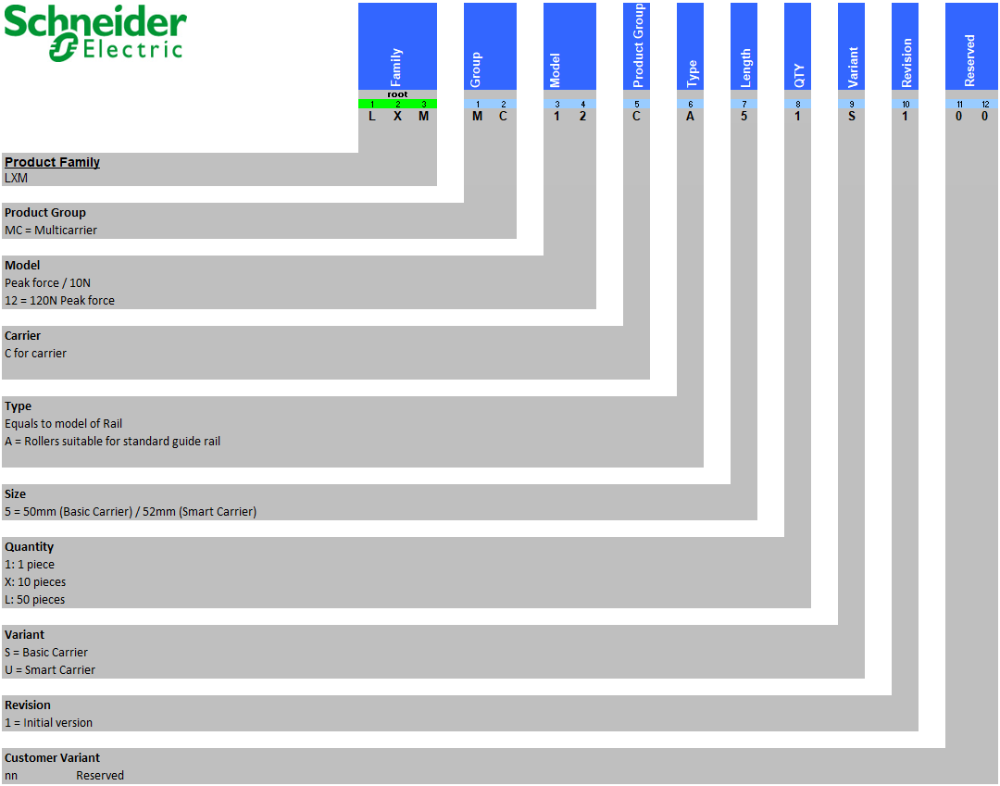
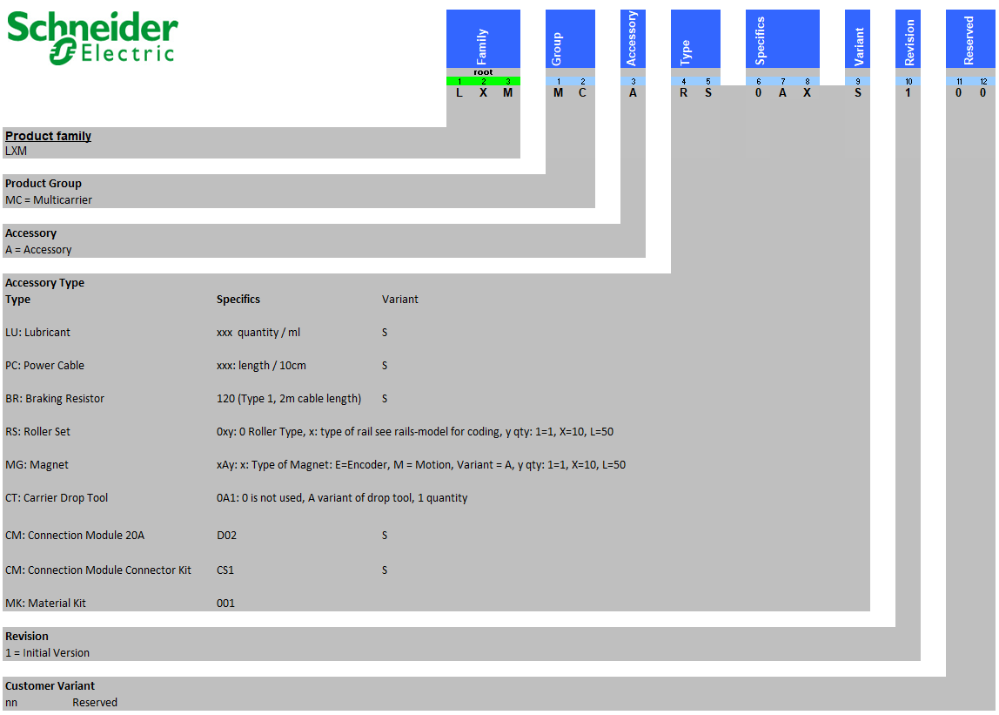

# Type Code

## Lexium™ MC12 long stator motor segments

## Lexium™ MC interconnects

## Lexium™ MC guide rails

For a description of the Heavy-Duty references, refer to [Lexium™ MC12 Heavy-Duty Guide Rail](TypeCode-05C44427.html#TypeCode-05C44427__Heavy-DutyGuideRail-05C438BC).

## Lexium™ MC12 carrier

For a description of the Heavy-Duty references, refer to [Lexium™ MC12 Heavy-Duty Carrier](TypeCode-05C44427.html#TypeCode-05C44427__Heavy-DutyCarrier-05C434E8).

## Lexium™ MC accessories

EIO0000004637.09