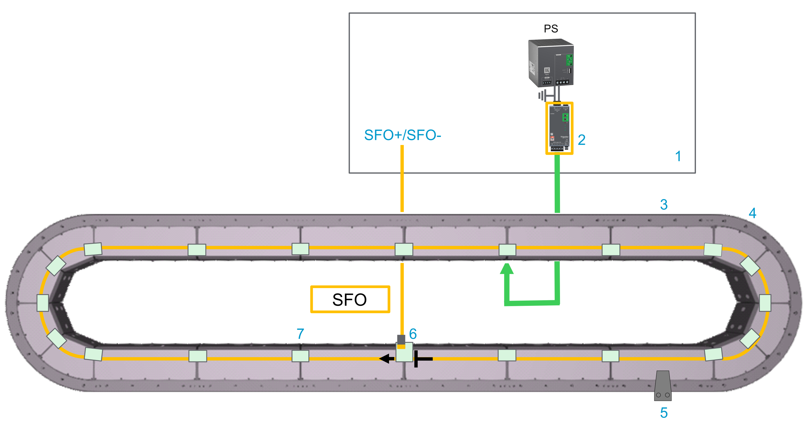
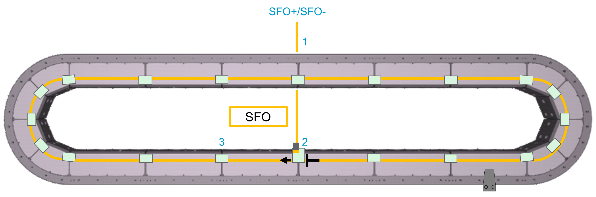
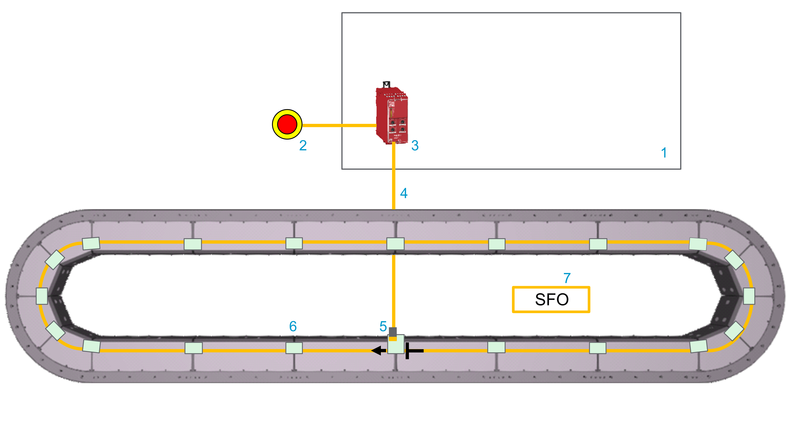
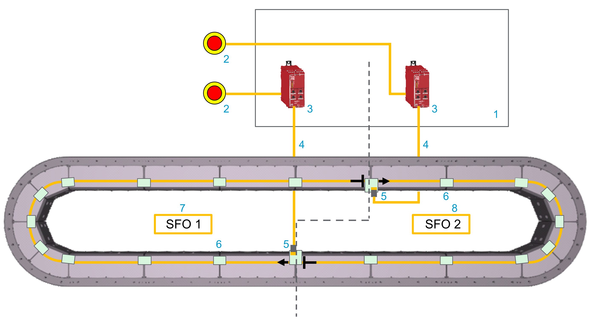
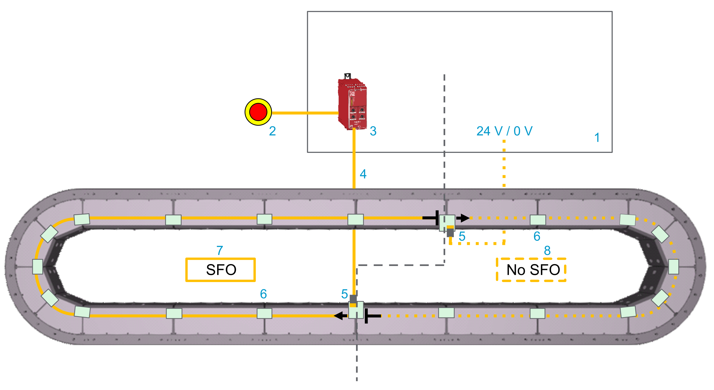
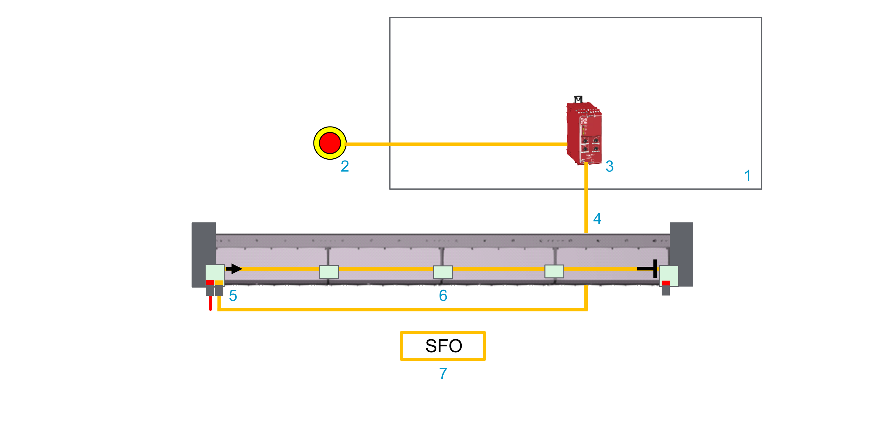

# Safe Force Off (SFO) Function

## Functional Description

With the SFO (Safe Force Off) function, you can set the segments to a defined safe state. In the defined safe state, the segment will not generate any force to carriers through its magnetic field.

This SFO (Safe Force Off) function relates to the components:

* Lexium™ MC connection modules
* Lexium™ MC12 long stator motor segments
* Lexium™ MC12 carriers
* Lexium™ MC communication interconnects

In the sense of the relevant standards (IEC 60204-1), the requirements of the stop category 0 (SFO) and stop category 1 (Safe Stop 1, SS1) can be met. Both categories lead to a force-free segment while SS1 takes this state after a predefined time.

| WARNING | |
| --- | --- |
|  | UNINTENDED EQUIPMENT OPERATION  * Make certain that no hazards can arise for persons or material during the coast down period of the carriers/machine. * Do not enter the zone of operation during the coast down period. * Ensure that no other persons can access the zone of operation during the coast down period. * Use appropriate protective devices (functional safety devices) in compliance with local and national standards.  Failure to follow these instructions can result in death, serious injury, or equipment damage. |

**View of the Lexium™ MC12 multi carrier track from above**

| Element | Description |
| --- | --- |
| 1 | Control cabinet |
| 2 | The Lexium™ MC connection module is connected to the track via the Lexium™ MC power cable and the Lexium™ MC power interconnect from below. Refer to [graphic below](#Desig_Safety_Func-9CDD3608__p-1235-E774694D).  Also refer to chapter Product Overview\[Lexium MC Connection Module](ProductOverview-5A703DB5.html#ProductOverview-5A703DB5__section-139-5B101246). |
| 3 | Lexium™ MC12 long stator motor segment straight, refer to chapter Product Overview\[Lexium™ MC12 long stator motor segment straight](ProductOverview-5A703DB5.html#ProductOverview-5A703DB5__jkbcjkbsycbsbcsc-5AF991F1). |
| 4 | Lexium™ MC12 long stator motor segment arc, refer to chapter Product Overview\[Lexium™ MC12 long stator motor segment arc](ProductOverview-5A703DB5.html#ProductOverview-5A703DB5__section-134-5AFB3852). |
| 5 | Lexium™ MC12 carrier, refer to Product Overview\[Lexium™ MC12 carrier](ProductOverview-5A703DB5.html#ProductOverview-5A703DB5__section-138-5B0FCE06). |
| 6 | Lexium™ MC communication interconnect with SFO connector, refer to Product Overview\[Lexium™ MC communication interconnects](ProductOverview-5A703DB5.html#ProductOverview-5A703DB5__ToDo-5B0E91E4). |
| 7 | Lexium™ MC communication interconnect, refer to Product Overview\[Lexium™ MC communication interconnects](ProductOverview-5A703DB5.html#ProductOverview-5A703DB5__ToDo-5B0E91E4). |

## Operating Principle

The SFO signal is used to set the segments to a defined safe state. In the defined safe state, the segment will not generate any force to carriers through its magnetic field.

There is no need to interrupt the power supply. Standstill, however, is not monitored.

## Scope of Operation (Designated Safety Function)

The SFO (Safe Force Off) function relates to the Lexium™ MC connection modules, Lexium™ MC power interconnects, Lexium™ MC12 long stator motor segments, Lexium™ MC12 carriers, and Lexium™ MC communication interconnects hereinafter referred to as Lexium™ MC12 multi carrier.

The function is activated/deactivated via a signal (pair) which is feed in via a Lexium™ MC communication interconnect with SFO connector at a freely selectable Lexium™ MC12 long stator motor segment straight or Lexium™ MC12 long stator motor segment arc. The signal is forwarded with the Lexium™ MC communication interconnects to all segments belonging to the same SFO group.

The supply voltage (48 Vdc DC bus) does not need to be interrupted.

**Lexium™ MC connection module**

* The Lexium™ MC connection module (**3**) helps protect the Lexium™ MC12 multi carrier track against overvoltage.
* The Lexium™ MC connection module (**3**) supplies the Lexium™ MC12 multi carrier track with power (DC bus)

  The Lexium™ MC power cable (**4**) is connected to the Lexium™ MC power interconnect (**5**) at the bottom of a segment.
* The DC bus (**7**) (up to 60 A) in the Lexium™ MC12 multi carrier track is distributed from segment to segment via the Lexium™ MC power interconnects (**6**).

  

View of the Lexium™ MC12 multi carrier track from below

| Element | Description |
| --- | --- |
| 1 | Control cabinet |
| 2 | Power supply |
| 3 | Lexium™ MC connection module |
| 4 | Lexium™ MC power cable with socket connector |
| 5 | Lexium™ MC power interconnect with plug connector |
| 6 | Lexium™ MC power interconnect without connector |
| 7 | Internal DC bus connection |

**SFO (Safe Force Off)**

View of the Lexium™ MC12 multi carrier track from above

* The SFO (Safe Force Off) signal is used to set the segments to a de-energized state. This means that the coils in the segments no longer exert an electromagnetic force on the carriers.
* The SFO signal is transmitted via an SFO cable (**1**). This cable is connected with a Lexium™ MC communication interconnect (**2**) with SFO connector at the top of a segment.
* The SFO signal is distributed from segment to segment via the Lexium™ MC communication interconnects (**3**).
* Several SFO groups can be set up for different sections of the track. An SFO group always starts at the Lexium™ MC communication interconnect with SFO connector and extends clockwise to the next Lexium™ MC12 long stator motor segment via the Lexium™ MC communication interconnect.
* Each segment must be provided with an SFO signal. Either with an SFO cable or via the Lexium™ MC communication interconnect from the segment before.

Also refer to [Connecting SFO (Safe Force Off) to the Track](TPC_MLS-HWG_ConnectingSafetyDevices-9419DE36.html#TPC_MLS-HWG_ConnectingSafetyDevices-9419DE36).

## Defined Safe State

In the defined safe state, the segment will not generate any force to carriers through its magnetic field. This de-energized state is also automatically entered when errors are detected in the safety-related circuit.

## Mode of Operation

When the stop or the emergency stop button is activated, the defined safe state is requested. This is achieved by inhibiting the PWM signals to the power stage of the segments. This means that the coils in the segments no longer exert an electromagnetic force on the carriers. The PWM signals cannot control the power stage so that a startup of the Lexium™ MC12 multi carrier is prevented (pulse pattern lock).

You can use the SFO (Safe Force Off) function to implement the control function “Stopping in case of emergency” (IEC 60204-1) for stop category 0 and stop category 1. Use an appropriate external safety-related circuit to prevent the unintended restart of the Lexium™ MC12 multi carrier after a stop, as required in the machine directive.

## Stop Category 0

In stop category 0 (SFO), the carriers coast to a stop (provided there are no external forces operating to the contrary). The SFO safety-related function is intended to help prevent an unintended start-up, and therefore corresponds to an unassisted stop in accordance with IEC 60204-1.

In circumstances where external influences are present, the coast down time depends on physical properties of the components used (such as weight, velocity, friction, and so on). That is to say, if this means a hazard to your personnel or equipment, you must take appropriate measures (refer to [Hazard and Risk Analysis](ProcessMinimizingRisks-9CD8E4AD.html#ProcessMinimizingRisks-9CD8E4AD__HazardAndRiskAnalysis-9CDA4419)).

| WARNING | |
| --- | --- |
|  | UNINTENDED EQUIPMENT OPERATION  * Make certain that no hazards can arise for persons or material during the coast down period of the carriers/machine. * Do not enter the zone of operation during the coast down period. * Ensure that no other persons can access the zone of operation during the coast down period. * Use appropriate protective devices (functional safety devices) in compliance with local and national standards.  Failure to follow these instructions can result in death, serious injury, or equipment damage. |

Also refer to [Track Orientation](SystemPlanning-6D8A3A34.html#SystemPlanning-6D8A3A34__TrackOrientation-959FF23D).

## Stop Category 1

For stops of category 1 (Safe Stop 1, SS1) you can request a controlled stop via the PacDrive Logic Motion Controller (LMC). The controlled stop by the PacDrive LMC is not safety-relevant, nor monitored, and does not perform as defined in the case of a power outage or if an error is detected. The final switch off in the defined safe state is accomplished by switching off the SFO (Safe Force Off) input. This has to be implemented by using an external safety-related switching device with safety-related delay.

## Coast Down Time of Carriers

Your track may have sections with and without the Safe Force Off (SFO) function. For example:

* The segments of your track belong to different SFO groups with the SFO function.
* Some segments of your track belong to an SFO group with the SFO function and other segments belong to an SFO group without the SFO function.

Refer to [Examples SFO/Non-SFO Groups](#Desig_Safety_Func-9CDD3608__ExamplesSFONon-SFOGroups-CAAA4107).

You must be aware that de-energizing a segment (SFO function) does not lead to an immediate standstill of the carriers, but that the carriers require a certain coast down time.

The coast down time of carriers depends on physical properties of the components used (such as weight, velocity, friction, and so on). This means that after activating the SFO function for one segment (segment group), a carrier can still roll into another segment.

For open tracks, this means that a carrier can still roll to the end of the track after activating the SFO function and strike the hard stop of the track.

NOTE: If coast down time means a hazard to your personnel or equipment, you must take appropriate measures (refer to [Hazard and Risk Analysis](ProcessMinimizingRisks-9CD8E4AD.html#ProcessMinimizingRisks-9CD8E4AD__HazardAndRiskAnalysis-9CDA4419)).

| WARNING | |
| --- | --- |
|  | UNINTENDED EQUIPMENT OPERATION  * Make certain that no hazards can arise for persons or material during the coast down period of the carriers/machine. * Do not enter the zone of operation during the coast down period. * Ensure that no other persons can access the zone of operation during the coast down period. * Use appropriate protective devices (functional safety devices) in compliance with local and national standards.  Failure to follow these instructions can result in death, serious injury, or equipment damage. |

Also refer to [Open Track](MountingThe-5FAA5905.html#MountingThe-5FAA5905__OpenTrack-0569ECA8).

## Examples SFO/Non-SFO Groups

**Views of the Lexium™ MC12 multi carrier track from above**

Example: All segments of a closed track belong to one SFO group with the SFO function. This means that all segments of your track are de-energized at once.

Before entering the SFO group area, you must wait until all carriers have coasted down. Also refer to [Coast Down Time of Carriers](#Desig_Safety_Func-9CDD3608__CoastDownTimeOfCarriers-CAA84227).

| Element | Description |
| --- | --- |
| 1 | Control cabinet |
| 2 | Emergency stop switch |
| 3 | Safety-related switching device (for example, Harmony XPSUAT Safety Module) |
| 4 | SFO cable |
| 5 | Lexium™ MC communication interconnect with SFO connector |
| 6 | Lexium™ MC communication interconnect |
| 7 | SFO group |

Also refer to [Connecting SFO (Safe Force Off) to the Track](TPC_MLS-HWG_ConnectingSafetyDevices-9419DE36.html#TPC_MLS-HWG_ConnectingSafetyDevices-9419DE36).

Example: The segments of a closed track belong to two different SFO groups with the SFO function. This means that the segments of SFO group 1 and SFO group 2 can be de-energized independently of each other. If you de-energize SFO group 1, you must be aware that the carriers of the SFO group 2 can still roll into SFO group 1 and vice versa.

Before entering the SFO group 1 area, you must wait until all carriers have coasted down and you must take appropriate measures that no carriers from SFO group 2 can roll into SFO group 1. Also refer to [Coast Down Time of Carriers](#Desig_Safety_Func-9CDD3608__CoastDownTimeOfCarriers-CAA84227).

| Element | Description |
| --- | --- |
| 1 | Control cabinet |
| 2 | Emergency stop switch |
| 3 | Safety-related switching device (for example, Harmony XPSUAT Safety Module) |
| 4 | SFO cable |
| 5 | Lexium™ MC communication interconnect with SFO connector |
| 6 | Lexium™ MC communication interconnect |
| 7 | SFO group 1 |
| 8 | SFO group 2 |

Also refer to [Connecting SFO (Safe Force Off) to the Track](TPC_MLS-HWG_ConnectingSafetyDevices-9419DE36.html#TPC_MLS-HWG_ConnectingSafetyDevices-9419DE36).

Example: Some segments of a closed track belong to an SFO group with the SFO function and other segments belong to an SFO group without the SFO function. This means that the segments of the SFO group with the SFO function can be de-energized and the segments of the SFO group without the SFO function can not be de-energized.

If you de-energize the SFO group with the SFO function, you must be aware that the carriers of the group without the SFO function can roll into the SFO group with the SFO function and vice versa.

Before entering the SFO group area, you must wait until all carriers have coasted down and you must take appropriate measures that no carriers from the group with no SFO can roll into the SFO group. Also refer to [Coast Down Time of Carriers](#Desig_Safety_Func-9CDD3608__CoastDownTimeOfCarriers-CAA84227).

| Element | Description |
| --- | --- |
| 1 | Control cabinet |
| 2 | Emergency stop switch |
| 3 | Safety-related switching device (for example, Harmony XPSUAT Safety Module) |
| 4 | SFO cable |
| 5 | Lexium™ MC communication interconnect with SFO connector |
| 6 | Lexium™ MC communication interconnect |
| 7 | SFO group |
| 8 | Non-SFO group |

Also refer to [Connecting SFO (Safe Force Off) to the Track](TPC_MLS-HWG_ConnectingSafetyDevices-9419DE36.html#TPC_MLS-HWG_ConnectingSafetyDevices-9419DE36).

Example: All segments of an open track belong to one SFO group with the SFO function. This means that all segments of your track are de-energized at once.

If you de-energize the SFO group, you must be aware that the carriers can still roll to the end of the track and strike the hard stop of the track.

Before entering the SFO group area, you must wait until all carriers have coasted down. Also refer to [Coast Down Time of Carriers](#Desig_Safety_Func-9CDD3608__CoastDownTimeOfCarriers-CAA84227).

| Element | Description |
| --- | --- |
| 1 | Control cabinet |
| 2 | Emergency stop switch |
| 3 | Safety-related switching device (for example, Harmony XPSUAT Safety Module) |
| 4 | SFO cable |
| 5 | Lexium™ MC communication interconnect with SFO connector |
| 6 | Lexium™ MC communication interconnect |
| 7 | SFO group |

Also refer to [Open Track](MountingThe-5FAA5905.html#MountingThe-5FAA5905__OpenTrack-0569ECA8).

Also refer to [Connecting SFO (Safe Force Off) to the Track](TPC_MLS-HWG_ConnectingSafetyDevices-9419DE36.html#TPC_MLS-HWG_ConnectingSafetyDevices-9419DE36).

## Not Using the Safe Force Off (SFO) Function

If you have a group of segments in your track that should not use the SFO function, you must supply 24 Vdc to this group permanently. To do this, install a Lexium™ MC communication interconnect with SFO connector to the first segment of this group and supply SFOin+ (24 Vdc) and SFOin- (0 Vdc). This puts the segments of this group in an energized state and allows them to apply electromagnetic force to the Lexium™ MC12 carriers.

If the transition of carriers from a section of the track that does not use the SFO function to a section of the track with SFO function poses a hazard to your personnel or equipment, you must take appropriate measures (refer to [Hazard and Risk Analysis](ProcessMinimizingRisks-9CD8E4AD.html#ProcessMinimizingRisks-9CD8E4AD__HazardAndRiskAnalysis-9CDA4419)).

| WARNING | |
| --- | --- |
|  | UNINTENDED EQUIPMENT OPERATION  * Make certain that no hazards can arise for persons or material during the coast down period of the carriers/machine. * Do not enter the zone of operation during the coast down period. * Ensure that no other persons can access the zone of operation during the coast down period. * Use appropriate protective devices (functional safety devices) in compliance with local and national standards.  Failure to follow these instructions can result in death, serious injury, or equipment damage. |

## Validity of the Safety Case

The safety case for the SFO (Safe Force Off) function of the Lexium™ MC12 multi carrier is identified and defined by the standards listed in [*Safety Standards*](../../../../../api/crossBook?lang=en-US&virtualBookName=SafetyStandards-A2896F3B.html#SafetyStandards-A2896F3B). The safety case for the designated safety function of the Lexium™ MC12 multi carrier applies to the following product versions, which can be found examining the appropriate software object in [EcoStruxure Machine Expert](../../SoMProg&topicID=D_SG_0026478):

| Component | References | Product version |
| --- | --- | --- |
| Lexium™ MC connection module | LXMMCACMD02S100 | 02, 03, 04 |
| Lexium™ MC12 long stator motor segment straight | LXMMC12MS06S100 | 02, 03, 04,05,06 |
| Lexium™ MC12 long stator motor segment straight for automated lubrication | LXMMC12MS06S10L | 06 |
| Lexium™ MC12 long stator motor segment arc | LXMMC12MA02S100 | 02, 03, 04,05,06 |
| Lexium™ MC communication interconnect plain | LXMMCBCA001S100 | 02, 03, 04 |
| Lexium™ MC communication interconnect with two Sercos connectors | LXMMCBCAS01S100 | 02, 03, 04 |
| Lexium™ MC communication interconnect with one SFO connector | LXMMCBCAF01S100 | 02, 03, 04 |
| Lexium™ MC communication interconnect for open track with one Sercos and one SFO connector | LXMMCBDASF1S100 | 02, 03, 04 |
| Lexium™ MC communication interconnect for open track with one Sercos connector | LXMMCBDAS01S100 | 02, 03, 04 |
| Also refer to [Product Overview](ProductOverview-5A703DB5.html#ProductOverview-5A703DB5). | | |

For additional information, contact your Schneider Electric service representative.

## Interface and Control

The SFO (Safe Force Off) function is operated via the difference between the two input signals SFOin+ (24 Vdc) and SFOin- (0 Vdc).

For information on the technical data and electrical connections, refer to the chapter [Technical Data for Safe Force Off (SFO)](MechanicalData-5F95A173.html#MechanicalData-5F95A173__TechnicalDataForSafeForceOffSFO-C15E2AD5).

EIO0000004637.09