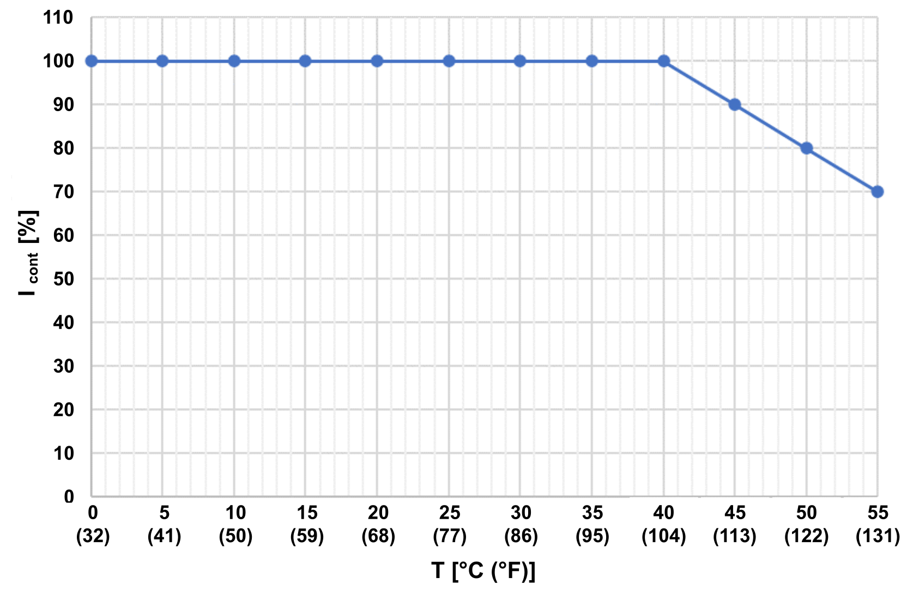
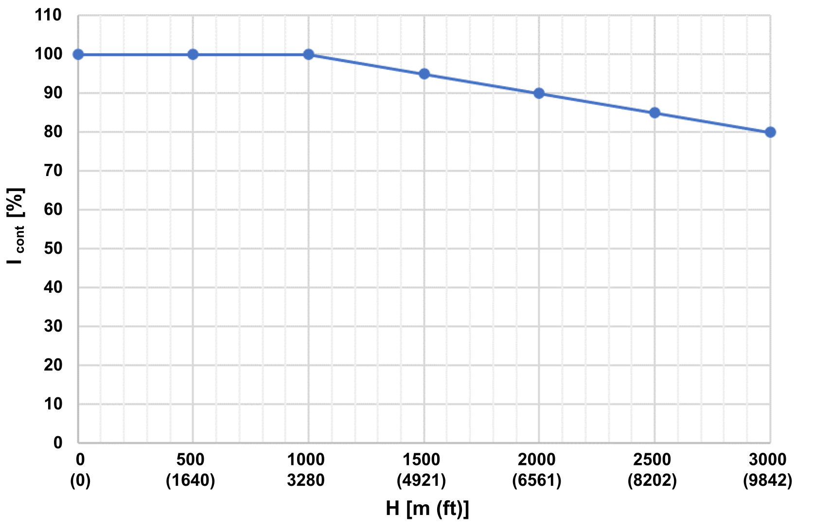
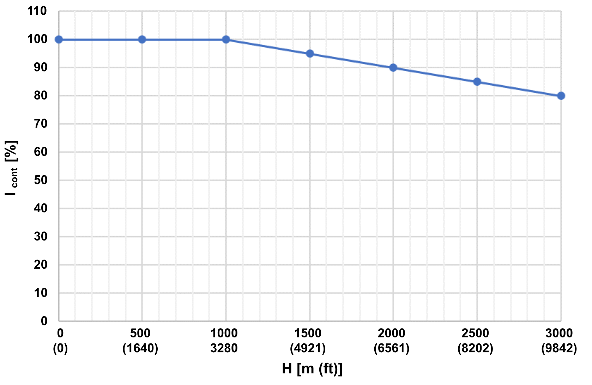

# Special Conditions

## Increased Ambient Temperature

Due to increased ambient temperature, the available continuous output current and the continuous coil current is reduced.

**Cabinet devices (connection modules)**

Continuous output current **Icont [%]** reduction at increased ambient temperature **T [°C (°F)]**

**Field devices (track, segments, coils)**

Continuous coil current **Icont [%]** reduction at increased ambient temperature **T [°C (°F)]**

## Increased Installation Altitude

Due to the lower air pressure at higher altitudes, the cooling effect is reduced. Therefore, the continuous current of the segments / coils and the DC bus output current of the connection module must be reduced by 1% per 100 m (328 ft) starting from an installation altitude of 1000 m (3281 ft).

**Cabinet devices (connection modules)**

Continuous output current **Icont [%]** reduction at increased installation height **H [m (ft)]**

**Field devices (track, segments, coils)**

Continuous coil current **Icont [%]** reduction at increased installation height **H [m (ft)]**

EIO0000004637.09