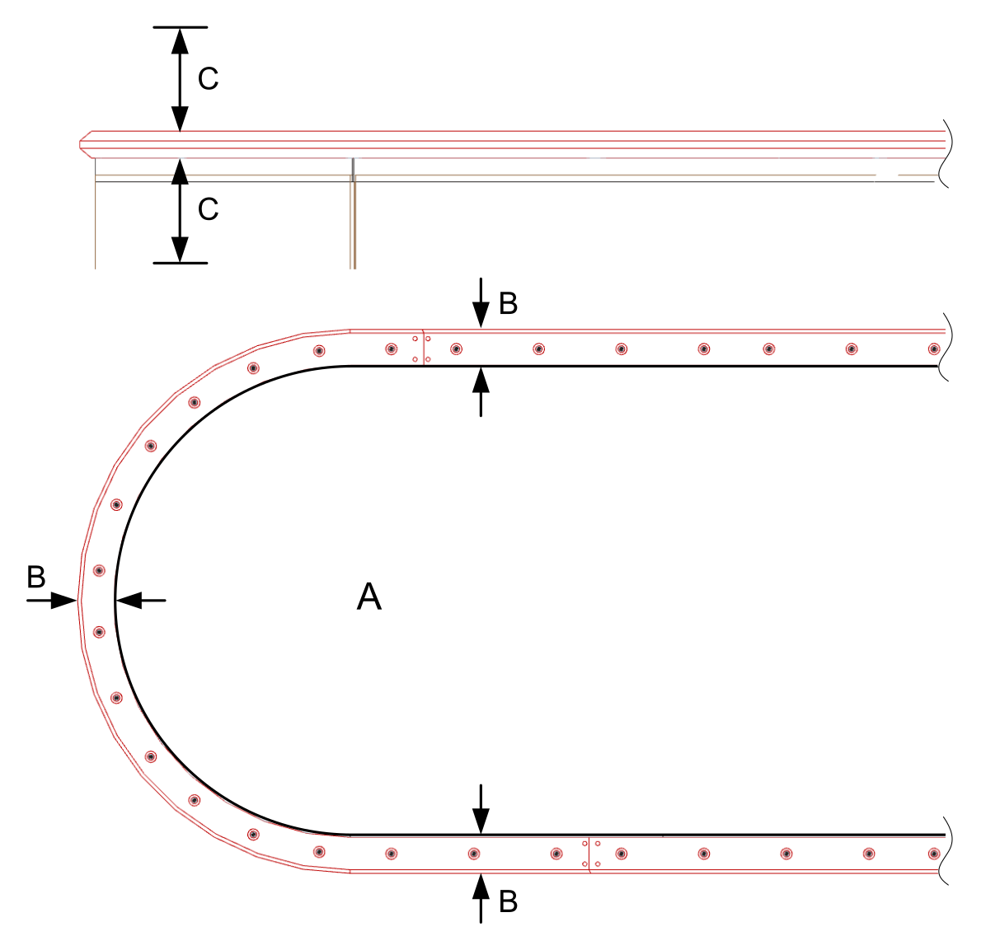

# Mounting Plate

## Overview

The following prerequisites must be met by the mounting plate:

* The mounting plate must be flat, level and clean. The flatness of the mounting plate must be at least 0.4 mm/m (0.0048 in/ft).
* The mounting plate must support the weight of the fully assembled system.
* Have the mounting plate made of aluminum with a thickness of at least 15 mm (0.59 in) to help to ensure a sufficient heat dissipation. This also requires a good thermal connection between the segments and the mounting plate.

  If you use other material you must verify to reach a sufficient heat dissipation.
* To help to install the guide rails:

  + The size of the mounting plate (**A**) must be about 70 mm (2.76 in) (= 2 x **B**) smaller than the shape of your system layout.
  + A working space (**C**) of about 100 mm (3.94 in) must be available above and below the rails.

    
* The mounting plate must be provided with all necessary holes and threads. The drilling templates of the components are part of this documentation. Refer to [Dimensions and Drilling Templates](DimensionsAndDrillingTemplates-B68BDE96.html#DimensionsAndDrillingTemplates-B68BDE96).

  You can download the CAD files of the individual components from the Schneider Electric homepage.

NOTE: For a large system, use a frame with several mounting plates installed.

Do not move/lift the pre-assembled Lexium™ MC12 multi carrier if it is not installed on a mounting plate.

If you plan to assemble the Lexium™ MC12 multi carrier track outside of your machine, equip the mounting plate with suitable transport devices to be able to lift the mounted track into your machine.

| WARNING | |
| --- | --- |
|  | HEAVY AND/OR FALLING PARTS  * Use a suitable crane or other suitable lifting gear for mounting the system. * Use the necessary personal protective equipment (for example, protective shoes, protective glasses and protective gloves). * Mount the system so that it cannot come loose (use of securing screws with appropriate tightening torque), especially in cases of fast acceleration or continuous vibration.  Failure to follow these instructions can result in death, serious injury, or equipment damage. |

EIO0000004637.09