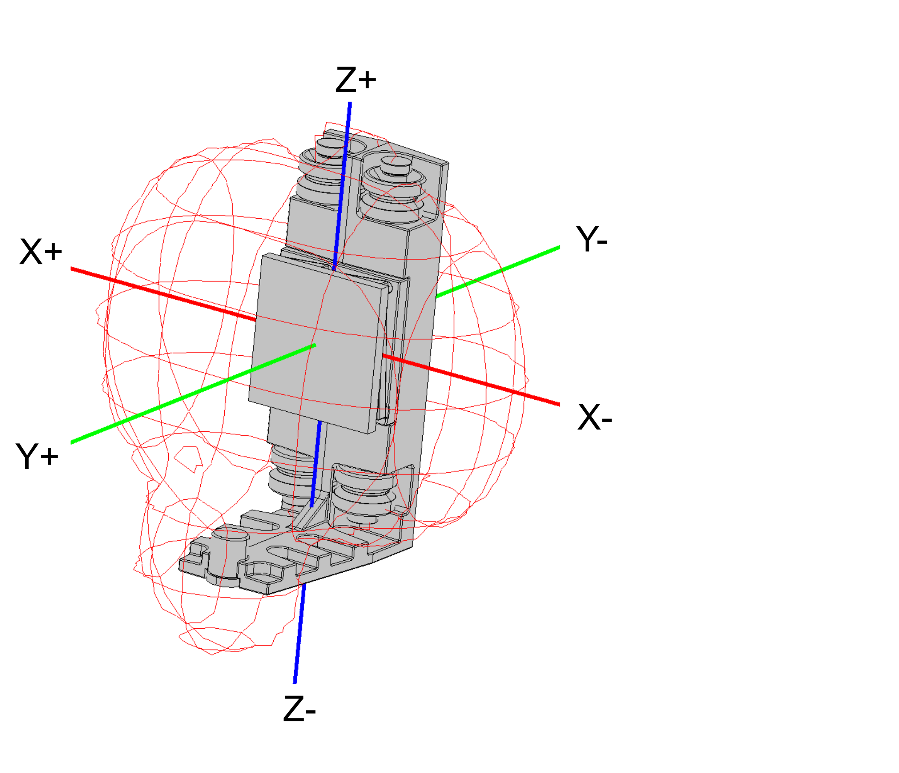

# Transport and Storage

## Transport Conditions

The components of the Lexium™ MC12 multi carrier must be handled with care. Shocks and impacts may damage the components. Damage may lead to reduced running accuracy, reduced service life, or to an inoperable Lexium™ MC12 multi carrier.

The components of the system are transported in cardboard boxes. The respective box dimensions vary according to the dimensions of the components and the order quantity.

For detailed information about transport conditions, refer to [Ambient Conditions](AmbientConditions-5F940331.html#AmbientConditions-5F940331).

## Storage

The components of the Lexium™ MC12 multi carrier can be stored inside the packaging or unpacked. In both cases, ensure that they are stored in a sheltered and dry place. Avoid humidity which can have corrosive effects on the components.

NOTE: When stored, the components of the Lexium™ MC12 multi carrier need to be on a level surface.

For detailed information about storage conditions, refer to [Ambient Conditions](AmbientConditions-5F940331.html#AmbientConditions-5F940331).

## Transporting and Storing the Lexium™ MC guide rails

Lexium™ MC guide rails can bend if handled improperly and may then no longer be usable.

| NOTICE | |
| --- | --- |
|  | INOPERABLE EQUIPMENT  Do not bend or otherwise distort the guide rails.  Failure to follow these instructions can result in equipment damage. |

## Transporting the Lexium™ MC12 carriers

The carriers must be transported in their associated protective packaging, which helps to reduce the effects of the strong drive magnets.

NOTE: Exposed or uninstalled carriers must have the protective cover of the drive magnets installed at all times. The cover is only removed at the time of carrier installation.

* Carriers have strong local magnetic fields. Refer to [Transporting the Lexium™ MC12 carriers](TransportAndStorage-5F99D6F3.html#TransportAndStorage-5F99D6F3__TransportingThe-832E29D6).
* The carriers have strong drive magnets and can attract metal objects that are in their proximity.
* A carrier can move suddenly and fast due to magnetic attraction.

| WARNING | |
| --- | --- |
|  | Strong MAGNETIC FIELDS  * Keep persons with medical implants (for example, pacemakers or metal implants) or metallic body jewelry away from the carriers and segments with a minimum distance of 30 cm (11.9 in). * Always leave the protective cover of the drive magnets in place for all exposed or uninstalled carriers. * Do not put your hands or fingers between the carriers and segments. * Do not place metallic tools in the vicinity of the carriers and segments. * Do not place electromagnetically sensitive devices near the carriers and segments. * Do not place credit cards or electronic/magnetic media in the vicinity of the carriers and segments.  Failure to follow these instructions can result in death, serious injury, or equipment damage. |

The graphic shows the magnetic field of a carrier with a protective cover for the drive magnets.

NOTE: To avoid interferences with implanted devices, keep at least the following minimum distances from the carrier (with the protective cover in place) to achieve a flux density of less than 0.5 mT (milli-Tesla) according to DIRECTIVE 2013/35/EU.

| Dimension | + | - |
| --- | --- | --- |
| **X** | 85 mm (3.35 in) | 85 mm (3.35 in) |
| **Y** | 70 mm (2.76 in) | 25 mm (0.99 in) |
| **Z** | 75 mm (2.96 in) | 105 mm (4.14 in) |

NOTE: If you remove the protective cover, the distance to be kept to all carrier and segment surfaces increases to 300 mm (11.9 in).

The carrier has two magnets which, together with the magnetic fields in the segments, move the carrier on the track. These two magnets are glued onto the carrier. A shock to the carrier can cause the glued-on magnets to flake off and the magnets can splinter.

In addition, the carrier has an encoder magnet. This can be demagnetized by improper handling, for example, if the magnets of another carrier come too close.

| WARNING | |
| --- | --- |
|  | INOPERABLE EQUIPMENT  * Do not drop the carrier. * Do not strike the carrier. * Keep a minimum distance of 50 mm (1.97 in) between the encoder magnet and other magnets. * Ensure to fill the lubrication reservoirs of the carriers before first use.  Failure to follow these instructions can result in death, serious injury, or equipment damage. |

For information on filling the lubrication reservoirs refer to [Filling the Lubrication Reservoirs](TPC_MLS-HWG_Lubrication_Carrier-87476023.html#TPC_MLS-HWG_Lubrication_Carrier-87476023__RefillingTheLubricationReservoirs-874ABAF0).

EIO0000004637.09