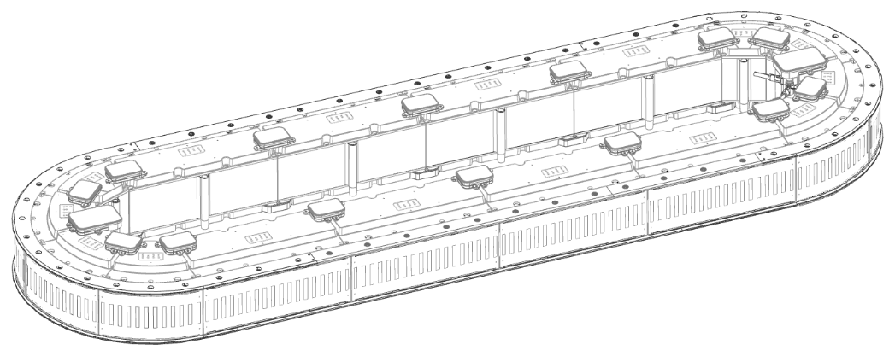

# Horizontal Mounting of the Track without Automated Lubrication

This chapter presents the horizontal mounting for the segments and guide rails without automated lubrication. For the automated lubrication track, refer to [Horizontal Mounting of the Track with Automated Lubrication](HorizMountingWithAutomatedLubr-C03D6E55.html).

## General Information

When mounting the system, apply a tightening torque of:

* 7.2 Nm (63.7 lbf-in) for rails
* 10.1 Nm (89.4 lbf-in) for segments

## Mounting

The steps for mounting the system are described in the following table:

| Step | Action |
| --- | --- |
| 1 | Place two Lexium™ MC power interconnects (**a**) at a distance of one segment length at the intended location on the mounting plate.    To achieve the correct distance between the interconnects, insert the three semi-circular positioning knobs on the bottom of the interconnects into the corresponding holes in the mounting plate.    NOTE: If a power interconnect is used to supply your system with power from the control cabinet, use the respective reference of the  [Lexium™ MC power interconnects / Power disconnector](ProductOverview-5A703DB5.html#ProductOverview-5A703DB5__section-135-5B04316E). |
| 2 | Insert a segment (**b**) from above into the two interconnects. Make sure that the segment is not tilted during insertion. The alignment aid and the oval fitting of the power interconnects help you to join the segments in a straight alignment.  Fasten the segment loosely with three screws (M6x120 class 8.8 ISO 4762) to the mounting plate so that it will stay in place but can still be shifted a little. |
| 3 | Place the next Lexium™ MC interconnect (**c**) at a distance of one segment length at the intended location on the mounting plate.  To achieve the correct distance between the interconnects, insert the three semi-circular positioning knobs on the bottom of the interconnect into the corresponding holes in the mounting plate.  Insert a segment (**d**) from above into the two interconnects. Make sure that the segment is not tilted during insertion. The alignment aid and the oval fitting of the power interconnects help you to join the segments in a straight alignment.  Fasten the segment loosely with three screws. |
| 4 | Proceed in the same way, using straight and arc segments to build your system layout.  With an open track, proceed as described under [Hard Stops\Horizontal Mounting](MountHardStops-C03F41F0.html#MountHardStops-C03F41F0__Hard_Horiz_Mount-49DD67E5). |
| 5 | When all the segments are in place, install the bottom Lexium™ MC guide rails (**e**), starting at an arc segment or at an open end of the track. The rails are mounted offset to the segments by design. |
| 6 | Position a Lexium™ MC guide rail (**e**) under the segments and loosely fasten the rail with M6x16 class 8.8 DIN 7984 screws.  NOTE: Make sure that the holes in the rails are aligned with the holes in the segments. |
| 7 | Align the next rail. Make sure that the rails fit tightly together at the transition points.  Use M5x8 (ISO 4026) set screws to fine-tune the rail alignment. Unscrew the set screws approximately halfway out of the rail to avoid contact with the support surface for the rails. To install the rails, slide a suitable mounting tool between the screws (in or across the rail direction) and carefully push them into place.  NOTE: Avoid scratching the surface of the rails.    After aligning the rails, screw the set screws back into the rails. |
| 8 | Tighten the two screws at the left and the right side of the transition of both bottom rails at the segment with a torque of 7.2 Nm (63.7 lbf-in). |
| 9 | Proceed in the same way with the subsequent bottom rails until all bottom rails are installed. |
| 10 | Repeat steps 5 - 9 for the corresponding top rails (**f**). |
| 11 | If you need to adjust the height of a rail at the transition of two rails, unfasten the screws closest to the transition, adjust the two set screws (M5x8 ISO 4026) and fasten the rail again by tightening the first and the last fastening screws with 7.2 Nm (63.7 lbf-in).  NOTE: Before adjusting the height of the rails, apply medium-strength thread locking adhesive to the M5x8 set screws to prevent them from coming loose during machine operation.  NOTE: Make sure that the height of the rails is accurately aligned to ensure smooth guidance of the carrier. The sound of the carrier, while manually pushing over the transition of two rails, is a good indicator of the alignment quality of the rails. There should be almost no sound. |
| 12 | Repeat step 11 for all bottom and top rails. |
| 13 | Hand tighten the M5 set screws that were not used when adjusting the height of the rails (step 12). Make sure that they are screwed in completely. |
| 14 | Tighten the rest of the guide rail screws with the a torque of 7.2 Nm (63.7 lbf-in). |
| 15 | After you installed the rails, tighten the screws of the Lexium™ MC12 long stator motor segments with a torque of 10.1 Nm (89.4 lbf-in). |
| 16 | Insert the Lexium™ MC communication interconnects (**g**) from top between the segments. Attach the communication interconnect with its four M3x8 ISO 14583 screws with a torque of 0.6 Nm (5.31 lbf-in).  NOTE: If a communication interconnect is used to connect the system to the Sercos bus and/or a Safe Force Off (SFO) control device, refer to the [Lexium™ MC communication interconnects](ProductOverview-5A703DB5.html#ProductOverview-5A703DB5__ToDo-5B0E91E4). |
| 17 | Use the Lexium™ MC power cables, the Sercos cable, and the SFO cables to connect your Lexium™ MC12 multi carrier with the control cabinet.  For details, refer to chapter [Electrical Installation](ElectricalInstallation-74288EC9.html#ElectricalInstallation-74288EC9).  **Result**: The Lexium™ MC12 multi carrier track is installed and ready for verification.  Also refer to [Verifying the Installation](TPC_MLS-HWG_Verifying_Installation-B8AB2CA9.html#TPC_MLS-HWG_Verifying_Installation-B8AB2CA9). |

NOTE: If you mounted the Lexium™ MC12 multi carrier track outside of your machine, disconnect the track from the control cabinet (power, Sercos, and SFO), equip the mounting plate with the suitable transport devices, and lift the Lexium™ MC12 multi carrier track into your machine, and then re-connect it to the control cabinet.

| DANGER | |
| --- | --- |
|  | HAZARD OF ELECTRIC SHOCK, EXPLOSION, OR ARC FLASH  * Disconnect all power from all equipment including connected devices prior to removing any covers or doors, or installing or removing any accessories, hardware, cables, or wires except under the specific conditions specified in the appropriate hardware guide for this equipment. * Always use a properly rated voltage sensing device to confirm the power is off where and when indicated. * Replace and secure all covers, accessories, hardware, cables, and wires and confirm that a proper ground connection exists before applying power to this equipment. * Use only the specified voltage when operating this equipment and any associated equipment.  Failure to follow these instructions will result in death or serious injury. |

EIO0000004637.09