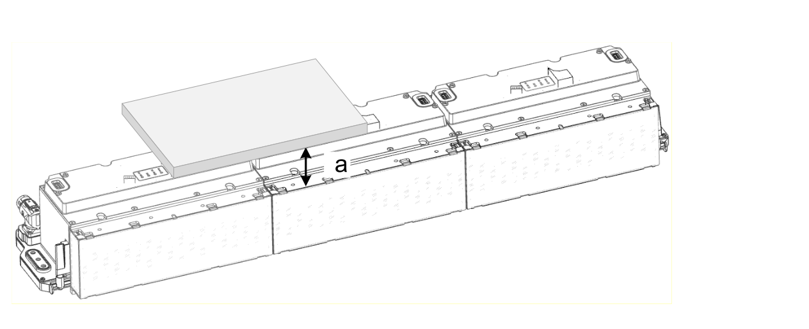

# Unmounting a Segment With Little Free Space Above It

## Overview

If there is less than 70 mm (2.75 inches) of free space (**a**) above a segment you want to unmount, for example, because there is a machine part there, you must first unmount a neighboring segment.

## Unmounting the Segment

| Step | Action |
| --- | --- |
| 1 | Unscrew and remove a neighboring segment (**b**). |
| 2 | Unscrew the segment you want to unmount. |
| 3 | Ensure there is about 40 mm (1,57 in) of space at the top, then lift the segment (**c**) upwards out of the power connection. |
| 4 | Move the segment sideways (**d**) to the position where you previously removed the first segment. |
| 5 | You can now remove (**e**) the segment. |

EIO0000004637.09