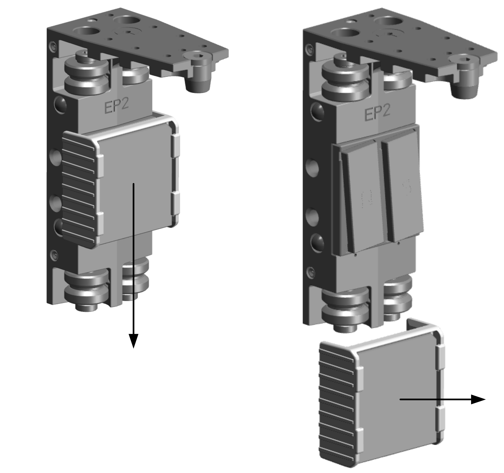

# Mounting a Lexium™ MC12 carrier

## Overview

NOTE: Exposed or uninstalled carriers must have the protective cover of the drive magnets installed at all times. The cover is only removed at the time of carrier installation.

* Carriers have strong local magnetic fields. Refer to [Transporting the Lexium™ MC12 carriers](TransportAndStorage-5F99D6F3.html#TransportAndStorage-5F99D6F3__TransportingThe-832E29D6).
* The carriers have strong drive magnets and can attract metal objects that are in their proximity.
* A carrier can move suddenly and fast due to magnetic attraction.

| WARNING | |
| --- | --- |
|  | Strong MAGNETIC FIELDS  * Keep persons with medical implants (for example, pacemakers or metal implants) or metallic body jewelry away from the carriers and segments with a minimum distance of 30 cm (11.9 in). * Always leave the protective cover of the drive magnets in place for all exposed or uninstalled carriers. * Do not put your hands or fingers between the carriers and segments. * Do not place metallic tools in the vicinity of the carriers and segments. * Do not place electromagnetically sensitive devices near the carriers and segments. * Do not place credit cards or electronic/magnetic media in the vicinity of the carriers and segments.  Failure to follow these instructions can result in death, serious injury, or equipment damage. |

The carrier has two magnets which, together with the magnetic fields in the segments, move the carrier on the track. These two magnets are glued onto the carrier. A shock to the carrier can cause the glued-on magnets to flake off and the magnets can splinter.

In addition, the carrier has an encoder magnet. This can be demagnetized by improper handling, for example, if the magnets of another carrier come too close.

| WARNING | |
| --- | --- |
|  | INOPERABLE EQUIPMENT  * Do not drop the carrier. * Do not strike the carrier. * Keep a minimum distance of 50 mm (1.97 in) between the encoder magnet and other magnets. * Ensure to fill the lubrication reservoirs of the carriers before first use.  Failure to follow these instructions can result in death, serious injury, or equipment damage. |

For information on filling the lubrication reservoirs refer to [Filling the Lubrication Reservoirs](TPC_MLS-HWG_Lubrication_Carrier-87476023.html#TPC_MLS-HWG_Lubrication_Carrier-87476023__RefillingTheLubricationReservoirs-874ABAF0).

## Mounting

NOTE: Exposed or uninstalled carriers must have the protective cover of the drive magnets installed at all times. The cover is only removed at the time of carrier installation.

| Step | Action | |
| --- | --- | --- |
| 1 | Install the protective cover of the drive magnets by sliding it onto the magnets if it is not already installed. | |
| 2 | Fill the lubrication reservoirs of the carriers before first use. Refer to [Filling the Lubrication Reservoirs](TPC_MLS-HWG_Lubrication_Carrier-87476023.html#TPC_MLS-HWG_Lubrication_Carrier-87476023__RefillingTheLubricationReservoirs-874ABAF0). | |
| 3 | Attach the Lexium™ MC carrier handling tool to the carrier.  NOTE: The Lexium™ MC carrier handling tool consists of two identical parts.  Push the guide bolt (**a**) of the first part of the Lexium™ MC carrier handling tool from the right through the carrier.  Push the guide bolt (**b**) of the second part of the Lexium™ MC carrier handling tool from the left through the carrier.  NOTE: The right and the left part of the Lexium™ MC carrier handling tool are secured by circlips at the upper end of the guide bolts. | |
| 4 | Remove the protective cover of the drive magnets by sliding it from the magnets. For more details, refer to [Removing the Protective Cover of the Drive Magnets](#MountingCarrier-B69855A0__RemovingTheProtectiveCoverOfTheDriv-09755CCE). | |
| 5 | Place the upper and lower guide grooves (**c**) of the Lexium™ MC carrier handling tool on the upper and lower rails. | |
| 6 | Swivel the Lexium™ MC carrier handling tool with the carrier towards the segment until the carrier is magnetically attracted to the segment (**d**).  **Result**: The two upper rollers (**e**) and the two lower rollers (**f**) of the carrier are positioned on the rails. The carrier can be moved manually along the rails. | |
| 7 | Disassemble the Lexium™ MC carrier handling tool from the Lexium™ MC12 carrier. | |

## **Removing the Protective Cover of the Drive Magnets**

Remove the protective cover of the drive magnets by sliding it from the magnets.

EIO0000004637.09