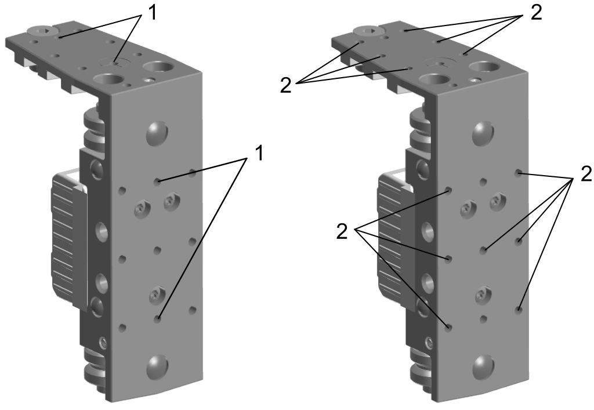
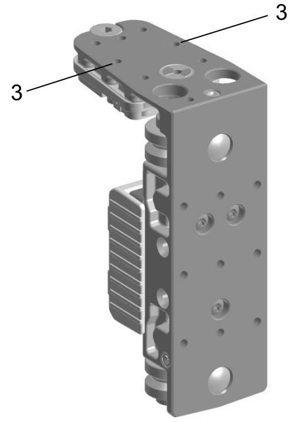

# Mounting the Tools on the Lexium™ MC12 carrier

## Overview

You must design tools suitable for your application and install the tools on the Lexium™ MC12 carriers to transport your products within your track.

* Your products must be held properly by the tools so that the products do not move on the carriers or slide down from the carriers during the acceleration and deceleration movements.
* Distribute the load of the products and tools symmetrically on the Lexium™ MC12 carriers to allow maximum acceleration/deceleration and velocity of the Lexium™ MC12 carriers.

NOTE: Exposed or uninstalled carriers must have the protective cover of the drive magnets installed at all times. The cover is only removed at the time of carrier installation.

* Carriers have strong local magnetic fields. Refer to [Transporting the Lexium™ MC12 carriers](TransportAndStorage-5F99D6F3.html#TransportAndStorage-5F99D6F3__TransportingThe-832E29D6).
* The carriers have strong drive magnets and can attract metal objects that are in their proximity.
* A carrier can move suddenly and fast due to magnetic attraction.

* Use a device such as a sensor to identify the carrier and the type of tool mounted on the carrier to help prevent collisions.

| WARNING | |
| --- | --- |
|  | Strong MAGNETIC FIELDS  * Keep persons with medical implants (for example, pacemakers or metal implants) or metallic body jewelry away from the carriers and segments with a minimum distance of 30 cm (11.9 in). * Always leave the protective cover of the drive magnets in place for all exposed or uninstalled carriers. * Do not put your hands or fingers between the carriers and segments. * Do not place metallic tools in the vicinity of the carriers and segments. * Do not place electromagnetically sensitive devices near the carriers and segments. * Do not place credit cards or electronic/magnetic media in the vicinity of the carriers and segments.  Failure to follow these instructions can result in death, serious injury, or equipment damage. |

The carrier has two magnets which, together with the magnetic fields in the segments, move the carrier on the track. These two magnets are glued onto the carrier. A shock to the carrier can cause the glued-on magnets to flake off and the magnets can splinter.

In addition, the carrier has an encoder magnet. This can be demagnetized by improper handling, for example, if the magnets of another carrier come too close.

| WARNING | |
| --- | --- |
|  | INOPERABLE EQUIPMENT  * Do not drop the carrier. * Do not strike the carrier. * Keep a minimum distance of 50 mm (1.97 in) between the encoder magnet and other magnets. * Ensure to fill the lubrication reservoirs of the carriers before first use.  Failure to follow these instructions can result in death, serious injury, or equipment damage. |

For information on filling the lubrication reservoirs refer to [Filling the Lubrication Reservoirs](TPC_MLS-HWG_Lubrication_Carrier-87476023.html#TPC_MLS-HWG_Lubrication_Carrier-87476023__RefillingTheLubricationReservoirs-874ABAF0).

## Mounting Options

1. A Lexium™ MC12 carrier provides two fitting holes (diameter: 4.02 mm ±0.01 mm (0.1583 in ±0.0004 in); depth: 6.00 mm ±0.1 (0.2362 in ±0.0039 in)) on the short angle arm of the carrier and two fitting holes on the long angle arm of the carrier.

   Use these fitting holes (**1**) to align your tool with the carrier.
2. The Lexium™ MC12 carrier provides six M5 threaded holes (hole depth 10 mm/0.39 in) on the short angle arm of the carrier and seven M5 threaded holes (hole depth 10 mm/0.39 in) on the long angle arm of the carrier.

   Use these threaded holes (**2**) to fix your tool on the carrier.

   Tighten the fixing screws. Maximum tightening torque is 5.9 Nm (52.2 lbf-in).

NOTE: On a Lexium™ MC12 Smart Carrier, two of the six M5 threaded holes on the short angle arm are used for the screws holding the electronics of the Smart Carrier. Therefore, you cannot use these two holes (**3**) for the screws holding your tool on the carrier.

EIO0000004637.09