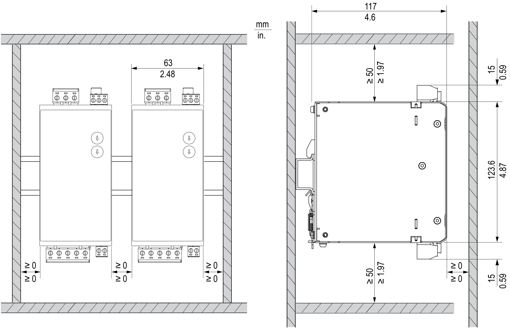
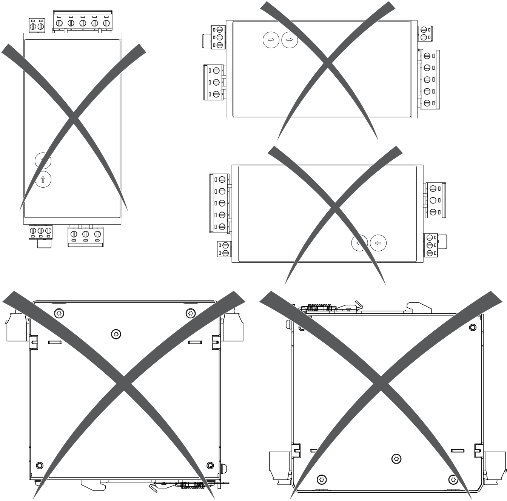
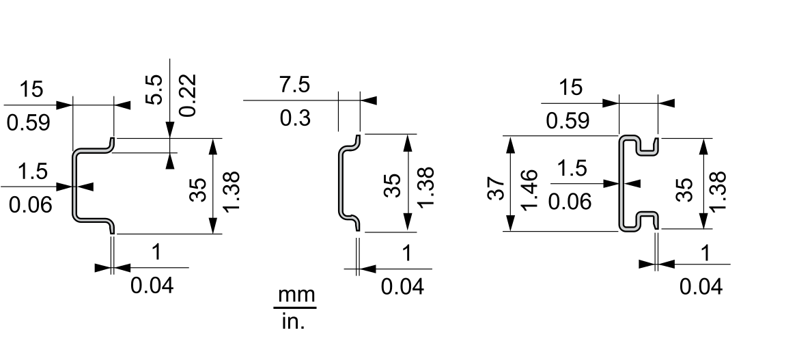

# Mounting/Unmounting the Lexium™ MC connection module

## Overview

The Lexium™ MC connection module must be installed in a control cabinet with degree of protection greater or equal to IP54.

## Preparing the Control Cabinet

| Step | Action |
| --- | --- |
| 1 | If necessary to maintain and respect the maximum ambient operating temperature, install an additional fan in the control cabinet. |
| 2 | Do not block the fan air inlet of the product. |
| 3 | Observe tolerances as well as distances to the cable channels and adjacent braking resistors or other heat producing equipment. |

## Required Distances

Keep a distance of at least 50 mm (1.97 in) above and below the Lexium™ MC connection module.

NOTE: Do not lay any cables or cable channels over the Lexium™ MC connection module.

## Not Allowed Mounting Positions

Do not mount the Lexium™ MC connection module in any of the following mounting positions:

## DIN Rails

The Lexium™ MC connection module can be mounted on various DIN rails. The DIN rails are not included in the scope of delivery of the Lexium™ MC connection module.

DIN rail examples:

## Mounting/Unmounting the Lexium™ MC connection module

| Step | Action |
| --- | --- |
| 1 | Place the upper guide groove of the Lexium™ MC connection module on the DIN rail. |
| 2 | Swivel the Lexium™ MC connection module towards the DIN rail until the lower guide groove engages. |
| 3 | To remove the Lexium™ MC connection module from the DIN rail, insert a screwdriver into the hole in the bottom locking tab and swivel the screwdriver to the Lexium™ MC connection module.  **Result**: The Lexium™ MC connection module is mechanically unlocked. |
| 4 | Swing the Lexium™ MC connection module up and remove it from the DIN rail. |

EIO0000004637.09