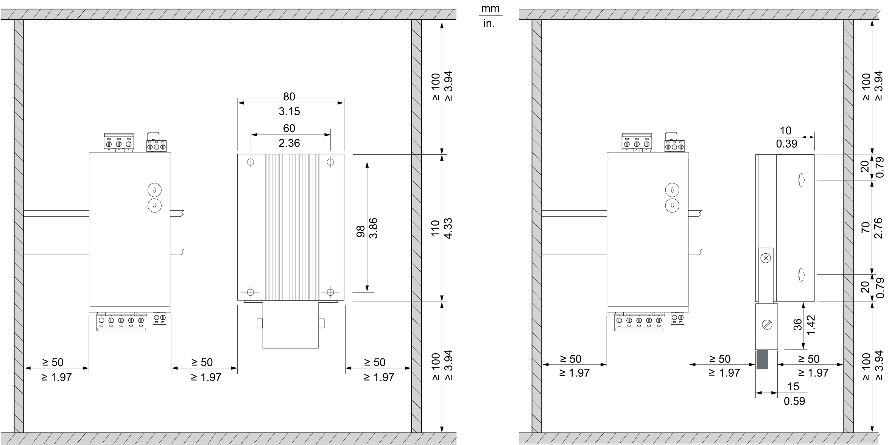
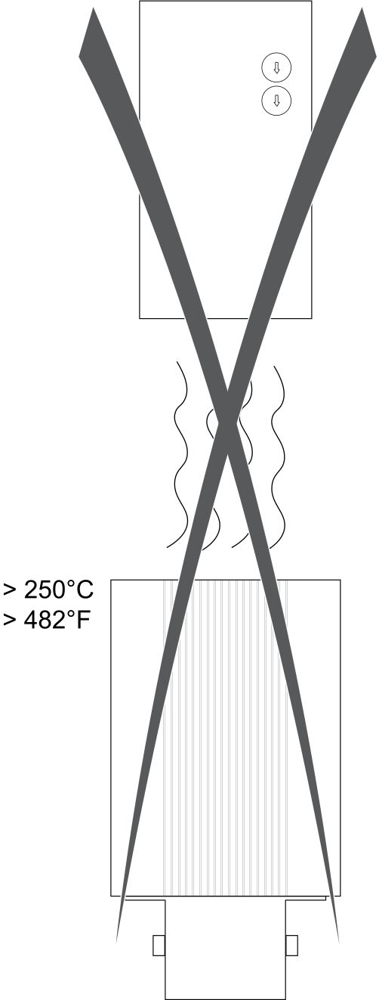
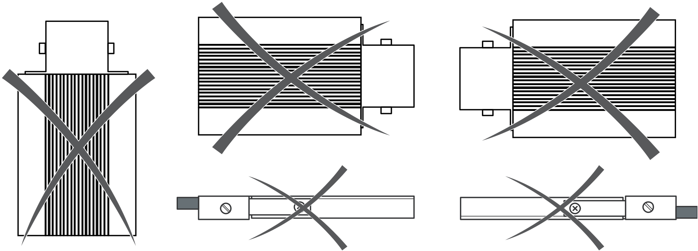

# Mounting the External Braking Resistor

## Preparing the Control Cabinet

During operation, the surface temperature of the external braking resistor may exceed 250 °C (482 °F).

| DANGER | |
| --- | --- |
|  | **EXTREMELY HOT SURFACES**  * Do not make unprotected contact with the surfaces of the external braking resistor. * Keep all flammable or heat-sensitive materials away from the external braking resistor. * Verify that the heat dissipation is sufficient by performing a test run under maximum load conditions.  Failure to follow these instructions will result in death or serious injury. |

| Step | Action |
| --- | --- |
| 1 | If necessary to maintain and respect the maximum ambient operating temperature, install an additional fan in the control cabinet. |
| 2 | Do not block the fan air inlet of the product. |
| 3 | Observe tolerances as well as distances to the cable channels and adjacent braking resistors or other heat producing equipment. |

## Required Distances

* Keep a distance of at least 100 mm (3.94 in) above and below the external braking resistor.
* Keep a distance of at least 50 mm (1.97 in) to the right and left of the external braking resistor.

NOTE: Do not lay any cables or cable channels over the external braking resistor.

## Not Allowed Mounting Positions

Do not mount the external braking resistor below another device.

Do not mount the external braking resistor in any of the following mounting positions.

## Mounting the External Braking Resistor

The following options are available for mounting the external braking resistor:

* Four through holes in the corners of the external braking resistor (**1**).
* Mounting bracket supplied with the external braking resistor (**2**).

EIO0000004637.09