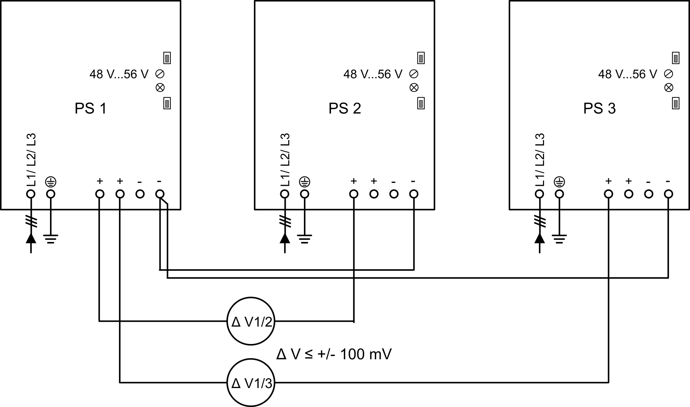
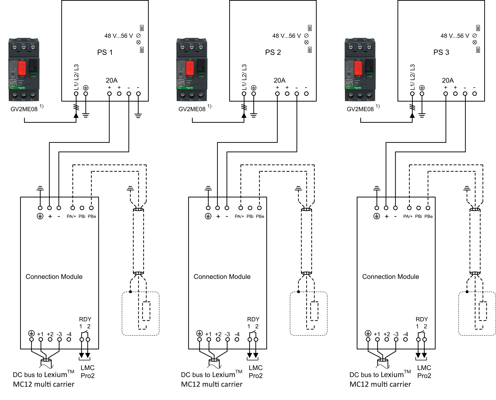
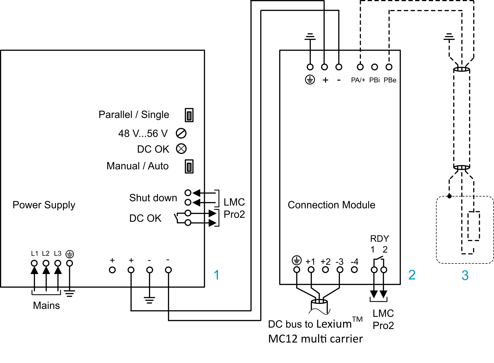
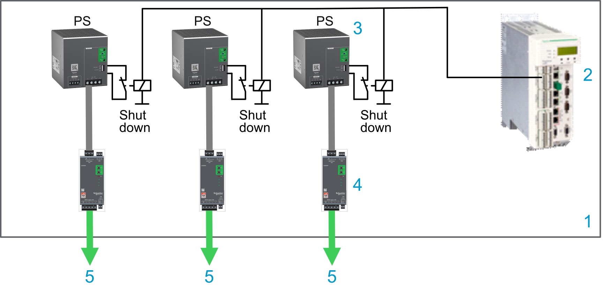

# Power Supply

## Overview

* The power supplies feed the Lexium™ MC12 multi carrier track. For each power supply, you must place a Lexium™ MC connection module between the power supply output and the Lexium™ MC12 multi carrier track.

  Up to a maximum of three power supply/Lexium™ MC connection module combinations can be used in parallel. If more than three power supplies are required, the track must be divided into power groups that are powered separately. For how to define power groups, refer to the different power interconnects ([Lexium™ MC power interconnects / Power disconnector](ProductOverview-5A703DB5.html#ProductOverview-5A703DB5__section-135-5B04316E)).

  The universal power supply ABLU3A48200 is designed to handle the back feed voltage (braking voltage) from the Lexium™ MC12 multi carrier track during the braking phase. Refer to [Connecting a Braking Resistor (CN2)](ConnectionModule-74374974.html#ConnectionModule-74374974__ConnectionBrakingResistorCN2-9099E2FD).
* For how to dimension the power supplies, refer to [System Planning](SystemPlanning-6D8A3A34.html#SystemPlanning-6D8A3A34).

| CAUTION | |
| --- | --- |
|  | INOPERABLE EQUIPMENT  * Do not connect the DC bus of the Lexium™ MC12 multi carrier track directly to the power supply. * Always connect the DC bus through the Lexium™ MC connection module.  Failure to follow these instructions can result in injury or equipment damage. |

NOTE: Only use power supplies that are approved for use by Schneider Electric. Refer to [Technical Data for Power Supply](MechanicalData-5F95A173.html#MechanicalData-5F95A173__TechnicalDataFor-6D7D8BA3).

Also refer to [Technical Data for Power Supply](MechanicalData-5F95A173.html#MechanicalData-5F95A173__TechnicalDataFor-6D7D8BA3) and [Information About Power Supply/Connection Module](TPC_MLS-HWG_Info_PowerSupply_CM-9209C109.html).

## Status LEDs/Switches/Potentiometer

The universal power supply ABLU3A48200 provides a status LED, switches, and a potentiometer. (Also refer to [Technical Data for Power Supply](MechanicalData-5F95A173.html#MechanicalData-5F95A173__TechnicalDataFor-6D7D8BA3)).

| Component | Description |
| --- | --- |
| LED **DC OK**  (output status LED) | Steady on (green): The adjusted output voltage is available.  Flashing (green): The power supply is in power boost or overload.  Steady on (red): The power supply is in overtemperature.  Flashing (red): The power supply has detected an overvoltage.  Flashing (green/red): The power supply is in shut down mode. |
| Switch  (**Parallel** / **Single**) | Set to **Parallel** when the power supplies are connected in parallel to increase the output power.  NOTE: If you use several power supplies in parallel, the output voltage of all power supplies must be set to the same value (default value = 48 Vdc). |
| Switch  (**Manual** / **Auto**) | Set to **Auto** for automatic return to rated power supply operation once the overload has been corrected. |
| Potentiometer  (**48 V...56 V**) | Output voltage (48 Vdc = nominal value for the Lexium™ MC12 multi carrier) |

For a detailed description, refer to the ABLU3A48200 Universal Power Supply, Instruction Sheet.

## Voltage Adjustment for Parallel Operation of Power Supplies

If only one power supply per power group is used, the switch at the power supply has to be set to **Single**.

For two or three power supplies in parallel, the switches at the power supplies have to be set to **Parallel**.

If you use several power supplies in parallel, the output voltage of all power supplies must be adjusted to the same value (≤ +/- 100 mV). It is important to maintain an even load.

The following diagram shows a circuit for adjusting the output voltages of several power supplies.

Proceed in the following way:

| Step | Action |
| --- | --- |
| 1 | Connect the power supplies to the mains. **L1**, **L2**, **L3**, **PE** (protective ground/earth). |
| 2 | Connect the negative output voltage terminal of power supply 1 to the negative output voltage terminals of the power supplies 2 and 3 for the purposes of calibrating the voltage of the supplies. |
| 3 | Power on the parallel power supplies.  NOTE: The power supplies connected in parallel must be powered on at the same time. Use one contactor or power on the mains. |
| 4 | Measure the voltage difference between the positive output voltage terminal of the power supply 1 and the positive output voltage terminal of the power supply 2 and adjust the output voltage of power supply 2 to the same voltage as that of power supply 1 (the measured voltage difference must be less than +/- 100 mV). Use the potentiometer **48 V...56 V** to adjust the voltage. |
| 5 | Measure the voltage difference between the positive output voltage terminal of the power supply 1 and the positive output voltage terminal of the power supply 3 and adjust the output voltage of power supply 3 to the same voltage as that of power supply 1 (the measured voltage difference must be less than +/- 100 mV). |
| 6 | Power off the parallel power supplies. |
| 7 | Remove the connections of the negative output voltage terminal of power supply 1 to the negative output voltage terminals of power supplies 2 and 3. |
| 8 | For further steps, refer to [Connecting the Power Supply to the Lexium™ MC connection module](#PowerSupply-743793A5__ConnectingThePowerSupplyToThe-EE31CD24). |

To ensure an equal load on the power supplies connected in parallel, the power cables in the same power group must have the same length.

| NOTICE | |
| --- | --- |
|  | INOPERABLE EQUIPMENT  Use the same length of power cables to the connection modules when using parallel power supplies.  Failure to follow these instructions can result in equipment damage. |

## Wiring Power Groups (Example)

The following must be observed when installing power groups:

* The output voltage of all power supplies must be adjusted to the same value.
* The switches at the power supplies must be set to **Parallel**.

  Refer to section [Voltage Adjustment for Parallel Operation of Power Supplies](#PowerSupply-743793A5__ParallelOperationOfPowerSupplies-EE2FB9D8).

The DC bus of the power supplies is connected in parallel by the power interconnects on the Lexium™ MC12 multi carrier track.

1) GV2ME08 is an example. Refer to the documentation of the power supply for protection devices.

## Fusing the Mains Connection

* Depending on the power supplies you use, you must install appropriate fuses and circuit breakers for the power supplies.
* Do not short circuit or overload the power supplies.
* If you use two or three power supplies in parallel, set the respective switch at the power supplies to **Parallel** and adjust the output voltage of the power supplies to an identical value.
* Connect the **DC OK** relay contact to the PacDrive LMC Pro2 Motion Controller for diagnostic purposes.
* If application requirements or your risk analysis dictates, ensure that the PacDrive LMC Pro2 Motion Controller can de-energize the power supplies in case of an error detected in the Lexium™ MC12 multi carrier track or the Lexium™ MC connection module.

NOTE: The power supplies, the mains connection of the power supplies and their fusing are not part of the Schneider Electric scope of delivery. Installation, fusing, and so on, must be in accordance with the specifications of the power supply manufacturer. Also refer to [Technical Data for Power Supply](MechanicalData-5F95A173.html#MechanicalData-5F95A173__TechnicalDataFor-6D7D8BA3).

| DANGER | |
| --- | --- |
|  | HAZARD OF ELECTRIC SHOCK, EXPLOSION, OR ARC FLASH  * Disconnect all power from all equipment including connected devices prior to removing any covers or doors, or installing or removing any accessories, hardware, cables, or wires except under the specific conditions specified in the appropriate hardware guide for this equipment. * Always use a properly rated voltage sensing device to confirm the power is off where and when indicated. * Replace and secure all covers, accessories, hardware, cables, and wires and confirm that a proper ground connection exists before applying power to this equipment. * Use only the specified voltage when operating this equipment and any associated equipment.  Failure to follow these instructions will result in death or serious injury. |

## Connecting the Power Supply to the Lexium™ MC connection module

**1** Power supply (refer to [Technical Data for Power Supply](MechanicalData-5F95A173.html#MechanicalData-5F95A173__TechnicalDataFor-6D7D8BA3))

**2** Lexium™ MC connection module

**3** Optional external braking resistor with over temperature switch (optional) and heat sink

NOTE: To use the internal braking resistor, jumper **PA/+** to **PBi**.

| Step | Action |
| --- | --- |
| 1 | Remove power from the supply voltages. Respect the safety instructions concerning electrical installation. |
| 2 | Verify that no voltages are present. |
| 3 | Set the switch **Parallel** / **Single** to the required position (refer to [Status LEDs/Switches/Potentiometer](#PowerSupply-743793A5__StatusLEDsSwitches-94B58BCE)) |
| 4 | Set the potentiometer: **48 V...56 V** to 48 Vdc (default output value for the Lexium™ MC12 multi carrier)  NOTE: If you use several power supplies in parallel, the output voltage of all power supplies must be set to the same value (48 Vdc). Refer to [Voltage Adjustment for Parallel Operation of Power Supplies](#PowerSupply-743793A5__ParallelOperationOfPowerSupplies-EE2FB9D8). |
| 5 | Connect the **PE** (protective ground/earth) terminal of the Lexium™ MC connection module to the **PE** (protective ground/earth) of the cabinet. |
| 6 | Connect one negative output voltage terminal of the power supply to the **PE** (protective ground/earth) of the cabinet.  NOTE: For each group of power supplies (up to three) only the negative output voltage terminal of power supply 1 is connected to the **PE** (protective ground/earth) of the cabinet. |
| 7 | Connect the positive output voltage terminal of the power supply to the positive output voltage terminal of the Lexium™ MC connection module. |
| 8 | Connect one negative output voltage terminal of the power supply to the negative output voltage terminal of the Lexium™ MC connection module. |
| 9 | Connect the **DC OK** relay contact of the power supply to the PacDrive LMC Pro2 Motion Controller for diagnostic purposes. Refer to [Wiring Example (DC OK + RDY)](#PowerSupply-743793A5__WiringExampleDCOk-B26EC187). |
| 10 | Connect the **Shut down** digital input of the power supply to the PacDrive LMC Pro2 Motion Controller so that the PacDrive LMC Pro2 Motion Controller can de-energize the power supply in case of an error detected in the Lexium™ MC12 multi carrier or the Lexium™ MC connection module. Refer to [Wiring Example (Shut Down)](#PowerSupply-743793A5__WiringExampleShutDown-B26EC2D3). |

## Monitoring of Lexium™ MC12 multi carrier Components

* The PacDrive LMC Pro2 Motion Controller receives status and diagnostic information from the segments and carriers via the Sercos bus.
* To monitor the status of the power supplies, connection modules and the external braking resistors, you can connect the respective signal contacts to the inputs of the PacDrive LMC Pro2 Motion Controller. Refer to [Wiring Example (DC OK + RDY)](#PowerSupply-743793A5__WiringExampleDCOk-B26EC187).

  + Power supplies: **DC OK**
  + Connection modules: **RDY**
  + Braking resistor: Over temperature switch (optional)
* In the event of a detected error on the output voltage, the power supplies can be de-energized via the **Shut down** input or, alternatively, the power supplies can be powered off on the input side via a contactor. Refer to [Wiring Example (Shut Down)](#PowerSupply-743793A5__WiringExampleShutDown-B26EC2D3).

  Also refer to [Coast Down Time of Carriers](Desig_Safety_Func-9CDD3608.html#Desig_Safety_Func-9CDD3608__CoastDownTimeOfCarriers-CAA84227).

## Wiring Example (DC OK + RDY)

| Element | Description |
| --- | --- |
| 1 | Control cabinet |
| 2 | PacDrive LMC Pro2 Motion Controller |
| 3 | Power supply with **DC OK** relay contact |
| 4 | Lexium™ MC connection module with **RDY** relay Normally Open (NO) output |
| 5 | External braking resistor with over temperature switch (optional) |
| 6 | DC bus to the Lexium™ MC12 multi carrier track |

## Wiring Example (Shut Down)

| Element | Description |
| --- | --- |
| 1 | Control cabinet |
| 2 | PacDrive LMC Pro2 Motion Controller |
| 3 | Power supply with **Shut down** digital input  NOTE: This input must not be controlled directly with a 24 Vdc signal. It must be controlled via a potential-free contact. |
| 4 | Lexium™ MC connection module |
| 5 | DC bus to the Lexium™ MC12 multi carrier track |

EIO0000004637.09