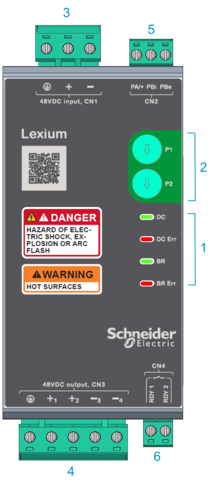
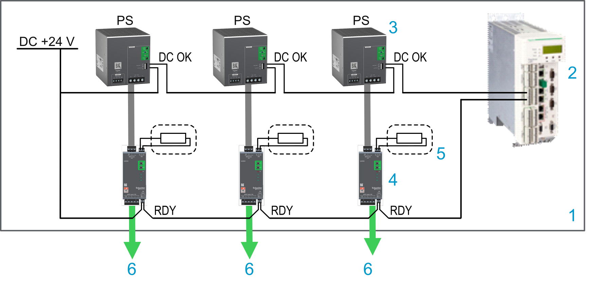

# Lexium™ MC connection module

## Overview

* The power supplies feed the Lexium™ MC12 multi carrier track. For each power supply, you must place a Lexium™ MC connection module between the power supply output and the Lexium™ MC12 multi carrier track.
* Up to a maximum of three power supply/Lexium™ MC connection module combinations can be used in parallel. If more than three power supplies are required, the track must be divided into power groups that are powered separately. For how to define power groups, refer to the different power interconnects ([Lexium™ MC power interconnects / Power disconnector](ProductOverview-5A703DB5.html#ProductOverview-5A703DB5__section-135-5B04316E)).
* The Lexium™ MC connection module supplies the Lexium™ MC12 multi carrier track with power (DC bus).

  The Lexium™ MC connection module limits the DC bus voltage to <60 Vdc, conforming to Functional Safety rules. Refer to [Scope of Operation (Designated Safety Function)](Desig_Safety_Func-9CDD3608.html#Desig_Safety_Func-9CDD3608__DesignatedSafetyFunctionSafeForceOf-9CE0EAF3).

Also refer to:

* [Technical Data for Lexium™ MC connection modules](MechanicalData-5F95A173.html#MechanicalData-5F95A173__TechnicalDataFor-6D7D83FC)
* [Information About Power Supply/Connection Module](TPC_MLS-HWG_Info_PowerSupply_CM-9209C109.html)
* [Connecting the Connection Module to the Track](TPC_MLS-HWG_Connecting_CM_Track-92133D3C.html#TPC_MLS-HWG_Connecting_CM_Track-92133D3C)

| Element | Description |
| --- | --- |
| 1 | Status LEDs (**DC**, **DC Err**, **BR**, **BR Err**). Refer to [Status LEDs](#ConnectionModule-74374974__StatusLEDs-743BDAE6). |
| 2 | Rotary switches (**P1, P2**) for the braking resistors and voltage level. Refer to [Switches](#ConnectionModule-74374974__Switches-743CBC69). |
| 3 | **CN1**: 48 Vdc input from power supply (**PE** connection, **+, -**) |
| 4 | **CN3**: 48 Vdc output to the Lexium™ MC12 multi carrier track (**PE** connection, **+1**, **+2**, **-3**, **-4**) |
| 5 | **CN2**: Connection for braking resistor (**PA/+**, **PBi**, **PBe**)  Also refer to [Connecting a Braking Resistor (CN2)](#ConnectionModule-74374974__ConnectionBrakingResistorCN2-9099E2FD). |
| 6 | **CN4**: Ready relay, Normally Open (NO) output (**RDY 1, RDY 2)**.  Connect this relay output to the PacDrive LMC Pro2 Motion Controller for diagnostic purposes. Refer to [Wiring Example (RDY)](#ConnectionModule-74374974__WiringExampleRDY-B273B115). |

## Connectors

| Connector | Description | Wire cross section  [mm2 (AWG)] | Stripped wire length  [mm (in)] | Tightening torque  [Nm (lbf-in)] | Screw driver style  [mm (in)] |
| --- | --- | --- | --- | --- | --- |
| **CN1** | 48 Vdc input from power supply | 4.0 (12) | 7 (0.28) | 0.5 (4.5) | Slotted,  3.5 (0.14) |
| **CN3** | 48 Vdc output to the Lexium™ MC12 multi carrier track |
| **CN2** | Connection for braking resistor (**PA/+**, **PBi**, **PBe**)  The connection module is delivered with a jumper between **PA/+** and **PBi**. This means that the internal braking resistor is used by default. | 1.0 - 2.5 (18 - 14) |
| **CN4** | Ready relay, Normally Open (NO) output (**RDY 1, RDY 2)** | 0.25 - 2.5 (24 - 14) |

## Wiring Example (RDY)

| Element | Description |
| --- | --- |
| 1 | Control cabinet |
| 2 | PacDrive LMC Pro2 Motion Controller |
| 3 | Power supply |
| 4 | Lexium™ MC connection module with **RDY** relay Normally Open (NO) output |
| 5 | External braking resistor (optional) |
| 6 | DC bus to the Lexium™ MC12 multi carrier track |

## Status LEDs

Refer to [connection module above](#ConnectionModule-74374974__CM_Graphic_DCDCEr-FD3C8366).

| Name | Color | Description | On | Slow flashing 2 Hz (1) | Fast flashing 4 Hz (1) |
| --- | --- | --- | --- | --- | --- |
| **DC** | Green | DC bus status | Steady on: Input supply OK, 40.8...60 Vdc | Undervoltage | Overvoltage |
| **DC Err** | Red | General error detected | Steady on: Track could not be charged | Undervoltage during operation detected, stored | Incorrect setting of switches |
| **BR** | Green | Braking resistor activated | On for ≥ 500 ms: Braking resistor is activated | – | –(2) |
| **BR Err** | Red | Braking resistor overload / short circuit | Steady on: Braking resistor short circuit | Braking resistor connection supervision (3) | Braking resistor overload (I2t) |
| **(1)** Switch off input voltage to acknowledge an error state:   * Wait until input voltage < 7 Vdc or * Wait ≥ 30 s   **(2)** Invalid voltage selection on the Lexium™ MC connection module.  **(3)** Braking resistor connection supervision:   * Internal braking resistor selected, but not connected * External braking resistor selected, but internal braking resistor connected * Internal transistor for braking error detected | | | | | |

## Switches

Use the rotary switches (**P1, P2**) to set the parameters for the braking resistors. Refer to [connection module](#ConnectionModule-74374974__CM_Graphic_DCDCEr-FD3C8366) above.

In the delivery state, both switches are set to the value zero.

Modifying the switch positions of P1 / P2 during operation may result in high temperatures and damage of the connection module and the braking resistor after the next power cycle of the module.

| WARNING | |
| --- | --- |
|  | UNINTENDED EQUIPMENT OPERATION  Do not put the connection module into service before the settings of the switches are established and verified.  Failure to follow these instructions can result in death, serious injury, or equipment damage. |

| P1 (type) | Braking resistor type | P\_Braking resistor [W] | R\_Braking resistor [Ω] | Pulse energy capacity [J] |
| --- | --- | --- | --- | --- |
| 0 | Internal (default) | 10 | 1.56 | 60 |
| 2 | External | 50 1) | 3.0 | 4000 |
| 4 | External | 100 | 3.0 | 4000 |
| 6 | External | 100 1) | 1.5 2) | 8000 |
| 8 | External | 200 | 1.5 2) | 8000 |
| 1, 3, 5, 7, 9...E | Not allowed. An error is indicated. | – | – | – |
| F | Not allowed (special mode) | – | – | – |
| P\_Braking = Continuous power value  R\_Braking = Resistance value  1) In this switch position, the continuous power is reduced to 50%, resulting in a lower surface temperature.  2) Two external 3 Ω braking resistors in parallel for higher peak and continuous power. | | | | |

For the external braking resistor (LXMMCABR120S100), also refer to [Technical Data for Lexium™ MC braking resistor](MechanicalData-5F95A173.html#MechanicalData-5F95A173__TechnicalDataForLexiumMCBrakingResi-298979E9).

| P2 (level) | Braking resistor voltage | V\_BR0 [V] | V\_BR1 [V] |
| --- | --- | --- | --- |
| 0 | Increasing with load (default) | 52 | 56 |
| 1 | Increasing with load | 54 | 58 |
| 2 | Increasing with load | 56 | 60 |
| 3 | Constant | 54 | 54 |
| 4 | Constant | 56 | 56 |
| 5 | Constant | 58 | 58 |
| 6 | Constant | 60 | 60 |
| 7...E | Not allowed. An error is indicated. | – | – |
| F | Not allowed. Braking resistor will be permanently off. | – | – |
| Dynamic load-dependent switch-on threshold for the braking resistor:  **V\_BR0** = Switch-on threshold value when the braking resistor is not yet loaded  **V\_BR1** = Switch-on threshold value when the braking resistor is fully loaded at its power limit | | | |

## Connecting a Braking Resistor (CN2)

NOTE: The required braking resistor must be calculated depending on the desired braking capability and characteristics of your application. Refer to [Dimensioning the Braking Resistor and the Interconnects](SystemPlanning-6D8A3A34.html#SystemPlanning-6D8A3A34__DimensioningTheBrakingResistorAndTh-B1EFB8D0). For setting the parameters for the braking resistor, refer to [Switches](#ConnectionModule-74374974__Switches-743CBC69).

An insufficiently rated braking resistor can cause overvoltage on the DC bus. Overvoltage on the DC bus causes the power stage to be disabled. The system is no longer actively decelerated.

| WARNING | |
| --- | --- |
|  | UNINTENDED EQUIPMENT OPERATION  * Verify that the braking resistor has a sufficient rating by performing a test run under maximum load conditions. * Verify that the parameter settings for the braking resistor are correct.  Failure to follow these instructions can result in death, serious injury, or equipment damage. |

During operation, the surface temperature of the housing of the Lexium™ MC connection module may exceed 70 °C (158 °F).

| WARNING | |
| --- | --- |
|  | HOT SURFACES  * Avoid unprotected contact with hot surfaces. * Do not allow flammable or heat-sensitive parts in the immediate vicinity of hot surfaces. * Verify that the heat dissipation is sufficient by performing a test run under maximum load conditions.  Failure to follow these instructions can result in death, serious injury, or equipment damage. |

**Internal braking resistor**

A braking resistor is integrated in the Lexium™ MC connection module to absorb braking energy. The Lexium™ MC connection module is shipped with the internal braking resistor (10 W, continuous power) active (jumper between **PA/+** and **PBi**).

## External Braking Resistor

An external braking resistor is required for applications in which the internal resistor is not able to absorb the braking energy.

Remove the jumper between **PA/+** and **PBi** and connect the external braking resistor between **PA/+** and **PBe**. Refer to [Technical Data for Lexium™ MC braking resistor](MechanicalData-5F95A173.html#MechanicalData-5F95A173__TechnicalDataForLexiumMCBrakingResi-298979E9).

NOTE: Make sure to set switch **P1** to the correct values of the external braking resistor. Refer to [Switches](#ConnectionModule-74374974__Switches-743CBC69). The continuous power must be set to a value less or equal to the continuous power of the external braking resistor (depending on mounting: free air or on heat sink).

During operation, the surface temperature of the external braking resistor may exceed 250 °C (482 °F).

| DANGER | |
| --- | --- |
|  | **EXTREMELY HOT SURFACES**  * Do not make unprotected contact with the surfaces of the external braking resistor. * Keep all flammable or heat-sensitive materials away from the external braking resistor. * Verify that the heat dissipation is sufficient by performing a test run under maximum load conditions.  Failure to follow these instructions will result in death or serious injury. |

**Connecting an external braking resistor**

| DANGER | |
| --- | --- |
|  | HAZARD OF ELECTRIC SHOCK, EXPLOSION, OR ARC FLASH  * Disconnect all power from all equipment including connected devices prior to removing any covers or doors, or installing or removing any accessories, hardware, cables, or wires except under the specific conditions specified in the appropriate hardware guide for this equipment. * Always use a properly rated voltage sensing device to confirm the power is off where and when indicated. * Replace and secure all covers, accessories, hardware, cables, and wires and confirm that a proper ground connection exists before applying power to this equipment. * Use only the specified voltage when operating this equipment and any associated equipment.  Failure to follow these instructions will result in death or serious injury. |

| Step | Action |
| --- | --- |
| 1 | Remove power from the supply voltages. Respect the safety instructions concerning electrical installation. |
| 2 | Verify that no voltages are present. |
| 3 | Remove the jumper between **PA/+** and **PBi** and connect the external braking resistor between **PA/+** and **PBe** to the Lexium™ MC connection module. |
| 4 | If the braking resistor is equipped with an over temperature switch, it can be connected to the PacDrive LMC Pro2 Motion Controller for diagnostic purposes and to de-energize the power supply in case of overheat. Refer to [Wiring Example (Connecting an External Braking Resistor)](#ConnectionModule-74374974__WiringExampleConnectingAnExternalBr-B2F3EEA7) and [Wiring Example (Shut Down)](PowerSupply-743793A5.html#PowerSupply-743793A5__WiringExampleShutDown-B26EC2D3). |
| 5 | Use the switches **P1** and **P2** of the Lexium™ MC connection module to set the braking resistor type and the braking resistor voltage level. Refer to [Switches](#ConnectionModule-74374974__Switches-743CBC69). |

## Monitoring of the Braking Resistor

The braking resistor (internal or external) is monitored by the Lexium™ MC connection module. In case of overload and short circuit, the connection module signals a detected error (**BR Err**, refer to [Status LEDs](#ConnectionModule-74374974__StatusLEDs-743BDAE6)) and opens the **RDY** relay.

## Wiring Example (Connecting an External Braking Resistor)

| Element | Description |
| --- | --- |
| 1 | Control cabinet |
| 2 | PacDrive LMC Pro2 Motion Controller |
| 3 | Power supply |
| 4 | Lexium™ MC connection module |
| 5 | External braking resistor (optional) |
| 6 | DC bus to the Lexium™ MC12 multi carrier track |

EIO0000004637.09