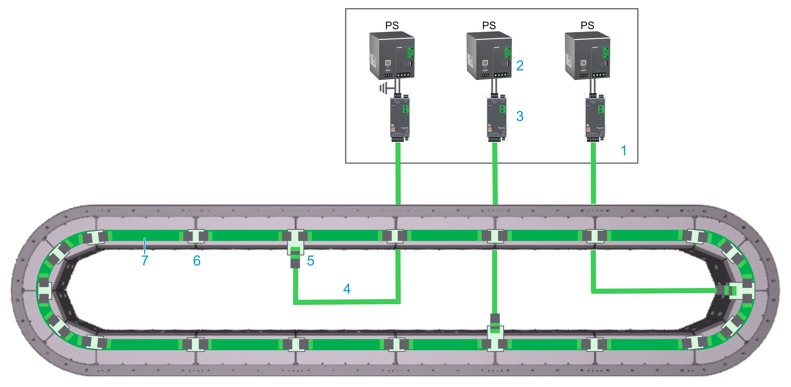
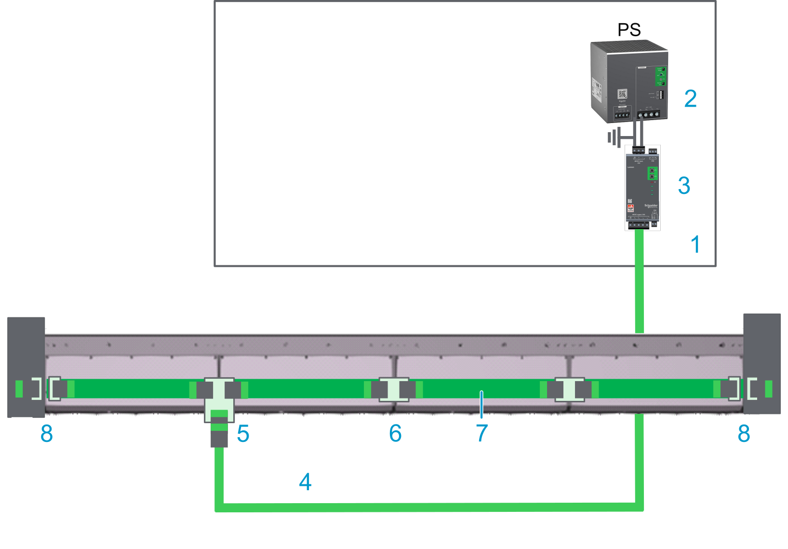
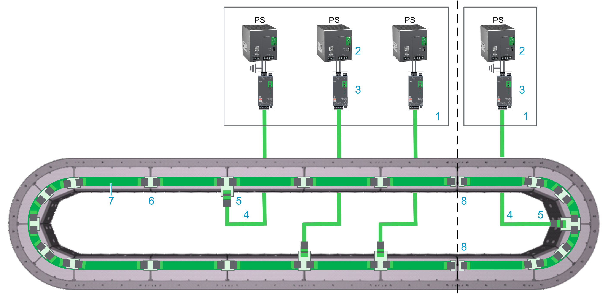

# Connecting the Connection Module to the Track

## Wiring Example

Also refer to [Additional Wiring Examples](#TPC_MLS-HWG_Connecting_CM_Track-92133D3C__AdditionalWiringExamples-AA4A74CD).

**Closed track**

| Element | Description |
| --- | --- |
| 1 | Control cabinet |
| 2 | Power supply |
| 3 | Lexium™ MC connection module |
| 4 | Lexium™ MC power cable with socket connector |
| 5 | Lexium™ MC power interconnect with plug connector |
| 6 | Lexium™ MC power interconnect without connector |
| 7 | Internal DC bus connection |

## Description

* The Lexium™ MC12 multi carrier track is connected to the Lexium™ MC connection module with pre-assembled cables.

  NOTE: The front covers of the segments are not connected to the PE (protective ground/earth). The electrical safety requirements are fulfilled by appropriate insulation measures (protective separation).
* The Lexium™ MC connection module supplies the Lexium™ MC12 multi carrier track with power (DC bus).

  The Lexium™ MC connection module limits the DC bus voltage to <60 Vdc, conforming to Functional Safety rules. Refer to [Scope of Operation (Designated Safety Function)](Desig_Safety_Func-9CDD3608.html#Desig_Safety_Func-9CDD3608__DesignatedSafetyFunctionSafeForceOf-9CE0EAF3).
* The DC bus (up to 60 A) in the Lexium™ MC12 multi carrier track is distributed from segment to segment via the Lexium™ MC power interconnects.
* The Lexium™ MC12 multi carrier requires the power supply to be dimensioned based on the number of segments, segment groups, carriers, load and other relevant parameters.

  Each power supply/Lexium™ MC connection module combination must not exceed 24 segments.

  Also refer to [Information About Power Supply/Connection Module](TPC_MLS-HWG_Info_PowerSupply_CM-9209C109.html).

## Connecting the Lexium™ MC connection module to the Lexium™ MC12 multi carrier Track

The following describes the connection from the Lexium™ MC connection module to the Lexium™ MC12 multi carrier track (refer to [Wiring Example](#TPC_MLS-HWG_Connecting_CM_Track-92133D3C__WiringExample-9218710A)):

| Step | Action |
| --- | --- |
| 1 | Connect the Lexium™ MC power cable to the Lexium™ MC connection module CN3 (**3**) in the wiring example above. |
| 2 | Connect the Lexium™ MC power cable (**4**) to the Lexium™ MC power interconnect (**5**) at the bottom of a segment. Verify that connector of the cable is fixed with its four M3x12 screws to the Lexium™ MC power interconnect, with a torque of 1.2 Nm (10.62 lbf-in). |

## Pinout and Cable Diagram

**Pinout**

Pre-assembled Lexium™ MC power cable. Refer to [Type Code](TypeCode-5B11CE11.html).

Only operate the Lexium™ MC12 multi carrier with approved, specified cables, accessories and replacement equipment by Schneider Electric.

| DANGER | |
| --- | --- |
|  | ELECTRIC SHOCK OR ARC FLASH  Do not use non-Schneider Electric approved cables, accessories or any type of replacement equipment.  Failure to follow these instructions will result in death or serious injury. |

| DANGER | |
| --- | --- |
|  | HAZARD OF ELECTRIC SHOCK, EXPLOSION, OR ARC FLASH  * Disconnect all power from all equipment including connected devices prior to removing any covers or doors, or installing or removing any accessories, hardware, cables, or wires except under the specific conditions specified in the appropriate hardware guide for this equipment. * Always use a properly rated voltage sensing device to confirm the power is off where and when indicated. * Replace and secure all covers, accessories, hardware, cables, and wires and confirm that a proper ground connection exists before applying power to this equipment. * Use only the specified voltage when operating this equipment and any associated equipment.  Failure to follow these instructions will result in death or serious injury. |

| Connector at the Lexium™ MC connection module (CN3) | Pin from CN3 | Description | Pin from M23 connector | Connector (M23, plug) at the Lexium™ MC12 multi carrier track |
| --- | --- | --- | --- | --- |
|  |  | Protective ground (earth) | 3 |  |
| +1 | 48 Vdc DC bus voltage + | 2 |
| +2 | Not connected | 1 |
| -3 | 48 Vdc DC bus voltage - | 4 |
| -4 | Not connected | 5 |
|  | Not connected | 6 |
| **Cable diagram**  Shield connected to housing on connector side. | | |

NOTE: If you have to remove a connector from the cable, for example, to lead the cable through a cable bushing, make sure to reconnect the wires of the cable correctly to the connector afterwards. Observe the requirements for the degree of protection and the EMC regulations.

| WARNING | |
| --- | --- |
|  | UNINTENDED EQUIPMENT OPERATION  Do not connect wires to unused terminals and/or terminals indicated as “No Connection (N.C.)”.  Failure to follow these instructions can result in death, serious injury, or equipment damage. |

An incorrect wiring may result in damage of components.

| CAUTION | |
| --- | --- |
|  | DAMAGE OF COMPONENTS DUE TO INCORRECT WIRING  Ensure and verify the correct wiring of power supplies, connection modules and segments.  Failure to follow these instructions can result in injury or equipment damage. |

## Additional Wiring Examples

**Open track**

With an open track, you need a power disconnector (**8**) at each end of your track.

Also refer to [Open Track](MountingThe-5FAA5905.html#MountingThe-5FAA5905__OpenTrack-0569ECA8).

| Element | Description |
| --- | --- |
| 1 | Control cabinet |
| 2 | Power supply |
| 3 | Lexium™ MC connection module |
| 4 | Lexium™ MC power cable with socket connector |
| 5 | Lexium™ MC power interconnect with plug connector |
| 6 | Lexium™ MC power interconnect without connector |
| 7 | Internal DC bus connection |
| 8 | Power disconnector |

**Track with two power supply groups**

With a track with two power supply groups, you need power disconnectors (**8**) between the two power supply groups.

| Element | Description |
| --- | --- |
| 1 | Control cabinet |
| 2 | Power supply |
| 3 | Lexium™ MC connection module |
| 4 | Lexium™ MC power cable with socket connector |
| 5 | Lexium™ MC power interconnect with plug connector |
| 6 | Lexium™ MC power interconnect without connector |
| 7 | Internal DC bus connection |
| 8 | Power disconnector |

To ensure an equal load on the power supplies connected in parallel, the power cables in the same power group must have the same length.

| NOTICE | |
| --- | --- |
|  | INOPERABLE EQUIPMENT  Use the same length of power cables to the connection modules when using parallel power supplies.  Failure to follow these instructions can result in equipment damage. |

EIO0000004637.09