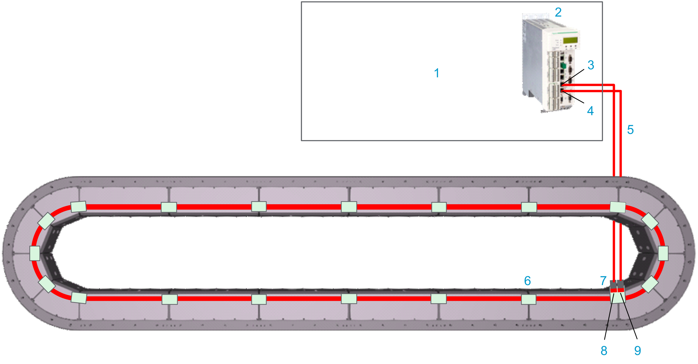
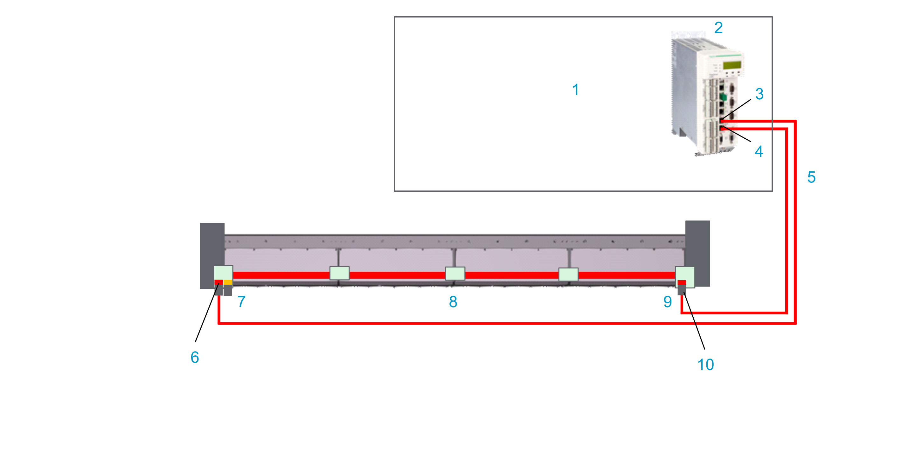

# Connecting the Sercos Bus to the Track

## Wiring Example

Also refer to [Additional Wiring Example](#TPC_MLS-HWG_ConnectingSercos-9418D197__AdditionalWiringExample-AAB02800).

**Closed track**

| Element | Description |
| --- | --- |
| 1 | Control cabinet |
| 2 | LMC Pro2 Motion Controller |
| 3 | Sercos port 1 (CN12) of the controller |
| 4 | Sercos port 2 (CN13) of the controller |
| 5 | Sercos cables |
| 6 | Lexium™ MC communication interconnect |
| 7 | Lexium™ MC communication interconnect with two Sercos connectors (in/out) |
| 8 | Sercos port P1 (infeed) of a closed Lexium™ MC12 multi carrier track |
| 9 | Sercos port P2 (outfeed) of a closed Lexium™ MC12 multi carrier track |

## Description

* The LMC Pro2 Motion Controller is installed in a cabinet.
* The LMC Pro2 Motion Controller is connected to the Lexium™ MC12 multi carrier track with pre-assembled cables. If you do not use pre-assembled cables, make sure not to exceed a Sercos cable length of 50 m (164 ft).
* The LMC Pro2 Motion Controller communicates with the Lexium™ MC12 multi carrier track via Sercos bus.
* The Sercos bus

  is distributed from segment to segment via the Lexium™ MC communication interconnects.

## Connecting the Sercos Bus to the Lexium™ MC12 multi carrier Track

The following describes the Sercos bus connection from the LMC Pro2 Motion Controller to the Lexium™ MC12 multi carrier track:

| Step | Action |
| --- | --- |
| 1 | Connect the Sercos cables (**5**) to the LMC Pro2 Motion Controller (**2**). |
| 2 | Connect the Sercos cables (**5**) to the Lexium™ MC communication interconnect with the two Sercos connectors (**7**) at the top of a segment. Verify that the Lexium™ MC communication interconnect is fixed with its four M3x8 screws to the segment, with a torque of 0.6 Nm (5.31 lbf-in).  The Sercos port P1 (CN12) of the controller must be connected to the Sercos port P1 of the Lexium™ MC12 multi carrier track. |

## Pinout and Cable Diagram

**Pinout**

Pre-assembled Sercos cable.

Only operate the Lexium™ MC12 multi carrier with approved, specified cables, accessories and replacement equipment by Schneider Electric.

| DANGER | |
| --- | --- |
|  | ELECTRIC SHOCK OR ARC FLASH  Do not use non-Schneider Electric approved cables, accessories or any type of replacement equipment.  Failure to follow these instructions will result in death or serious injury. |

| Connector at LMC Pro2 Motion Controller (RJ45, CN12/CN13) | Pin from CN12/CN13 | Designation | Description | Pin from M12 connector | Connector (M12, D-coded, socket) at the Lexium™ MC12 multi carrier track |
| --- | --- | --- | --- | --- | --- |
|  | 1 | Tx+ | Output transmit data + | 1 |  |
| 2 | Tx- | Output transmit data - | 3 |
| 3 | Rx+ | Input receive data + | 2 |
| 4 | – | Reserved | N/A |
| 5 | – | Reserved | N/A |
| 6 | Rx- | Input receive data - | 4 |
| 7 | – | Reserved | N/A |
| 8 | – | Reserved | N/A |
| **Cable diagram**  Shield connected to housing on connector side. | | | |

NOTE: If you have to remove a connector from the cable, for example, to lead the cable through a cable bushing, make sure to reconnect the wires of the cable correctly to the connector afterwards. Observe the requirements for the degree of protection and the EMC regulations.

| WARNING | |
| --- | --- |
|  | UNINTENDED EQUIPMENT OPERATION  Do not connect wires to unused terminals and/or terminals indicated as “No Connection (N.C.)”.  Failure to follow these instructions can result in death, serious injury, or equipment damage. |

## Additional Wiring Example

**Open track**

With an open track, you need a communication interconnect (**7**) at the beginning of the open track with one Sercos (and one SFO) connector and a communication interconnect (**9**) at the end of the open track with one Sercos connector.

Also refer to [Open Track](MountingThe-5FAA5905.html#MountingThe-5FAA5905__OpenTrack-0569ECA8).

| Element | Description |
| --- | --- |
| 1 | Control cabinet |
| 2 | LMC Pro2 Motion Controller |
| 3 | Sercos port P1 (CN12) of the controller |
| 4 | Sercos port P2 (CN13) of the controller |
| 5 | Sercos cables |
| 6 | Sercos port P1 (infeed) of an open Lexium™ MC12 multi carrier track |
| 7 | Lexium™ MC communication interconnect with one Sercos (and one SFO) connector. |
| 8 | Lexium™ MC communication interconnect |
| 9 | Lexium™ MC communication interconnect with one Sercos connector. |
| 10 | Sercos port P2 (outfeed) of an open Lexium™ MC12 multi carrier track |

EIO0000004637.09