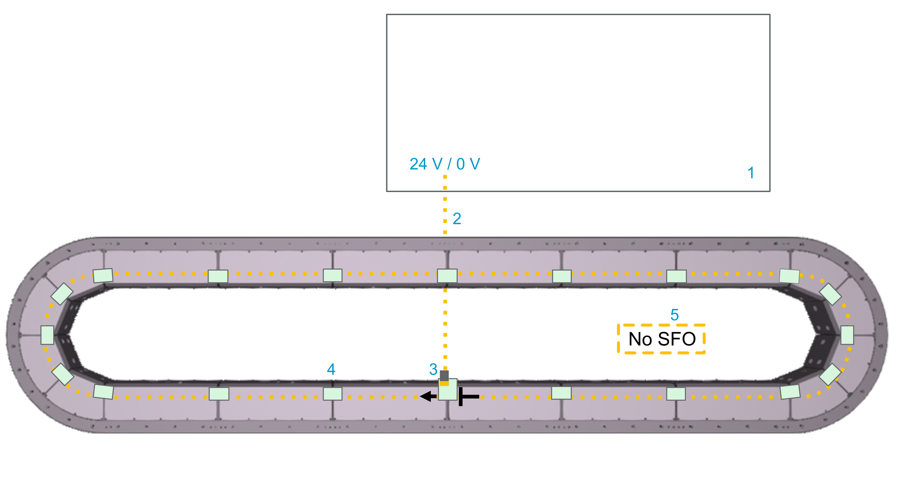
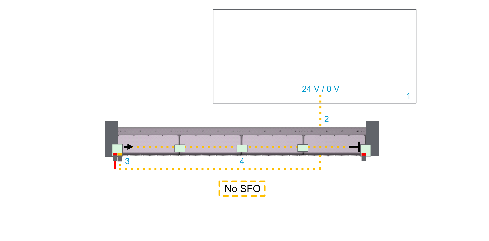

# Connecting SFO (Safe Force Off) to the Track

## General Information

Regardless of whether you use the SFO (Safe Force Off) function in your track or not, you must supply 24 Vdc to the track permanently. To do this, install a Lexium™ MC communication interconnect with SFO connector to the first segment of the track and supply SFOin+ (24 Vdc) and SFOin- (0 Vdc). This puts the Lexium™ MC12 long stator motor segments in an energized state and allows them to apply electromagnetic force to the Lexium™ MC12 carriers.

In case you use the SFO (Safe Force Off) function, the 24 Vdc must be supplied by an appropriate safety-related switching device. In case you do not use the SFO (Safe Force Off) function, the 24 Vdc can be provided by another power supply.

For more information on SFO (Safe Force Off), refer to [Functional Safety](FunctionalSafety-6D8AD583.html#FunctionalSafety-6D8AD583).

## Wiring Example (SFO)

Also refer to [Additional Wiring Examples (No SFO)](#TPC_MLS-HWG_ConnectingSafetyDevices-9419DE36__AdditionalWiringExample-ABB9C004).

**Closed track**

| Element | Description |
| --- | --- |
| 1 | Control cabinet |
| 2 | Emergency stop switch |
| 3 | Safety-related switching device (for example, Harmony XPSUAT Safety Module) |
| 4 | SFO cable |
| 5 | Lexium™ MC communication interconnect with SFO (Safe Force Off) connector |
| 6 | Lexium™ MC communication interconnect |
| 7 | SFO group |

## Description

You must provide at least one SFO (Safe Force Off) signal to the Lexium™ MC12 multi carrier track. Otherwise the Lexium™ MC12 long stator motor segments remain in a defined safe state and do not exert an electromagnetic force to the Lexium™ MC12 carriers.

In addition, if you wish to use the SFO safety-related function, you must use safety-related devices, for example, to integrate emergency stop switches into your system.

* The safety-related devices are installed in a cabinet. For example:

  + XPSUAT Safety Module (Harmony XPS Universal product range)
  + XPSMCMRO0004G Safety Relay Output Module (Modicon MCM product range)
  + TM5SDM4DTRFS Safety Discrete I/O Module (Modicon TM5/TM7 Modular I/O System product range in conjunction with a Safety Logic Controller (SLC)

  NOTE: Third-party safety-related modules must be able to handle the in-rush current consumption of 450 mA per segment.
* The safety-related devices are connected to the Lexium™ MC12 multi carrier track with pre-assembled cables.

  Make sure not to exceed a cable length of 20 m (65.6 ft).
* The safety-related modules allow to perform safety-related functions, for example, to bring carriers moving on the track to a defined safe stop (SFO).
* The SFO signal is distributed from segment to segment via the Lexium™ MC communication interconnects.
* Several SFO groups can be set up for different sections of the track. An SFO group always starts at the Lexium™ MC communication interconnect with SFO connector and extends clockwise to the next Lexium™ MC12 long stator motor segment via the Lexium™ MC communication interconnect.
* Each segment must be provided with an SFO signal. Either with an SFO cable (with SFO) connector at the top of a segment) or via the Lexium™ MC communication interconnect from the segment before.
* Up to 68 segments can be controlled by one safety-related output.

## Additional Wiring Examples (No SFO)

Even if you do not use the SFO (Safe Force Off) function in your track or in a group of segments of your track, you must supply 24 Vdc to the track permanently.

  

**Closed track**

With a closed track, you need a Lexium™ MC communication interconnect with SFO connector.

| Element | Description |
| --- | --- |
| 1 | Control cabinet |
| 2 | SFO cable |
| 3 | Lexium™ MC communication interconnect with SFO (Safe Force Off) connector |
| 4 | Lexium™ MC communication interconnect |
| 5 | Non-SFO group |

**Open track**

With an open track, you need a Lexium™ MC communication interconnect at the beginning of the open track with one SFO connector (and one Sercos connector).

Also refer to [Open Track](MountingThe-5FAA5905.html#MountingThe-5FAA5905__OpenTrack-0569ECA8).

| Element | Description |
| --- | --- |
| 1 | Control cabinet |
| 2 | SFO cable |
| 3 | Lexium™ MC communication interconnect with SFO (Safe Force Off) connector |
| 4 | Lexium™ MC communication interconnect |

## Connecting SFO (Safe Force Off) to the Lexium™ MC12 multi carrier Track

The following describes the SFO connection to the Lexium™ MC12 multi carrier track (refer to [Additional Wiring Examples (No SFO)](#TPC_MLS-HWG_ConnectingSafetyDevices-9419DE36__AdditionalWiringExample-ABB9C004)):

| Step | Action |
| --- | --- |
| 1 | Connect the SFO cable (**2**) in the wiring examples above to 24 Vdc. |
| 2 | Connect the negative output voltage terminal of the power supply to the **PE** (protective ground/earth) of the cabinet. |
| 3 | Connect the SFO cable (**2**) to the Lexium™ MC communication interconnect with SFO connector (**3**) at the top of a segment. Verify that the Lexium™ MC communication interconnect is fixed with its four M3x8 screws to the segment, with a torque of 0.6 Nm (5.31 lbf-in). |

## Pinout and Cable Diagram

**Pinout**

Pre-assembled SFO cable. Refer to [Type Code](TypeCode-5B11CE11.html).

Only operate the Lexium™ MC12 multi carrier with approved, specified cables, accessories and replacement equipment by Schneider Electric.

| DANGER | |
| --- | --- |
|  | ELECTRIC SHOCK OR ARC FLASH  Do not use non-Schneider Electric approved cables, accessories or any type of replacement equipment.  Failure to follow these instructions will result in death or serious injury. |

| Open cable end with wire end ferrules | Wire color | Designation | Description | Pin from M12 connector | Connector (M12, A-coded, plug) at the Lexium™ MC12 multi carrier track |
| --- | --- | --- | --- | --- | --- |
| – | Brown | Not connected | Not connected | 1 |  |
| White | SFO+ | Positive SFO  signal | 2 |
| Blue | SFO- | Negative SFO  signal | 3 |
| Black | Not connected | Not connected | 4 |
| **Cable diagram** | | | |

NOTE: If you have to remove a connector from the cable, for example, to lead the cable through a cable bushing, make sure to reconnect the wires of the cable correctly to the connector afterwards. Observe the requirements for the degree of protection and the EMC regulations.

| WARNING | |
| --- | --- |
|  | UNINTENDED EQUIPMENT OPERATION  Do not connect wires to unused terminals and/or terminals indicated as “No Connection (N.C.)”.  Failure to follow these instructions can result in death, serious injury, or equipment damage. |

NOTE: Protected wiring, e.g., control cabinet, armored conduit, etc., is required if the safety-related module generating the SFO signal is not able to perform an error detection on the wiring. Refer to IEC 61800-5-2 and IEC 60204-1.

EIO0000004637.09