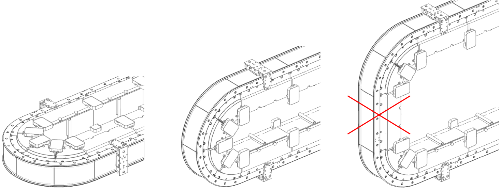

# Track Orientation

The track orientation can be horizontal, or vertical. Straight segments are only permitted in horizontal orientation, as illustrated:

| WARNING | |
| --- | --- |
|  | unintended equipment operation  Do not use straight segments vertically.  Failure to follow these instructions can result in death, serious injury, or equipment damage. |

EIO0000004637.09