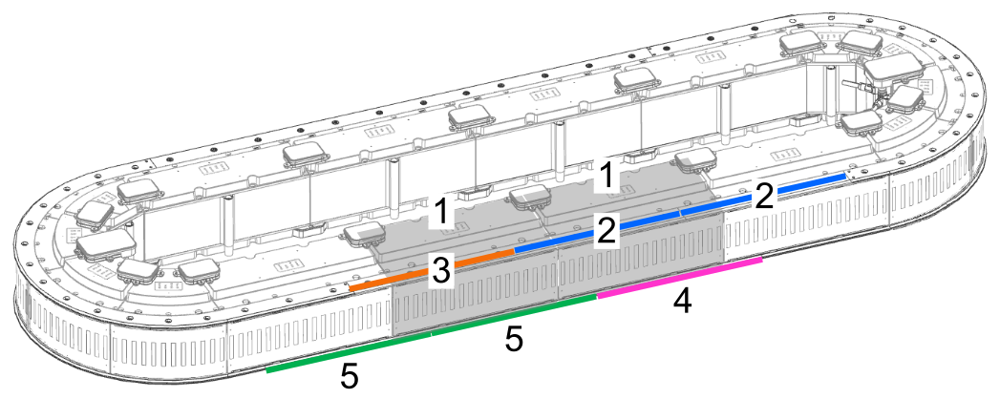

# Mounting a Lexium™ MC12 Heavy-Duty Guide Rail with Automated Lubrication

## General Information on Mounting a Heavy-Duty Guide Rail

The components of the Lexium™ MC12 multi carrier must be handled with care. Refer to [Transport and Storage](TransportAndStorage-5F99D6F3.html#TransportAndStorage-5F99D6F3).

Heavy-Duty guide rails can bend if handled improperly and then may become unusable.

| NOTICE | |
| --- | --- |
|  | Inoperable equipment  Do not bend or otherwise distort the Heavy-Duty guide rails.  Failure to follow these instructions can result in equipment damage. |

NOTE: Heavy-Duty carriers cannot be mounted by snapping them on the rails. Instead, they must be slipped into position on either a top Heavy-Duty straight guide rail or the Heavy-Duty mounting rail. In a closed loop application, you must first remove one of the upper curved guide rails and replace it with a short, straight rail to slip on the carrier. If it is an open track application, you must first remove the hard stop at the end of the track to do the same. Refer to [Mounting a Lexium™ MC12 Heavy-Duty Carrier](MountingHDCarrier-F8EB9B0C.html#MountingHDCarrier-F8EB9B0C).

## General Information on Heavy-Duty Tracks with Automated Lubrication

For a Lexium™ MC12 multi carrier Heavy-Duty track with automated lubrication, you need at minimum two lubrication segments (marked **1** in the example graphic below), two Heavy-Duty lubrication spacers (top) and four Heavy-Duty lubrication guide rails (marked **2** and **5** in the example graphic below)

NOTE: Do not use a lubrication segment immediately before or after a curve. Consequently, For using automated lubrication on a closed Heavy-Duty track, you need at least four straight segments in a row.

| Element | Color code | Description | References |
| --- | --- | --- | --- |
| **1** | Grey | Lexium™ MC12 long stator motor segment straight for automated lubrication  with  Lexium™ MC12 Heavy-Duty spacer straight for automated lubrication (1 unit length (ul)), with lubricant opening | LXMMC12MS06S10L    LXMMCCS0B06S10L |
| **2** | Blue | Lexium™ MC12 Heavy-Duty guide rail straight for automated lubrication (1 ul), with lubricant opening, top rail | LXMMCRS0B06S10L |
| **3** | Orange | Lexium™ MC12 Heavy-Duty guide rail straight (1 ul), top rail | LXMMCRS0B06S100 |
| **4** | Pink | Lexium™ MC12 Heavy-Duty guide rail straight (1 ul), bottom rail | LXMMCRS0B06S100 |
| **5** | Green | Lexium™ MC12 Heavy-Duty guide rail straight for automated lubrication (1 ul), with lubricant opening, bottom rail | LXMMCRS0B06S10L |
| Also refer to [Product Overview](ProductOverview-5A703DB5.html#ProductOverview-5A703DB5). | | | |

For more information on the automated lubrication system, refer to [Automated Lubrication of a Heavy-Duty Track](AutoLubricationHDTrack-D89E19FA.html).

When mounting the system, apply a tightening torque of:

* 7.2 Nm (63.7 lbf-in) for rails
* 10.1 Nm (89.4 lbf-in) for segments
* 1.5 Nm (13.3 lbf-in) for lubrication connectors

## Mounting a Heavy-Duty Guide Rail with Automated Lubrication

The following procedures describe the mounting of a Heavy-Duty guide rail with automated lubrication.

| Step | Action |
| --- | --- |
| 1 | To prepare two Lexium™ MC12 long stator motor segments straight for automated lubrication:  First, insert the four O-rings (**a**) into the appropriate cavities at the top and the bottom of the two lubrication segments. NOTE: Verify the correct positioning of the O-rings, which are used to seal the bottom and top guide rails for automated lubrication.  Then, screw in three threaded connectors (**b**) into the appropriate openings at the rear side of the segments. Tighten the connectors with a torque of 1.5 Nm (13.3 lbf-in). NOTE: At the junction of the two lubrication segments, use the left opening of the right segment (see graphic below). For more information on the components of the automated lubrication system, refer to [Automated Lubrication of a Heavy-Duty Track](AutoLubricationHDTrack-D89E19FA.html). |
| 2 | When the segments (**d**, **f** and **h**) and interconnects (**g**, **c** and **e**) are in place (refer to [Horizontal Mounting of the Track with Automated Lubrication](HorizMountingWithAutomatedLubr-C03D6E55.html)), install the bottom Heavy-Duty guide rails, starting with the first Heavy-Duty guide rail for automated lubrication (**i**). The rails are mounted offset to the segments by design.    Position the lubrication rail (**i**) offset under the lubrication segment (**d**) with the bottom lubricant opening (**k**) and loosely fasten the rail with M6x16 class 8.8 DIN 7984 screws.  NOTE: Make sure that the sealing O-rings are correctly positioned when mounting the rail.  NOTE: Make sure that the holes in the rails are aligned with the holes in the segments. |
| 3 | Loosely fasten the bottom rail screws at the first segment. |
| 4 | Align the next Heavy-Duty guide rail for automated lubrication (**I**) with the bottom lubricant opening (**m**). Make sure that the rails fit tightly together at the transition points.  Use M5x8 (ISO 4026) set screws to fine-tune the rail alignment. Unscrew the set screws approximately halfway out of the rail to avoid contact with the support surface for the rails. To install the rails, slide a suitable mounting tool between the screws (in or across the rail direction) and carefully push them into place.  NOTE: Avoid scratching the surface of the rails.    After aligning the rails, screw the set screws back into the rails. |
| 5 | Tighten the screws of both bottom Lexium™ MC12 Heavy-Duty guide rails straight for automated lubrication at the segment where the rails meet with a torque of 10.1 Nm (89.4 lbf-in). |
| 6 | Proceed in the same way with the subsequent standard bottom rails until all bottom rails are installed. |
| 7 | Prepare the Heavy-Duty spacers for automated lubrication (LXMMCCS0B06S10L) for the top guide rail. For an appropriate lubrication of the top guide rails, you need in total two lubricant outlets – one for the outer side and one for the inner side of the guide rail. For this, you need two spacers, each with one open lubricant channel and one closed lubrication channel.    Prepare the Heavy-Duty spacer for lubricating the inner running surface of the top guide rail:  1. Insert the O-ring into the appropriate cavity of the spacer at position (**n**).  NOTE: Verify the correct positioning of the O-ring, which is used to seal the top guide rail for automated lubrication. 2. Insert the screw with the pre-mounted O-ring into the threaded hole at position (**o**) to close the opening. Tighten the screw with a torque of 1 Nm (8.9 lbf-in).  Prepare the spacer for lubricating the outer running surface of the top guide rail:  1. Insert the O-ring into the appropriate cavity of the spacer at position (**o**). Verify the correct positioning of the O-ring, which is used to seal the top guide rail for automated lubrication. 2. Insert the screw with the pre-mounted O-ring into the threaded hole at position (**n**) to close the opening. Tighten the screw with a torque of 1 Nm (8.9 lbf-in).   NOTE: To supply the inner and outer side of the guide rails with lubricant, make sure that the lubricant openings are in position (**n**) in one spacer and in position (**o**) in the other spacer. |
| 8 | When all the bottom guide rails are installed, place the Heavy-Duty spacers on the track, beginning with installing the lubrication spacers (**p**) onto the lubrication segments (**q**). Align the holes with those in the segments. |
| 9 | Locate the long holes of the Heavy-Duty guide rails and insert the cylindrical pins into the Heavy-Duty spacer. |
| 10 | Beginning at an arc segment or an open end of the track, place the top Heavy-Duty guide rails over the segments with the Heavy-Duty spacers. The rails are mounted offset from the segments by design. The long holes must fit into the cylindrical pins. The holes in the rails must match the holes in the segments.  NOTE: Make sure that the two guide rails for automated lubrication (**r**) are installed offset on the lubrication segments (**q**) with the top lubricant openings.  NOTE: Make sure that the Heavy-Duty spacer is aligned with the segment stop and that the Heavy-Duty guide rail is aligned with the cylindrical pins. |
| 11 | Loosely attach the top rail with M6x35 class 8.8 DIN 7984 screws.  NOTE: The screws must go through the Heavy-Duty guide rails and the Heavy-Duty spacer. |
| 12 | Tighten the top rail screws at the first segment with a torque of 10.1 Nm (89.4 lbf-in). |
| 13 | Mount Heavy-Duty carriers on the track (refer to [Mounting a Lexium™ MC12 Heavy-Duty Carrier](MountingHDCarrier-F8EB9B0C.html#MountingHDCarrier-F8EB9B0C)).  NOTE: Heavy-Duty carriers must be mounted before the rails are closed. |
| 14 | Align the next rail. Make sure that the rails fit closely together at the transition points.  Use M5x8 (ISO 4026) set screws to fine-tune the rail alignment. Unscrew the set screws approximately halfway out of the rail to avoid contact with the support surface for the rails. To install the rails, slide a suitable mounting tool between the screws (in or across the rail direction) and carefully push them into place.  NOTE: Avoid scratching the surface of the rails.    After aligning the rails, screw the set screws back into the rails. |
| 15 | Tighten the screws of both top rails at the segment where the rails meet with a torque of 10.1 Nm (89.4 lbf-in). |
| 16 | Install each Heavy-Duty guide rail until all top rails are installed. |
| 17 | After you install the rails, tighten the screws of the Lexium™ MC12 long stator motor segments with a torque of 10.1 Nm (89.4 lbf-in). |
| 18 | Insert the Lexium™ MC communication interconnects from top between the segments. Attach the communication interconnect with its four M3x8 ISO 14583 screws with a torque of 0.6 Nm (5.31 lbf-in).  NOTE: If a communication interconnect is used to connect the system to the Sercos bus and/or a Safe Force Off (SFO) control device, refer to the [Lexium™ MC communication interconnects](ProductOverview-5A703DB5.html#ProductOverview-5A703DB5__ToDo-5B0E91E4). |
| 19 | Use the Lexium™ MC power cables, the Sercos cable, and the SFO cables to connect your Lexium™ MC12 multi carrier with the control cabinet.  For details, refer to [Electrical Installation](ElectricalInstallation-74288EC9.html#ElectricalInstallation-74288EC9). |
| 20 | Connect the lubricant lines to the indicated three lubrication connectors (**b**) at the rear side of the segment. Tighten the union nuts with a torque of 1.5 Nm (13.3 lbf-in).  For more information on the components of the automated lubrication system, refer to [Automated Lubrication of a Heavy-Duty Track](AutoLubricationHDTrack-D89E19FA.html).    **Result**: The Lexium™ MC12 multi carrier track is installed and ready for verification.  Also refer to [Verifying the Installation](TPC_MLS-HWG_Verifying_Installation-B8AB2CA9.html#TPC_MLS-HWG_Verifying_Installation-B8AB2CA9). |

NOTE: If you mounted the Lexium™ MC12 multi carrier track outside of your machine, disconnect the track from the control cabinet (power, Sercos and SFO), equip the mounting plate with the suitable transport devices, and lift the Lexium™ MC12 multi carrier track into your machine, and then re-connect it to the control cabinet.

| DANGER | |
| --- | --- |
|  | HAZARD OF ELECTRIC SHOCK, EXPLOSION, OR ARC FLASH  * Disconnect all power from all equipment including connected devices prior to removing any covers or doors, or installing or removing any accessories, hardware, cables, or wires except under the specific conditions specified in the appropriate hardware guide for this equipment. * Always use a properly rated voltage sensing device to confirm the power is off where and when indicated. * Replace and secure all covers, accessories, hardware, cables, and wires and confirm that a proper ground connection exists before applying power to this equipment. * Use only the specified voltage when operating this equipment and any associated equipment.  Failure to follow these instructions will result in death or serious injury. |

EIO0000004637.09