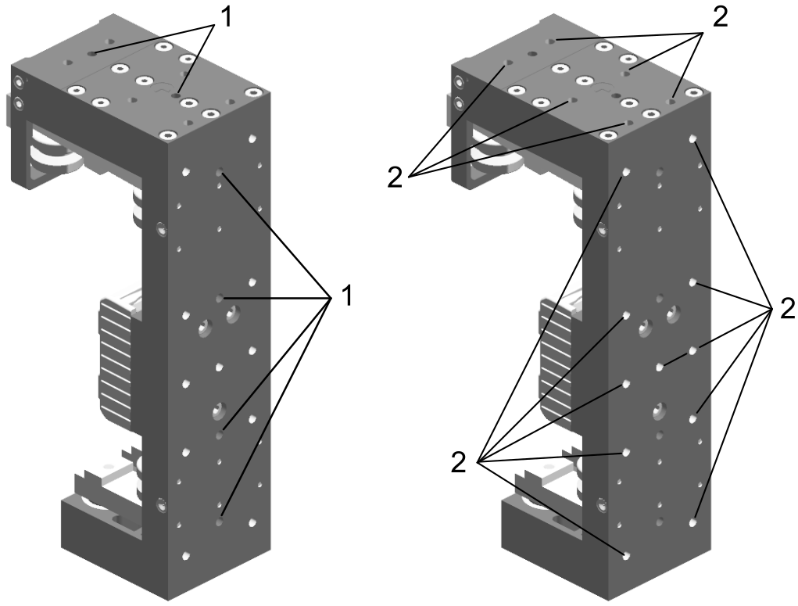

# Mounting the Tools on a Lexium™ MC12 Heavy-Duty Carrier

## Overview

You must design tools suitable for your application and install the tools on the Heavy-Duty carrier to transport your products within your track.

Observe the following guideline:

* Make sure your products are held properly by the tools so that the products do not move on the Heavy-Duty carriers or slide off from the Heavy-Duty carriers during acceleration and deceleration.
* Distribute the load of your products evenly on the Heavy-Duty carriers to operate at the maximum configured acceleration / deceleration and velocity of the Heavy-Duty carrier.
* Use a device such as a sensor to identify the Heavy-Duty carrier and the type of tool mounted on the Heavy-Duty carrier to help prevent collisions.

| WARNING | |
| --- | --- |
|  | Strong MAGNETIC FIELDS  * Keep persons with medical implants (for example, pacemakers or metal implants) or metallic body jewelry away from the carriers and segments with a minimum distance of 30 cm (11.9 in). * Always leave the protective cover of the drive magnets in place for all exposed or uninstalled carriers. * Do not put your hands or fingers between the carriers and segments. * Do not place metallic tools in the vicinity of the carriers and segments. * Do not place electromagnetically sensitive devices near the carriers and segments. * Do not place credit cards or electronic/magnetic media in the vicinity of the carriers and segments.  Failure to follow these instructions can result in death, serious injury, or equipment damage. |

The Heavy-Duty carrier has two magnets which, together with the magnetic fields in the segments, move the Heavy-Duty carrier on the track. These two magnets are glued onto the Heavy-Duty carrier. A shock to the Heavy-Duty carrier can cause the glued-on magnets to flake off and the magnets can splinter.

In addition, the Heavy-Duty carrier has an encoder magnet. This can be demagnetized by improper handling, for example, if the magnets of another Heavy-Duty carrier come too close.

| WARNING | |
| --- | --- |
|  | inoperable equipment  * Do not drop the Heavy-Duty carrier. * Do not strike the Heavy-Duty carrier. * Keep a minimum distance of 50 mm (1.97 in) between the encoder magnet and other magnets.  Failure to follow these instructions can result in death, serious injury, or equipment damage. |

## Mounting Options

1. A Lexium™ MC12 Heavy-Duty carrier provides two fitting holes (diameter: 4.02 mm ±0.01 mm (0.1583 in ±0.0004 in); depth: 6.00 mm ±0.1 (0.2362 in ±0.0039 in)) on the short angle arm of the carrier and four fitting holes on the long angle arm of the carrier.

   Use these fitting holes (**1**) to align your tool with the Heavy-Duty carrier.
2. A Lexium™ MC12 Heavy-Duty carrier provides six M5 threaded holes (hole depth 10 mm/0.39 in) on the short angle arm of the carrier and eleven M5 threaded holes (hole depth 10 mm/0.39 in) on the long angle arm of the carrier.

   Use these threaded holes (**2**) to fix your tool on the Heavy-Duty carrier.

   Tighten the fixing screws. Maximum tightening torque is 5.9 Nm (52.2 lbf-in).

EIO0000004637.09