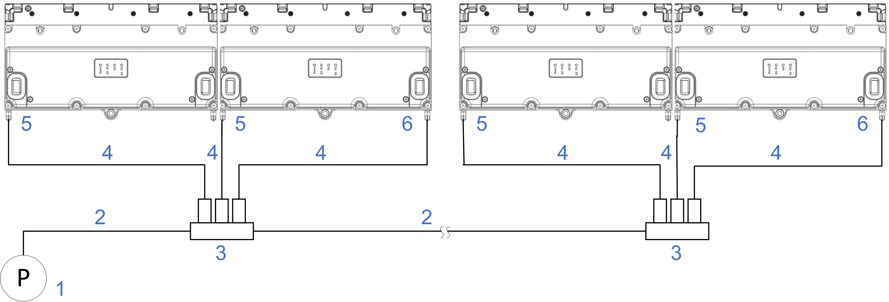

# Automated Lubrication of a Heavy-Duty Track

## Overview

On a Lexium™ MC12 Heavy-Duty guide system with automated lubrication, the running surfaces of the four upper and two lower rollers of the Lexium™ MC12 carrier and the running surfaces of the rails are lubricated with lubricant supplied by a lubrication pump (**1**). The lubricant is pumped through a lubricant line (**2**) to the distributors (**3**). From the distributors, the lubricant is supplied through lubricant lines (**4**) to the connectors (**5**/**6**) at the segments where it flows through channels inside the segments to the running surfaces of the lubrication rails.

| Element | Description |
| --- | --- |
| 1 | Lubrication pump |
| 2 | Lubricant line from the pump to the distributors and between the distributors |
| 3 | Distributor with dosing valves |
| 4 | Lubricant lines from the distributor to the connectors |
| 5 | Connector, lubrication of the top guide rail |
| 6 | Connector, lubrication of the bottom guide rail |

NOTE: Elements 1 through 4 are to be purchased separately. For more information, refer to [Lubrication System Requirements](#AutoLubricationHDTrack-D89E19FA__LubricationSystemRequirements-D89E2983).

NOTE: Place the lubrication pump as close as possible to the track and the lubricant distributors as close as possible to the lubrication segments to keep the lubrication lines short.

NOTE: It is a good practice to fill the lubricant lines manually with lubricant before commissioning for helping to avoid air bubbles in the lubricant supplied to the guide rails.

NOTE: To help ensure that the carrier rollers take up the lubrication oil properly and distribute it to the lubrication pads of the carrier rollers, the carrier must pass the lubrication segments at a controlled velocity. It is a good practice to move the carrier with a velocity of approximately 800 mm/s, depending on the viscosity of the lubricant.

For mounting the Heavy-Duty lubrication segment(s), the corresponding Heavy-Duty bottom lubrication rails and the corresponding Heavy-Duty lubrication spacers and Heavy-Duty top lubrication rails, refer to [Mounting a Lexium™ MC12 Heavy-Duty Guide Rail with Automated Lubrication](MountingHDGuideRailAutLub-D89DDB43.html).

  

Insufficient lubrication may damage the Heavy-Duty carrier rollers and the Heavy-Duty guide rails.

| NOTICE | |
| --- | --- |
|  | Inoperable equipment  Verify that the lubrication reservoirs of the Heavy-Duty carriers are filled before first use.  Failure to follow these instructions can result in equipment damage. |

For information on filling the lubrication reservoirs, refer to [Filling the Lubrication Pads](LubricatingHDCarrier-F8F68D40.html#LubricatingHDCarrier-F8F68D40__FillingTheLubricationPads-F8F68838)

## Lubrication System Requirements

Apart from the two Lexium™ MC12 long stator motor segments straight for automated lubrication (LXMMC12MS06S10L), the four Lexium™ MC12 Heavy-Duty guide rails straight for automated lubrication (LXMMCRS0B06S10L) and the two Lexium™ MC12 Heavy-Duty spacers straight for automated lubrication (LXMMCCS0B06S10L), the components of the automated lubrication system (pump, distributor(s), lubricant lines) are not provided by Schneider Electric. Select the components according to your individual needs.

For the automated lubrication of a Heavy-Duty Lexium™ MC12 multi carrier track, the following minimum requirements must be met:

* One lubrication point, consisting of two lubrication segments and the corresponding upper and lower lubrication rails and spacers, for every 6 meters of the track
* Lubricant: Refer to [Information About Lubrication](TPC_MLS-HWG_Info_Lubrication-864DAC04.html#TPC_MLS-HWG_Info_Lubrication-864DAC04)
* Lubrication pump: volume flow rate of 50 ml/min (0.013 gal/min)
* Distributor(s): One dosing valve per lubricant line, with a dosing volume of 0.01 cm3 (0.0006 in3) per stroke
* Lubricant lines: 4 mm (0.16 in) diameter, externally calibrated

NOTE: The given values apply to clean environments and the ambient temperatures defined in the [Ambient Conditions](AmbientConditions-5F940331.html#AmbientConditions-5F940331).

EIO0000004637.09