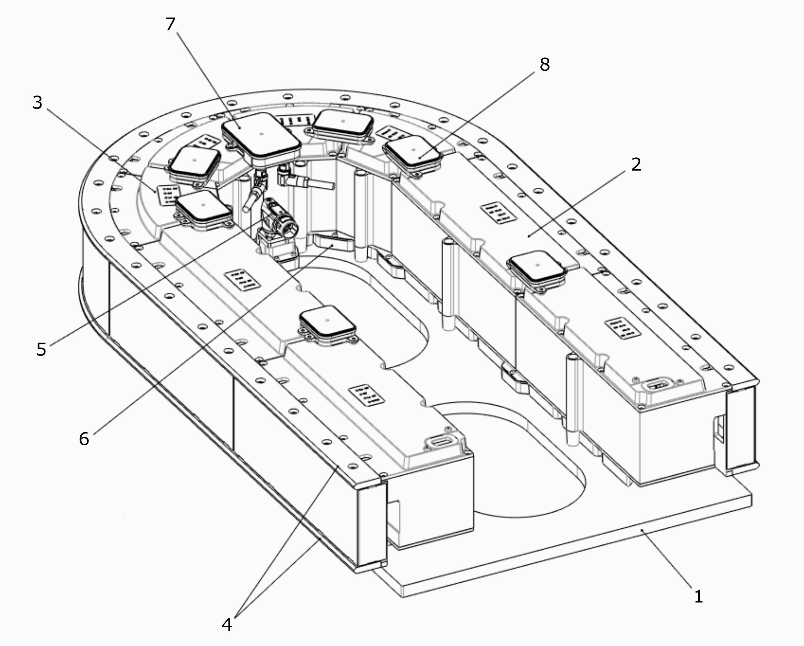
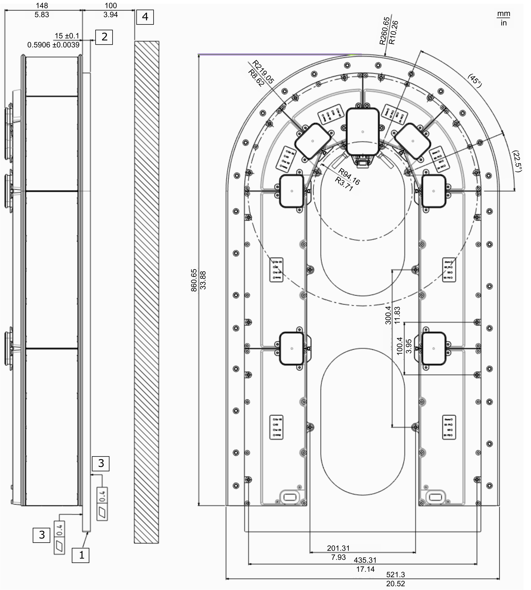
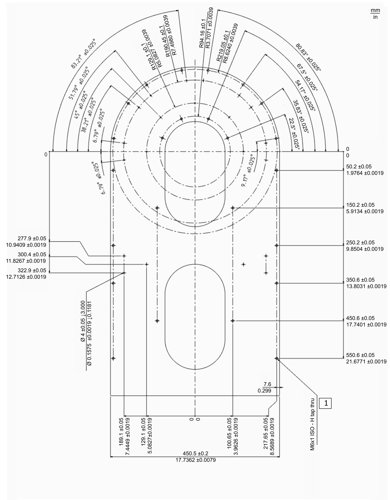
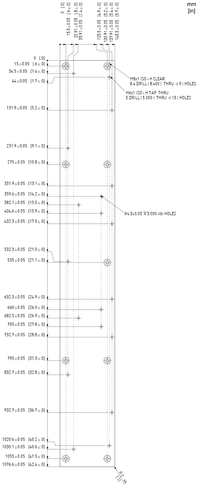
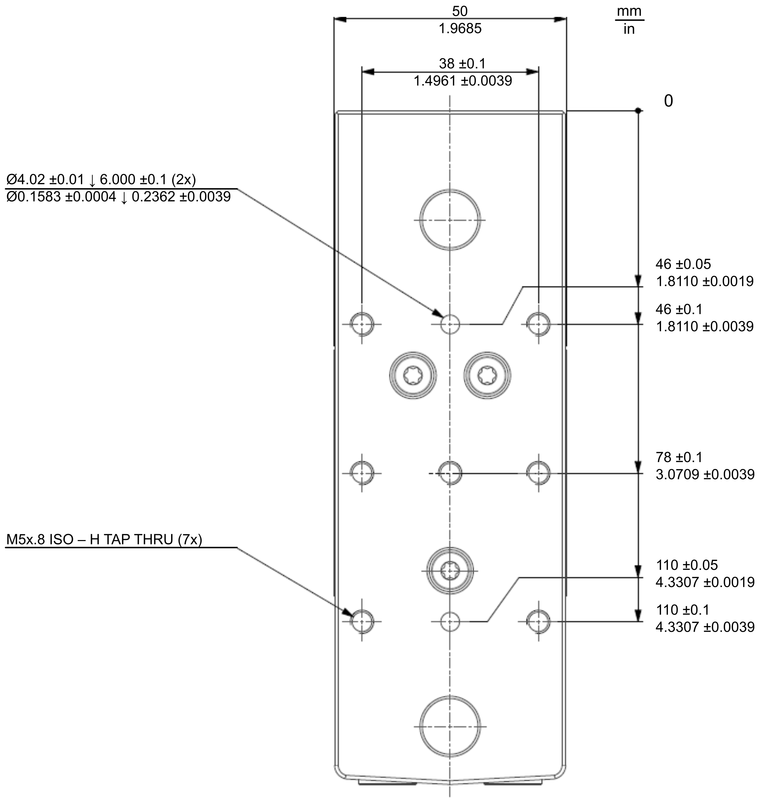
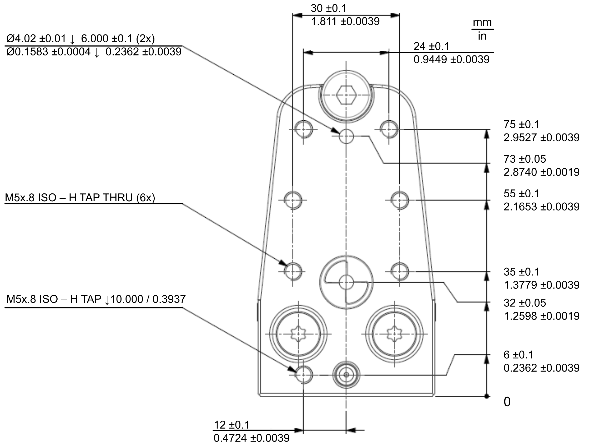

# Dimensions and Drilling Templates

## Layout Example – Components Overview

**1** Mounting plate

**2** Lexium™ MC12 long stator motor segment straight

**3** Lexium™ MC12 long stator motor segment arc

**4** Lexium™ MC guide rails

**5** Lexium™ MC power interconnect (with power infeed connector)

**6** Lexium™ MC power interconnect (plain)

**7** Lexium™ MC communication interconnect (with two Sercos connectors)

**8** Lexium™ MC communication interconnect (plain)

## Dimensions

You can download the CAD files of the individual components from the Schneider Electric homepage.

**1** Aluminum alloy Al 5754-0 H111 or an alloy with similar mechanical properties

**2** Minimum required thickness of the mounting plate (aluminum)

**3** Minimum required mounting plate flatness per meter

**4** Minimum required free space below the rails

## Drilling Template – Mounting Plate – Closed Track

You can download the CAD files of the individual components from the Schneider Electric homepage.

**1** Required hole depth = 15 mm (0.59 in)

## Drilling Template – Mounting Plate – Open Track with Hard Stops

You can download the CAD files of the individual components from the Schneider Electric homepage.

## Drilling Template – Carrier (Side view)

You can download the CAD files of the individual components from the Schneider Electric homepage.

## Drilling Template – Carrier (Top view)

You can download the CAD files of the individual components from the Schneider Electric homepage.

EIO0000004637.09