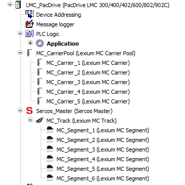

# General Information

## Overview

You can use the Multicarrier Configuration editor to layout tracks in single-track or multi-track mode or you can add multi carrier devices (tracks, segments, carriers) to your application in the Devices tree. You can also use both possibilities in parallel.

For more information on the Multicarrier Configuration editor, refer to the  [Lexium™ MC multi carrier Configuration Guide](../../../../../api/crossBook?lang=en-US&virtualBookName=MLSConfG&topicID=).

## Structure

The Lexium MC Track object represents a physical multi carrier track that consists of multiple segments.

In the Devices tree, the Lexium MC Track object can be inserted as a sub-object under the Sercos Master object. The Lexium MC Segment objects are inserted as sub-objects under the Lexium MC Track object.

The Lexium MC Carrier Pool is a track-independent collection of the carriers in the system. It can be added as a sub-object under the controller object. The Lexium MC Carrier objects in the whole system are added as sub-objects under the Lexium MC Carrier Pool object.

Example 

EIO0000004639.05