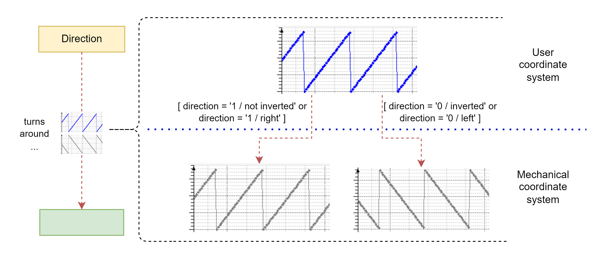

# Direction

## General

|  |  |
| --- | --- |
| Type | EF |
| Offline editable | Yes |
| Devices supporting the parameter | Lexium MC Track |
| Traceable | Yes |

## Functional description

With the parameter Direction, you can change the direction of the physical movement of the carriers on the track.

When the parameter Direction indicates Not inverted / 1, the carriers move clockwise (closed track) or from left to right (open track) and the Position value of the Lexium MC Carrier objects increases (see [Position](Position-9C72977E.html#Position-9C72977E)).

The value of the parameter Direction is evaluated during Sercos phase-up.

The setting of the parameter Direction inverts the relation between the user coordinate system in Units and the incremental position transferred to the carriers via the motion bus. The coupling via the function FC\_SetMasterEncoder() operates by transmitting velocities that are calculated in the mechanical coordinate system. Therefore, the change of direction of a carrier that is coupled to other objects as a master also affects the direction of movement of the coupled objects.  

NOTE: In PacDrive systems, the user coordinate system is represented in units. Depending on the setting of the FeedConstant (units/revolution or units/m), the user coordinate system is mapped to the physical dimensions. In a Lexium™ MC multi carrier transport system, one user unit is mapped to 1 mm (0.04 in) on the physical track. The setting of a FeedConstant is not supported.

For more information on the function FC\_SetMasterEncoder(), refer to the [SystemInterface library](../../../../../api/crossBook?lang=en-US&virtualBookName=PD.Lib.SystemInterface&topicID=D_SE_0085311).

| Value | Data type | Meaning |
| --- | --- | --- |
| Not inverted / 1 | BOOL | The carriers move clockwise (closed track) or from left to right (open track) and the Position parameter value increases. |
| Inverted / 0 | BOOL | The carriers move counterclockwise (closed track) or from right to left (open track) and the Position parameter value increases. |

EIO0000004639.05