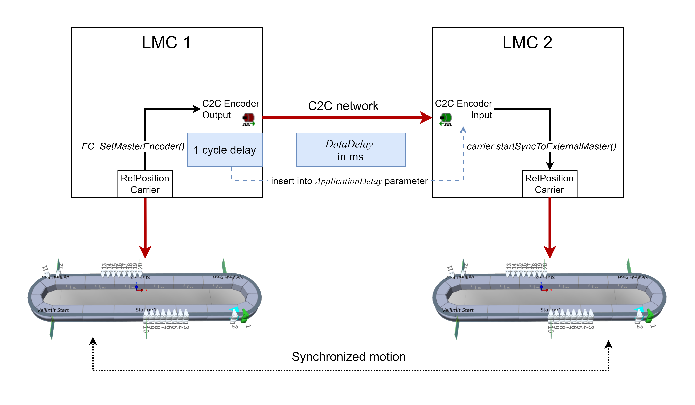

# Synchronized Carrier Movement via C2C

For enabling a synchronized movement of carriers on different tracks, you can use the C2C network concept (controller-to-controller coupling network concept): two LMC controllers can be coupled via Sercos for enabling the synchronized movement of the carriers on the respective tracks. As a precondition, the C2C network must be in the state synchronized.  
For more information on the C2C network concept, refer to the [LMC Pro Device Objects and Parameters Guide](../../../../../api/crossBook?lang=en-US&virtualBookName=PD.Parameter.LMCPro&topicID=D_SE_0088146).

The graphic illustrates the coupling of Lexium MC Carrier objects via C2C as well as the resulting delays:

* The SystemInterface function FC\_SetMasterEncoder() is used to couple a Lexium MC Carrier object as a master encoder to a C2C Encoder Output in LMC 1.  
  For more information on the function FC\_SetMasterEncoder(), refer to the [SystemInterface library](../../../../../api/crossBook?lang=en-US&virtualBookName=PD.Lib.SystemInterface&topicID=D_SE_0085311).
* The order of calculations inside the real-time process (RTP) results in a delay of one Sercos cycle until the velocity is transferred from the carrier to the C2C Encoder Output.
* In LMC 2, a C2C Encoder Input can be used as a position source for the Multicarrier library method IF\_MoveSyncFromStandstill.StartSyncToExternalMaster().  
  For more information on the method IF\_MoveSyncFromStandstill.StartSyncToExternalMaster(), refer to the [Multicarrier library](../../../../../api/crossBook?lang=en-US&virtualBookName=MLSLib&topicID=MoveSyncExtMaster_080435F3).
* The parameter DataDelay of the C2C Encoder Input indicates only the delay of the C2C network in milliseconds (ms).  
  Additional delays can be input in the parameter ApplicationDelay of the C2C Encoder Input. For carrier synchronization, an additional delay of one Sercos cycle occuring on the C2C Encoder Output side of the C2C network must be input via the parameter ApplicationDelay.   
  The method IF\_MoveSyncFromStandstill.StartSyncToExternalMaster() uses both delay parameters DataDelay and ApplicationDelay to compensate for the delays.  
  For more information on the delay parameters, refer to the [LMC Pro Device Objects and Parameters Guide](../../../../../api/crossBook?lang=en-US&virtualBookName=PD.Parameter.LMCPro&topicID=D_SE_0082657).

EIO0000004639.05