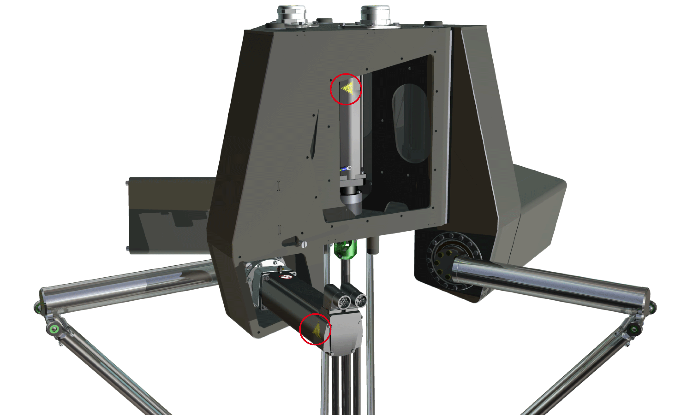

# Residual Risks

## Overview

Risks arising from the robot have been reduced. However a residual risk remains since the robot is moved and operated with electrical voltage and electrical currents.

If activities involve residual risks, a safety message is made at the appropriate points. This includes potential hazards that may arise, their possible consequences, and describes preventive measures to avoid the hazards.

## Electrical Parts

| DANGER | |
| --- | --- |
|  | ELECTRIC SHOCK, EXPLOSION, OR ARC FLASH  * Disconnect all power from all equipment including connected devices prior to removing any covers or doors, or installing or removing any accessories, hardware, cables, or wires except under the specific conditions specified in the appropriate hardware guide for this equipment. * Always use a properly rated voltage sensing device to confirm that the power is off where and when indicated. * Replace and secure all covers, accessories, hardware, cables, and wires and confirm that a proper ground connection exists before applying power to the equipment. * Use only the specified voltage when operating this equipment and any associated products. * After switching off the equipment make sure to maintain a waiting time of at least 15 minutes before disconnecting the power cable for the capacitors to discharge. * Operate electrical components only with a connected protective ground (earth) cable. * Verify the secure connection of the protective ground (earth) cable to the electrical devices so that connection complies with the wiring diagram. * Do not touch the electrical connection points of the components when the equipment is energized. * Provide protection against indirect contact. * Insulate any unused conductors on both ends of the connection cable. * Ensure that the power cables are correctly connected and connectors are locked in place during the operation time of the system.  Failure to follow these instructions will result in death or serious injury. |

## Emergency Stop

The robot mechanics, apart from the motor, are not supplied with external brakes nor an emergency stop switch to engage any external brakes.

| WARNING | |
| --- | --- |
|  | ENTRAPMENT BY ROBOT MECHANICS  * Provide means for ensuring that the motors can be put into a voltage-free state with any internal holding brake or external service brake released. * Make available those means to allow one person to manually move the robot within reach of the zone of operation.  Failure to follow these instructions can result in death, serious injury, or equipment damage. |

The opening of the motor holding brakes may cause the robot to sag.

| WARNING | |
| --- | --- |
|  | SAGGING OF THE ROBOT  * Ensure that the robot is in the defined safe state before entering the zone of operation. * Ensure that the release of the internal holding brakes poses no subsequent risks in the zone of operation. * Ensure that the emergency stop or the protective stop is enabled.  Failure to follow these instructions can result in death, serious injury, or equipment damage. |

NOTE: Provide separation devices for all infeed energies. It must be possible to secure the separation devices in de-energized position, for example, by locking.

## Assembly and Handling

| WARNING | |
| --- | --- |
|  | CRUSHING, SHEARING, CUTTING AND HITTING DURING HANDLING  * Observe the general construction and safety regulations for handling and assembly. * Use appropriate mounting and transport equipment and use appropriate tools. * Prevent clamping and crushing by taking appropriate precautions. * Cover edges and angles to protect against cutting damage. * Wear suitable protective clothing (for example, protective goggles, protective boots, protective gloves).  Failure to follow these instructions can result in death, serious injury, or equipment damage. |

## Robot Motion

Parts of the mechanics can move at high speeds. In such cases, the payload weight, additionally installed gripper, and shifts in the center of gravity of the moving parts contribute to the total energy of the forces generated.

Motion sequences can occur when operating with robot mechanics, which allow operational staff to make misjudgments. For safety considerations (according to EN ISO 13849-1), consider the controller and the brakes as non-safety-related elements. Ensure that necessary protective measures are implemented.

The safety standards and directives for the respective country where the equipment is in use define which protective measures are appropriate. Additionally, the system engineer who is responsible for the integration of the robot mechanics must evaluate which measures have to be taken.

NOTE: The configuration of the robot mechanics, the Tool Center Point (TCP) velocity, as well as the additional payload have an effect on the total energy, which can potentially be a source of damage and injury.

| WARNING | |
| --- | --- |
|  | CRUSHING, SHEARING, CUTTING AND IMPACT INJURY  * The robot must be operated only within an enclosure. * Open or enter the enclosure for cleaning and maintenance purposes only. * Design the enclosure to withstand an impact from the robot and to resist ejected parts from escaping the zone of operation. * Design the enclosure to safely deactivate the robot as soon as a person enters the zone of operation of the robot. * All barriers, protective doors, contact mats, light barriers, and other protective equipment, must be configured correctly and enabled whenever the robot mechanics are under power. * Define the clearance distance to the zone of operation of the robot so the operational staff do not have access to, nor can be enclosed in, the robot mechanics zone of operation. * Design the enclosure to account for the maximum possible travel paths of the robot; that is, the maximum path until the hardware safety system limits as well as the additional run-on paths, in case of a power interruption.  Failure to follow these instructions can result in death, serious injury, or equipment damage. |

For detailed information about travel path and power loss, refer to [*Run-On Motions of the Robot for Risk Analysis*](D-SE-0065319.html).

## Hot Surfaces

The metal surfaces of the robot may exceed 70 °C (158 °F) during operation.

The following figure presents the hot surface labels on the robot.

| WARNING | |
| --- | --- |
|  | HOT SURFACES  * Avoid unprotected contact with hot surfaces. * Do not allow flammable or heat-sensitive parts in the immediate vicinity of hot surfaces. * Verify that the heat dissipation is sufficient by performing a test run under maximum load conditions.  Failure to follow these instructions can result in death, serious injury, or equipment damage. |

## Hazardous Movements

There can be different sources of hazardous movements:

* No or incorrect calibration of the drive
* Wiring or cabling errors
* Errors in the application program
* Component errors
* Error in the measured value and signal transmitter

NOTE: Provide for personal safety by primary equipment monitoring or measures. Do not rely only on the internal monitoring of the components. Adapt the monitoring or other arrangements and measures to the specific conditions of the installation in accordance with a hazard and risk analysis.

Drive systems may perform unanticipated movements because of incorrect wiring, incorrect settings, incorrect data, or other errors.

| WARNING | |
| --- | --- |
|  | UNINTENDED MOVEMENT OR MACHINE OPERATION  * Carefully install the wiring in accordance with EMC standards. * Do not operate the robot with undetermined settings and data. * Perform comprehensive commissioning tests that include verification of configuration settings and data that determine position and movement.  Failure to follow these instructions can result in death, serious injury, or equipment damage. |

## Noise Protection

The noise level of the mechanics depends on the basic cycle and the payload, as well as on further application-specific accessory parts. Be aware of the fact that noise emissions multiply when several mechanics are in use at the same time. If noise emissions reach a value of more than 70 dBA, wear hearing protection.

| CAUTION | |
| --- | --- |
|  | NOISE EMISSIONS OF THE ROBOT MECHANICS  * Wear hearing protection in accordance with the locally applicable regulations. * Attach a sign on the robot mechanics if the noise emissions reach an excessive value.  Failure to follow these instructions can result in injury or equipment damage. |

NOTE: Attach the following symbol where it can easily be seen on the robot mechanics.

## Emissions

Some small amounts of lubricant emissions are to be expected over time. However, excessive lubricant emissions on or at the gearbox may be an indication of a damaged robot.

| NOTICE | |
| --- | --- |
|  | INOPERABLE EQUIPMENT INDICATED BY GEARBOX LUBRICANT EMISSIONS  * Verify the mechanics before, during, and after use. * Shut down the mechanics immediately if lubricant emissions appear on the robot mechanics.  Failure to follow these instructions can result in equipment damage. |

NOTE: To prevent any lubricant emissions, see chapter [*Gearbox Leakage Protection*](D-SE-0090309.html#D-SE-0090309).

## Hanging Loads

The robot is capable of suspending heavy loads.

| WARNING | |
| --- | --- |
|  | FALLING LOADS  Do not stand under hanging loads.  Failure to follow these instructions can result in death, serious injury, or equipment damage. |

## Attachments or Modifications

If different customer end products are transported by the robot mechanics, then the product pickup must be modified accordingly. For this reason, you can mount different product pickups (gripper mounting) to the flange. In doing so, ensure that the articulation movement is not restricted and/or that no motion errors can result from the modifications. Attachments and rebuilds must not influence the operation of the protective devices in any way and all EMERGENCY STOP buttons must be accessible and operational at all times.

| WARNING | |
| --- | --- |
|  | UNINTENDED EQUIPMENT OPERATION  * Do not drill into or modify the articulated arms. * Do not modify the cable set. * Do not modify the housing. * Do not modify the components of movable mechanics.  Failure to follow these instructions can result in death, serious injury, or equipment damage. |

The robot housing is part of the heat dissipation concept of the system. For this reason, the housing must be kept clean and free of any coating or paint.

| NOTICE | |
| --- | --- |
|  | INOPERABLE EQUIPMENT  * Keep the housing clean. * Do not apply coating or painting to the housing nor anything that would affect the heat dissipation properties of the housing surface.  Failure to follow these instructions can result in equipment damage. |

## Options for Moving the Robot Without Drive Energy

The robot mechanics are not equipped with an enclosure (see UL 1740).

NOTE: Take appropriate security measures concerning the specific use before operating the robot.

| WARNING | |
| --- | --- |
|  | SAGGING OF THE ROBOT  * Ensure that the robot is in the defined safe state before entering the zone of operation. * Ensure that the release of the internal holding brakes poses no subsequent risks in the zone of operation. * Ensure that the emergency stop or the protective stop is enabled.  Failure to follow these instructions can result in death, serious injury, or equipment damage. |

If the equipment is with power, perform the following steps:

| Step | Action |
| --- | --- |
| 1 | Switch the robot into a torque-free state. |
| 2 | Manually hold the robot in position. |
| 3 | Release the motor brakes.  NOTE: The function for releasing the brakes as well as for torque-free switching of the motors is not controlled by the equipment delivered with the product reference, but must be addressed by the application. |
| 4 | Manually move the robot.  NOTE: A greater force could be necessary because the motor and the gearbox may pose resistance to movement. |
| 5 | Engage the brakes. |

If you have to move the upper arms manually, proceed as follows:

| Step | Action |
| --- | --- |
| 1 | Pull the lower arms off the ball pins. |
| 2 | In case, the lower arms cannot be pulled off the ball pins, grip in the middle of the lower arms and apply pressure to bend the lower arms to release the ball pins. |

If an object is blocked by the upper arm of the robot and the equipment is without power, proceed as follows:

| Step | Action |
| --- | --- |
| 1 | Pull the lower arm off the ball pins. |
| 2 | Perform one of the following actions:   * Manually move the upper arm against the closed brake.  NOTE: This requires a high degree of force. * Remove the bolts on the upper arm and remove the upper arm. |

EIO0000002173.14