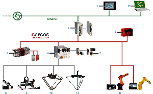

# System Architecture

## Overview

The control system consists of several components, depending on its application. The following graphic presents an example of a PacDrive 3 system.

|  |  |
| --- | --- |
| **1** Harmony SCU HMI Controller  **2** EcoStruxure Machine Expert  **3** Motion Controller  **4** Safety Controller  **5** I/O  **6** Drives | **7** Motors  **8** Single Axes (CAR, CAS, EAC, PAD, PAS, TAS)  **9** Multi-Axis Systems (MAXH, MAXS, MAXP, MAXR)  **10** Delta-2 Robots (Lexium T)  **11** Delta-3 Robots (Lexium P)  **12** Articulated Robots |

NOTE: To help keep your Schneider Electric products secure and protected, refer to the *Cybersecurity Best Practices* and *Cybersecurity Guidelines* provided on the Schneider Electric website. See [Related Documents](D-SE-0069556.3.html).

EIO0000002173.14