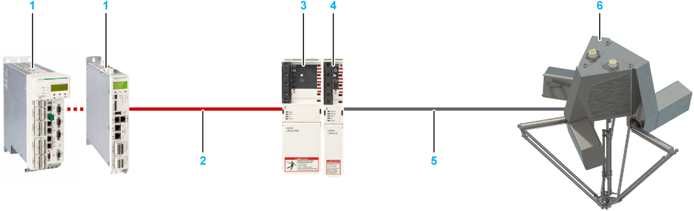
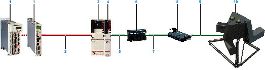
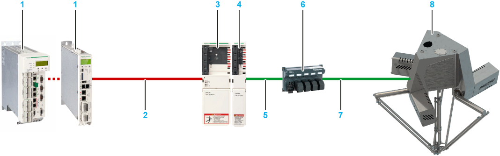
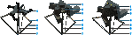

# Product Overview

## System Setup

The following figure presents an example of a system setup for one Lexium P robot with SH3 motors. At a minimum, this is the equipment required to achieve performances described in this guide.

| Number | Device name | Quantity | Device type | Comment |
| --- | --- | --- | --- | --- |
| 1 | Controller | 1 | LMC•00C…LMC•01C | Logic Motion Controller |
| 2 | Sercos cable | 3 | VW3E5001R | Sercos cable; the cable length depends on the distance between controller and cabinet. |
| 3 | Power supply | 1 | LXM62PD84A11000 | Lexium 62 Power Supply(1) |
| 4 | Double drive | 2 | Double drive: LXM62DD15•21000(2) | Lexium 62 Drive Module |
| Single drive | 3 or 4(3) | Single drive: LXM62DD15•21000(2) | Lexium 62 Drive Module(1) |
| 5 | Motor cable for connection of drive and motor | 3 or 4(3) | VW3E1143R••• | PacDrive 3 motor cable; the cable length depends on the distance between cabinet and robot. |
| Feedback cable for connection of drive and motor | 3 or 4(3) | VW3E2094R••• |
| 6 | Lexium P robot with SH3 motors | 1 | (4) | |
| (1) Alternatively, use the Lexium LXM52, Stand-Alone Servo Drive. Quantity: 3 or 4. Device type: LXM52DD18C.  (2) The specific variant of the drive depends on the safety requirements.  (3) The quantity depends on whether the robot has a rotational axis or not.  (4) The device type depends on the robot reference and its characteristics. For further information, refer to [*Type Code*](D-SE-0065758.html#D-SE-0065758). | | | | |

The following figure presents an example of a system setup for one Lexium P robot with SH3 motors and Lexium 62 ILD Detached Drive. At a minimum, this is the equipment required to achieve performances described in this guide.

| Number | Device name | Quantity | Device type | Comment |
| --- | --- | --- | --- | --- |
| 1 | Controller | 1 | LMC•00C…LMC•01C | Logic Motion Controller |
| 2 | Sercos cable | 3 | VW3E5001R | Sercos cable; the cable length depends on the distance between controller and cabinet. |
| 3 | Power supply | 1 | LXM62PD84A11000 | Lexium 62 Power Supply |
| 4 | Connection module | 1 | ILM62CMD20A000 | Lexium 62 Connection Module |
| 5 | Cable for connection of connection module and distribution box | 1 | VW3E1•••R••• | Hybrid cable; the cable length depends on the distance between the cabinet and the robot. Various connectors are available. |
| 6 | Distribution box | 1 | ILM62DB4A000 | Lexium 62 Distribution Box; already included in the housing of Lexium P robots VRKP4•••WD / VRKP4•••NO (not included in other Lexium P robots). |
| 7 | Cable for connection of distribution box and Lexium 62 ILD Detached Drive | 3 or 4(1) | VW3E1•••R••• | Hybrid cable; the cable length depends on the distance between the distribution box and the Lexium 62 ILD Detached Drive. Various connectors are available. |
| 8 | Lexium 62 ILD Detached Drive | 1 | Triple Drive:ILM62DDD24D1000  Additionally for robots with a rotational axis:  Single Drive: ILM62DDD24C1000 | Lexium 62 ILD Detached Drive |
| 9 | Motor cable for connection of Lexium 62 ILD Detached Drive and motor | 3 or 4(1) | FCE310•••A200 | Motor cable and feedback cable; the cable length depends on the distance between the Lexium 62 ILD Detached Drive and the robot |
| Feedback cable for connection of Lexium 62 ILD Detached Drive and motor | 3 or 4(1) | FCE311•••A200 |
| 10 | Lexium P robot with SH3 motors | 1 | (2) | |
| (1) The quantity depends on whether the robot has a rotational axis or not.  (2) The device type depends on the robot reference and its characteristics. For further information refer to [*Type Code*](D-SE-0065758.html#D-SE-0065758). | | | | |

The following figure presents an example of a system setup for one Lexium P robot with ILM motors. At a minimum, this is the equipment required to achieve performances described in this guide.

| Number | Device name | Quantity | Device type | Comment |
| --- | --- | --- | --- | --- |
| 1 | Controller | 1 | LMC•00C…LMC•01C | Logic Motion Controller |
| 2 | Sercos cable | 3 | VW3E5001R | Sercos cable; the cable length depends on the distance between controller and cabinet. |
| 3 | Power supply | 1 | LXM62PD84A11000 | Lexium 62 Power Supply |
| 4 | Connection module | 1 | ILM62CMD20A000 | Lexium 62 Connection Module |
| 5 | Cable for connection of connection module and distribution box | 1 | VW3E1•••R••• | Hybrid cable; the cable length depends on the distance between the cabinet and the robot. Various connectors are available. |
| 6 | Distribution box | 1 | ILM62DB4A000 | Lexium 62 Distribution Box; already included in the housing of Lexium P robots VRKP4•••WD / VRKP4•••NO (not included in other Lexium P robots). |
| 7 | Cable for connection of distribution box and motor | 3 or 4(1) | VW3E1•••R••• | Hybrid cable; the cable length depends on the distance between the cabinet and the robot. Various connectors are available. |
| 8 | Lexium P robot with ILM motors | 1 | (2) | |
| (1) The quantity depends on whether the robot has a rotational axis or not.  (2) The device type depends on the robot reference and its characteristics. For further information refer to [*Type Code*](D-SE-0065758.html#D-SE-0065758). | | | | |

## Components Overview

**1** Main body / housing

**2** Media cover / maintenance cover

**3** Motor cover (covering motor and gearbox)

**4** Upper arm

**5** Lower arm

**6** Telescopic axis

**7** Parallel plate

## Characteristics of the Lexium P Robot

The robot provides the following features:

* Stainless steel Delta 3 robot equipped by an automation platform
* Few references covering large performance
* Applicable in cleanrooms as well as in harsh environments
* Preassembled and ready to connect
* No calibration at customer site and automatic recalibration without tools
* Fast replacement of replacement equipment
* Available with or without a rotational axis (telescopic axis, ball bearing at the parallel plate, additional motor and gearbox)

EIO0000002173.14