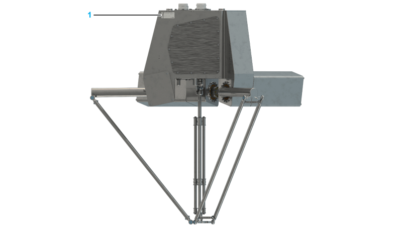
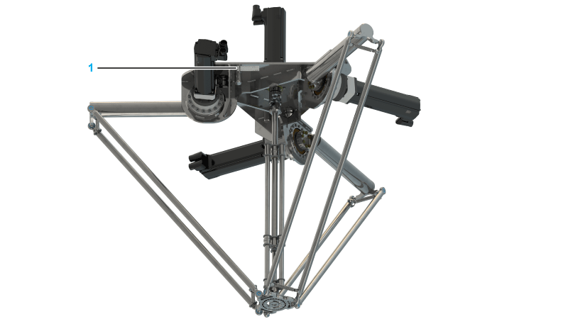
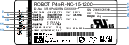

# Type Plate

## Position of the Type Plate

Representation for VRKP••••WD / VRKP••••NO / VRKP••••WF

**1** Type plate

Representation for VRKP••••NC

**1** Type plate

## Description of the Type Plate

|  |  |  |  |  |  |  |  |  |  |  |  |  |  |  |  |  |  |  |  |  |  |  |  |  |  |  |  |
| --- | --- | --- | --- | --- | --- | --- | --- | --- | --- | --- | --- | --- | --- | --- | --- | --- | --- | --- | --- | --- | --- | --- | --- | --- | --- | --- | --- |
| | 1 | Device name | | 2 | Type code\* | | 3 | Serial number | | 4 | Hardware code | | 5 | Weight of the robot | | 6 | Date of manufacture | | 7 | Voltage and current of the main axis SH3-motors | | | 8 | Voltage and current of the rotational axis SH3-motor | | 9 | Voltage and current of the SH3-motor brakes | | 10 | Voltage and current of all ILM-motors and brakes | | 11 | Voltage and current of the fans | | 12 | Maximum Load | | 13 | Radius of the working space | |
| \* For detailed information about the meaning of the particular digits, refer to [*Type Code*](D-SE-0065758.html#D-SE-0065758). | |

EIO0000002173.14