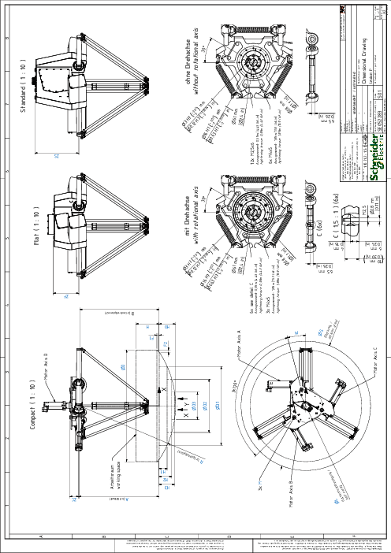

# Dimensional Drawing of the Lexium P Robot

| Dimension | Description | Unit | VRKP0 | VRKP0•••••••E00 | VRKP1 | VRKP1•••••••E00 | VRKP2 | VRKP4 | VRKP5 | VRKP6 | VRKP6•••••••E00 |
| --- | --- | --- | --- | --- | --- | --- | --- | --- | --- | --- | --- |
| ØD | Working space diameter | mm  (in) | 400  (15.7) | 400  (15.7) | 600  (23.6) | 600  (23.6) | 800  (31.5) | 1200  (47) | 1400  (55) | 1600  (63) | 1600  (63) |
| H | Working space height | mm  (in) | 100  (3.9) | 160  (6.3) | 125  (4.9) | 190  (7.5) | 190  (7.5) | 250  (9.8) | 275  (10.8) | 300  (11.8) | 400  (15.7) |
| H0 | Working space depth | mm  (in) | 44.5  (1.75) | 38.7  (1.52) | 81.5  (3.2) | 70.6  (2.8) | 84.9  (3.34) | 175.4  (6.9) | 193.1  (7.6) | 250.9  (9.9) | 257.9  (10.2) |
| ØD1 | Auxiliary diameter 1 | mm  (in) | 300  (11.8) | 292  (11.5) | 462  (18.2) | 472  (18.6) | 557  (22) | 847  (33.3) | 1013  (40) | 1240  (49) | 1235  (49) |
| H1 | Auxiliary height 1 | mm  (in) | 20  (0.79) | 20  (0.79) | 35  (1.38) | 30  (1.18) | 30  (1.18) | 85  (3.35) | 80  (3.15) | 100  (3.9) | 125  (4.9) |
| ØD2 | Auxiliary diameter 2 | mm  (in) | 188  (7.4) | 200  (7.9) | 318  (12.5) | 338  (13.3) | 415  (16.3) | 574  (22.6) | 734  (29) | 833  (33) | 826  (32.5) |
| H2 | Auxiliary height 2 | mm  (in) | 34  (1.34) | 30  (1.18) | 60  (2.36) | 50  (1.97) | 55  (2.17) | 135  (5.3) | 135  (5.3) | 185  (7.3) | 200  (7.9) |
| ØD3 | Auxiliary diameter 3 | mm  (in) | 75  (2.95) | 75  (2.95) | 175  (6.9) | 177  (7) | 240  (9.4) | 293  (11.5) | 413  (16.3) | 342  (13.5) | 307  (12) |
| H3 | Auxiliary height 3 | mm  (in) | 43  (1.7) | 37.5  (1.48) | 75  (2.95) | 65  (2.56) | 75  (2.95) | 165  (6.5) | 175  (6.9) | 240  (9.4) | 250  (9.8) |
| F1 | Chamfer dimension 1 | mm  (in) | – | – | – | – | 35  (1.38) | 25  (0.98) | 50  (1.97) | 25  (0.98) | – |
| F2 | Chamfer dimension 2 | mm  (in) | – | – | – | – | 60  (2.36) | 25  (0.98) | 50  (1.97) | 25  (1.98) | – |
| A | Z offset | mm  (in) | 438.2  (17.3) | 554  (22) | 528  (20.8) | 646.5  (25.5) | 650  (25.6) | 863.5  (34) | 997.4  (39) | 1100  (43) | 1245  (49) |
| B | Sphere center distance | mm  (in) | 427.2  (16.8) | 543  (21.4) | 517  (20.4) | 635.5  (25) | 650  (25.6) | 863.5  (34) | 997.4  (39) | 1100  (43) | 1245  (49) |
| R | Sphere radius | mm  (in) | 471.7  (18.6) | 581.7  (23) | 598.5  (23.6) | 706.1  (28) | 734.9  (29) | 1038.9  (41) | 1190.5  (47) | 1350.9  (53) | 1502.9  (59) |
| W | Bolt circle start angle | mm  (in) | 15  (0.59) | 15  (0.59) | 15  (0.59) | 15  (0.59) | 25  (0.98) | 15  (0.59) | 11  (0.43) | 11  (0.43) | 11  (0.43) |
| ØL | Bolt circle diameter | mm  (in) | 240  (9.4) | 240  (9.4) | 240  (9.4) | 240  (9.4) | 200  (7.9) | 355  (14) | 500  (19.7) | 500  (19.7) | 500  (19.7) |
| ØS | Collision area diameter | mm  (in) | 590  (32) | 590  (32) | 790  (31) | 790  (31) | 990  (39) | 1390  (55) | 1590  (63) | 1790  (70) | 1790  (70) |
| M | Threaded hole | – | M12 x 25 | M12 x 25 | M12 x 25 | M12 x 25 | M16 x 25 | M16 x 25 | M16 x 25 | M16 x 25 | M16 x 25 |
| Tightening torque | Nm  (lbf-in) | 54  (478) | 54  (478) | 54  (478) | 54  (478) | 100  (885) | 100  (885) | 100  (885) | 100  (885) | 100  (885) |
| ZC | Mounting distance compact housing | mm  (in) | 88  (3.46) | 88  (3.46) | 88  (3.46) | 88  (3.46) | 98  (3.86) | 98  (3.86) | 98  (3.86) | 98  (3.86) | 98  (3.86) |
| ZF | Mounting distance flat housing | mm  (in) | 267  (10.5) | 267  (10.5) | 267  (10.5) | 267  (10.5) | 273  (10.7) | 273  (10.7) | 273  (10.7) | 273  (10.7) | 273  (10.7) |
| ZS | Mounting distance standard housing | mm  (in) | – | – | – | – | 473  (18.6) | 473  (18.6) | – | – | – |

EIO0000002173.14