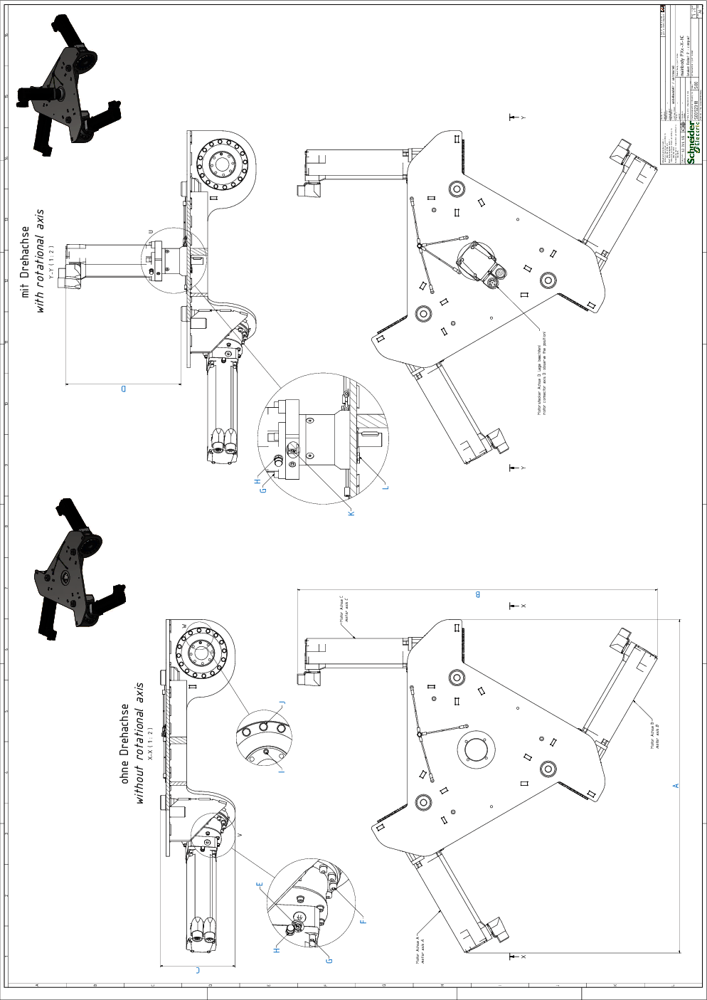

# Detail Drawing of the Main Body of VRKP•S0•NC

| Dimen-sion | Description | | Unit | VRKP0S••NC  VRKP1S••NC | VRKP2S0•NC | VRKP4S0•NC | VRKP5S0•NC  VRKP6S0•NC |
| --- | --- | --- | --- | --- | --- | --- | --- |
| A | Width A | | mm (in) | 617 (24.3) | 774 (30.5) | 794 (31.3) | 906 (36) |
| B | Width B | | mm (in) | 636 (25) | 790 (31) | 857 (34) | 922 (36) |
| C | Height C | | mm (in) | 148 (5.8) | 178 (7) | 178 (7) | 178 (7) |
| D | Height D | | mm (in) | 225 (8.9) | 275 (10.8) | 275 (10.8) | 275 (10.8) |
| E | Clamping screw gearbox main axis | Wrench size | mm | 3 | 4 | 4 | 4 |
| Tightening torque | Nm (lbf-in) | 4.1 (36) | 9.5 (84) | 9.5 (84) | 9.5 (84) |
| Quantity | – | 3 | | | |
| F | Screw gearbox main axis to housing | Wrench size | mm | 3 | 4 | 4 | 4 |
| Tightening torque | Nm (lbf-in) | 3 (26.6) | 4.7 (42) | 4.7 (42) | 4.7 (42) |
| Quantity | – | 24 | 48 | 48 | 48 |
| G | Screw motor to gearbox(2) | Wrench size | mm | 4 | | | |
| Tightening torque | Nm (lbf-in) | 3.5 (31) | | | |
| Quantity | – | 12 or 16(1) | | | |
| H | Hex nut grounding cable motor | Wrench size | mm | 7 | | | |
| Tightening torque | Nm (lbf-in) | 2.5 (22) | | | |
| Quantity | – | 3 or 4(1) | | | |
| I | Indexing bolt upper arm(2) | Wrench size | mm | 2.5 | 3 | 3 | 3 |
| Tightening torque | Nm (lbf-in) | Hand-tight | | | |
| Quantity | – | 3 | | | |
| J | Screw for Protector Cap | Wrench size | mm | 7 | 8 | 8 | 8 |
| Tightening torque | Nm (lbf-in) | 2 (17.7) | 3.5 (31) | 3.5 (31) | 3.5 (31) |
| Quantity | – | 24 | 48 | 48 | 48 |
| K(1) | Clamping screw gearbox rotational axis | Wrench size | mm | 3 | | | |
| Tightening torque | Nm (lbf-in) | 4.5 (40) | | | |
| Quantity | – | 1 | | | |
| L(1) | Screw gearbox rotational axis to housing | Wrench size | mm | 8 | | | |
| Tightening torque | Nm (lbf-in) | 3.5 (31) | | | |
| Quantity | – | 4 | | | |
| (1) For robots with a rotational axis.  (2) Medium threadlocked with Loctite 243. | | | | | | | |

EIO0000002173.14