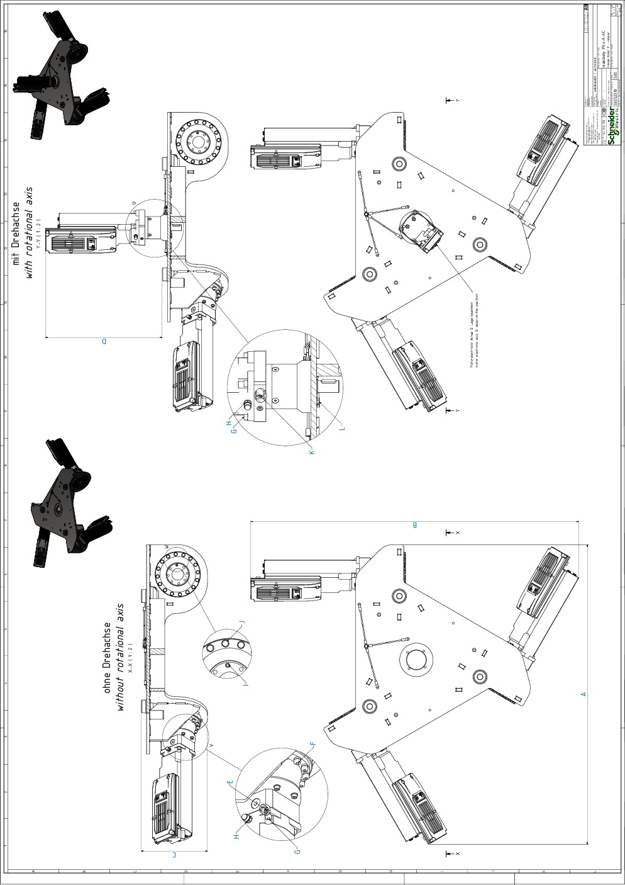

# Detail Drawing of the Main Body of VRKP•L0•NC

| Dimension | Description | | Unit | VRKP2L0•NC | VRKP4L0•NC | VRKP5L0•NC  VRKP6L0•NC |
| --- | --- | --- | --- | --- | --- | --- |
| A | Width A | | mm (in) | 800 (31.5) | 806 (32) | 918 (36) |
| B | Width B | | mm (in) | 817 (32) | 884 (35) | 948 (37) |
| C | Height C | | mm (in) | 178 (7) | | |
| D | Height D | | mm (in) | 313 (12.3) | | |
| E | Clamping screw gearbox main axis | Wrench size | mm | 4 | | |
| Tightening torque | Nm (lbf-in) | 9.5 (84) | | |
| Quantity | – | 3 | | |
| F | Screw gearbox main axis to housing | Wrench size | mm | 4 | | |
| Tightening torque | Nm (lbf-in) | 4.7 (42) | | |
| Quantity | – | 48 | | |
| G | Screw motor to gearbox(2) | Wrench size | mm | 4 | | |
| Tightening torque | Nm (lbf-in) | 3.5 (31) | | |
| Quantity | – | 12 or 16(1) | | |
| H | Hex nut grounding cable motor | Wrench size | mm | 7 | | |
| Tightening torque | Nm (lbf-in) | 2.5 (22) | | |
| Quantity | – | 3 or 4(1) | | |
| I | Indexing bolt upper arm(2) | Wrench size | mm | 3 | | |
| Tightening torque | Nm (lbf-in) | Hand-tight | | |
| Quantity | – | 3 | | |
| J | Screw for Protector Cap | Wrench size | mm | 8 | | |
| Tightening torque | Nm (lbf-in) | 3.5 (31) | | |
| Quantity | – | 48 | | |
| K(1) | Clamping screw gearbox rotational axis | Wrench size | mm | 3 | | |
| Tightening torque | Nm (lbf-in) | 4.5 (40) | | |
| Quantity | – | 1 | | |
| L(1) | Screw gearbox rotational axis to housing | Wrench size | mm | 8 | | |
| Tightening torque | Nm (lbf-in) | 3.5 (31) | | |
| Quantity | – | 4 | | |
| (1) For robots with a rotational axis.  (2) Medium threadlocked with Loctite 243. | | | | | | |

EIO0000002173.14