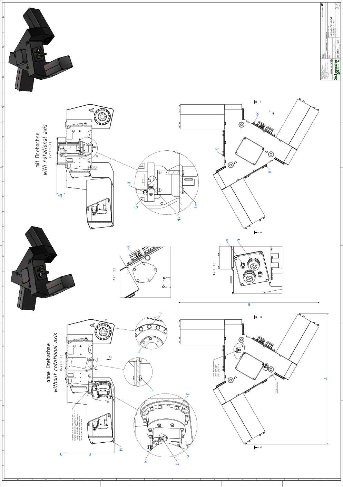

# Detail Drawing of the Main Body of VRKP•S0•WF

| Dimension | Description | | Unit | VRKP0S0•WF  VRKP1S0•WF | VRKP2•••WF | VRKP4S0•WF | VRKP5S0•WF  VRKP6S0•WF |
| --- | --- | --- | --- | --- | --- | --- | --- |
| A | Width A | | mm (in) | 667 (26) | 959 (37.8) | 959 (37.8) | 1078 (42) |
| B | Width B | | mm (in) | 698 (27.5) | 966 (38) | 1033 (41) | 1187 (47) |
| C | Height C | | mm (in) | 331 (13) | 356 (14) | 356 (14) | 356 (14) |
| D | Height D | | mm (in) | 2 (0.08) | 6 (0.2) | 6 (0.2) | 6 (0.2) |
| D\*(1) | Height D\* | | mm (in) | 57 (2.24) | 61 (2.4) | 61 (2.4) | 61 (2.4) |
| E | Clamping screw gearbox main axis | Wrench size | mm | 3 | 4 | 4 | 4 |
| Tightening torque | Nm (lbf-in) | 4.1 (36) | 9.5 (84) | 9.5 (84) | 9.5 (84) |
| Quantity | – | 3 | | | |
| F | Screw gearbox main axis to housing | Wrench size | mm | 3 | 4 | 4 | 4 |
| Tightening torque | Nm (lbf-in) | 3 (26.6) | 4.7 (42) | 4.7 (42) | 4.7 (42) |
| Quantity | – | 24 | 48 | 48 | 48 |
| G | Screw motor to gearbox(2) | Wrench size | mm | 4 | | | |
| Tightening torque | Nm (lbf-in) | 3.5 (31) | | | |
| Quantity | – | 12 or 16(1) | | | |
| H | Hex nut grounding cable motor | Wrench size | mm | 7 | | | |
| Tightening torque | Nm (lbf-in) | 2.5 (22) | | | |
| Quantity | – | 3 or 4(1) | | | |
| I | Indexing bolt upper arm(2) | Wrench size | mm | 2.5 | 3 | 3 | 3 |
| Tightening torque | Nm (lbf-in) | Hand-tight | | | |
| Quantity | – | 3 | | | |
| J | Screw for Protector Cap | Wrench size | mm | 7 | 8 | 8 | 8 |
| Tightening torque | Nm (lbf-in) | 2 (17.7) | 3.5 (31) | 3.5 (31) | 3.5 (31) |
| Quantity | – | 24 | 48 | 48 | 48 |
| K | Screw media cover | Wrench size | mm | 10 | | | |
| Tightening torque | Nm (lbf-in) | 6 (53) | | | |
| Quantity | – | 5 | | | |
| L | Screw cover rotational axis | Wrench size | mm | 8 | | | |
| Tightening torque | Nm (lbf-in) | 3.5 (31) | | | |
| Quantity | – | 4 | | | |
| L\*(1) | Screw gearbox rotational axis to housing | Wrench size | mm | 8 | | | |
| Tightening torque | Nm (lbf-in) | 3.5 (31) | | | |
| Quantity | – | 4 | | | |
| M | Threaded rod motor cover | Wrench size | mm | 10 | | | |
| Tightening torque | Nm (lbf-in) | 6 (53) | | | |
| Quantity | – | 12 | | | |
| N\*(1) | Clamping screw gearbox rotational axis | Wrench size | mm | 3 | | | |
| Tightening torque | Nm (lbf-in) | 4.5 (40) | | | |
| Quantity | – | 1 | | | |
| O | Cable gland M50 for motor/encoder cable | Wrench size | mm | 56 | | | |
| Tightening torque | Nm (lbf-in) | 10 (89) | | | |
| Quantity | – | 2 or 4(1) | 2 | 2 | 2 |
| P | Cable gland M16 for grounding cable/fan cable | Wrench size | mm | 19 | | | |
| Tightening torque | Nm (lbf-in) | 6 (53) | | | |
| Quantity | – | 2 or 4(1) | 2 | 2 | 2 |
| (1) For robots with a rotational axis.  (2) Medium threadlocked with Loctite 243. | | | | | | | |

EIO0000002173.14