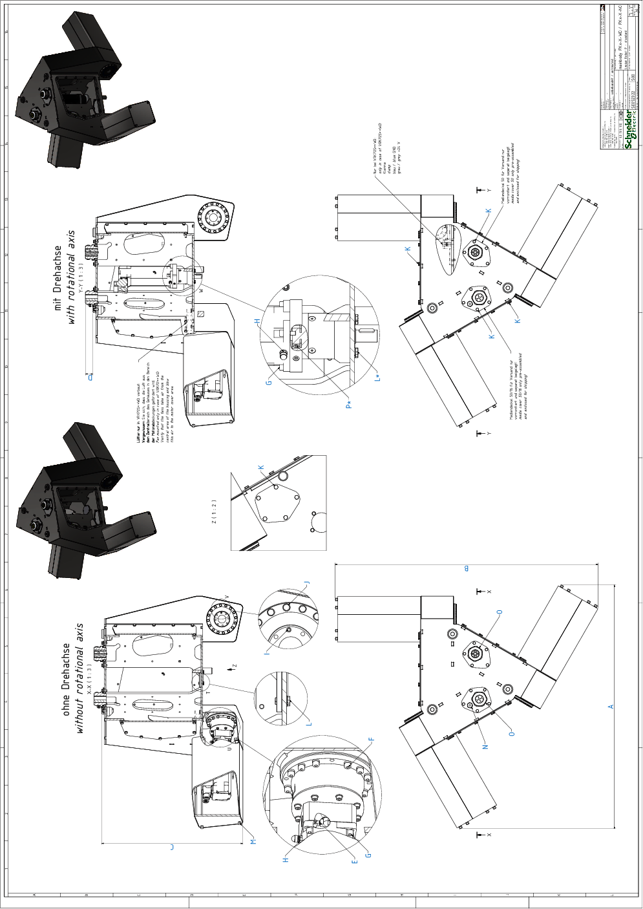

# Detail Drawing of the Main Body of VRKP•S0•WD

| Dimension | Description | | Unit | VRKP2S0•WD | VRKP4S0•WD |
| --- | --- | --- | --- | --- | --- |
| A | Width A | | mm (in) | 959 (38) | |
| B | Width B | | mm (in) | 966 (38) | 1033 (41) |
| C | Height C | | mm (in) | 556 (22) | |
| D | Height D | | mm (in) | 30 (1.18) | |
| E | Clamping screw gearbox main axis | Wrench size | mm | 4 | |
| Tightening torque | Nm (lbf-in) | 9.5 (84) | |
| Quantity | – | 3 | |
| F | Screw gearbox main axis to housing | Wrench size | mm | 4 | |
| Tightening torque | Nm (lbf-in) | 4.7 (42) | |
| Quantity | – | 48 | |
| G | Screw motor to gearbox(2) | Wrench size | mm | 4 | |
| Tightening torque | Nm (lbf-in) | 3.5 (31) | |
| Quantity | – | 12 or 16(1) | |
| H | Hex nut grounding cable motor | Wrench size | mm | 7 | |
| Tightening torque | Nm (lbf-in) | 2.5 (22) | |
| Quantity | – | 3 or 4(1) | |
| I | Indexing bolt upper arm(2) | Wrench size | mm | 3 | |
| Tightening torque | Nm (lbf-in) | Hand-tight | |
| Quantity | – | 3 | |
| J | Screw for Protector Cap | Wrench size | mm | 8 | |
| Tightening torque | Nm (lbf-in) | 3.5 (31) | |
| Quantity | – | 48 | |
| K | Screw media cover / maintenance cover | Wrench size | mm | 10 | |
| Tightening torque | Nm (lbf-in) | 6 (53) | |
| Quantity | – | 57 | |
| L | Screw cover rotational axis | Wrench size | mm | 8 | |
| Tightening torque | Nm (lbf-in) | 3.5 (31) | |
| Quantity | – | 4 | |
| L\*(1) | Screw gearbox rotational axis to housing | Wrench size | mm | 8 | |
| Tightening torque | Nm (lbf-in) | 3.5 (31) | |
| Quantity | – | 4 | |
| M | Threaded rod motor cover | Wrench size | mm | 10 | |
| Tightening torque | Nm (lbf-in) | 6 (53) | |
| Quantity | – | 12 | |
| N | Cable gland M16 for grounding cable | Wrench size | mm | 19 | |
| Tightening torque | Nm (lbf-in) | 6 (53) | |
| Quantity | – | 1 | |
| O | Cable gland M50 for motor / encoder cable | Wrench size | mm | 56 | |
| Tightening torque | Nm (lbf-in) | 10 (89) | |
| Quantity | – | 2 | |
| P\*(1) | Clamping screw gearbox rotational axis | Wrench size | mm | 3 | |
| Tightening torque | Nm (lbf-in) | 4.5 (40) | |
| Quantity | – | 1 | |
| (1) For robots with a rotational axis.  (2) Medium threadlocked with Loctite 243. | | | | | |

EIO0000002173.14