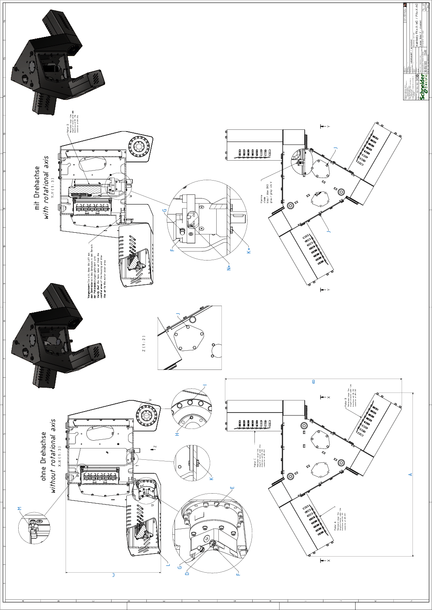

# Detail Drawing of the Main Body of VRKP•L0•WD / VRKP•L0•NO

| Dimension | Description | | Unit | VRKP4L0•WD  VRKP4L0•NO |
| --- | --- | --- | --- | --- |
| A | Width A | | mm (in) | 959 (38) |
| B | Width B | | mm (in) | 1033 (41) |
| C | Height C | | mm (in) | 556 (22) |
| D | Clamping screw gearbox main axis | Wrench size | mm | 4 |
| Tightening torque | Nm (lbf-in) | 9.5 (84) |
| Quantity | – | 3 |
| E | Screw gearbox main axis to housing | Wrench size | mm | 4 |
| Tightening torque | Nm (lbf-in) | 4.7 (42) |
| Quantity | – | 48 |
| F | Screw motor to gearbox(2) | Wrench size | mm | 4 |
| Tightening torque | Nm (lbf-in) | 3.5 (31) |
| Quantity | – | 12 or 16(1) |
| G | Hex nut grounding cable motor | Wrench size | mm | 7 |
| Tightening torque | Nm (lbf-in) | 2.5 (22) |
| Quantity | – | 3 or 4(1) |
| H | Indexing bolt upper arm(2) | Wrench size | mm | 3 |
| Tightening torque | Nm (lbf-in) | Hand-tight |
| Quantity | – | 3 |
| I | Screw for Protector Cap | Wrench size | mm | 8 |
| Tightening torque | Nm (lbf-in) | 3.5 (31) |
| Quantity | – | 48 |
| J | Screw media cover / maintenance cover | Wrench size | mm | 10 |
| Tightening torque | Nm (lbf-in) | 6 (53) |
| Quantity | – | 57 |
| K | Screw cover rotational axis | Wrench size | mm | 8 |
| Tightening torque | Nm (lbf-in) | 3.5 (31) |
| Quantity | – | 4 |
| K\*(1) | Screw gearbox rotational axis to housing | Wrench size | mm | 8 |
| Tightening torque | Nm (lbf-in) | 3.5 (31) |
| Quantity | – | 4 |
| L | Threaded rod motor cover | Wrench size | mm | 10 |
| Tightening torque | Nm (lbf-in) | 6 (53) |
| Quantity | – | 12 |
| M | Fixing bolt ILM Distribution Box | Wrench size | mm | 8 |
| Tightening torque | Nm (lbf-in) | 3.5 (31) |
| Quantity | – | 4 |
| N\*(1) | Clamping screw gearbox rotational axis | Wrench size | mm | 3 |
| Tightening torque | Nm (lbf-in) | 4.5 (40) |
| Quantity | – | 1 |
| (1) For robots with a rotational axis.  (2) Medium threadlocked with Loctite 243. | | | | |

EIO0000002173.14