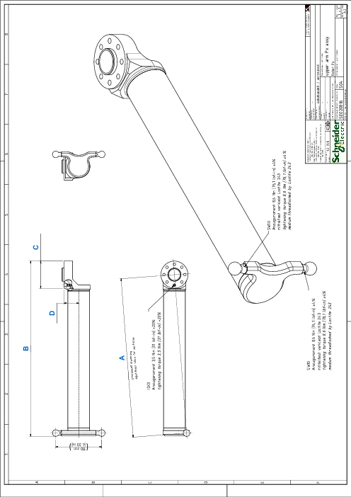

# Detail Drawing of the Upper Arm

| Dimension | Description | Unit | Robot type | | | | | |
| --- | --- | --- | --- | --- | --- | --- | --- | --- |
| VRKP0 | VRKP1 | VRKP2 | VRKP4 | VRKP5 | VRKP6 |
| A | Adjustment value for controller | mm  (in) | 180  (7.1) | 230  (9) | 280  (11) | 380  (15) | 430  (17) | 480  (19) |
| B | Total length | mm  (in) | 206.9  (8.1) | 257.1  (10.1) | 319  (13) | 419.4  (16.5) | 469.5  (18.5) | 519.6  (20.5) |
| C | Flange diameter | mm  (in) | 40  (1.57) | 40  (1.57) | 65  (2.56) | 65  (2.56) | 65  (2.56) | 65  (2.56) |
| D | Flange center distance | mm  (in) | 25  (0.98) | 25  (0.98) | 35  (1.38) | 35  (1.38) | 35  (1.38) | 35  (1.38) |

EIO0000002173.14