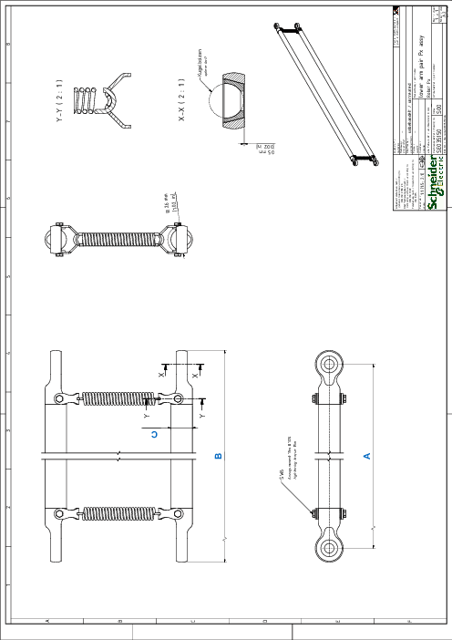

# Detail Drawing of the Lower Arm

| Dimen-sion | Description | Unit | Robot type | | | | | | | | |
| --- | --- | --- | --- | --- | --- | --- | --- | --- | --- | --- | --- |
| VRKP0 | VRKP0•••••••E00 | VRKP1 | VRKP1•••••••E00 | VRKP2 | VRKP4 | VRKP5 | VRKP6 | VRKP6•••••••E00 |
| A | Adjustment value for controller | mm  (in) | 400  (15.7) | 500  (19.7) | 500  (19.7) | 600  (23.6) | 600  (23.6) | 900  (35.4) | 1050  (41) | 1150  (45) | 1270  (50) |
| B | Total length | mm  (in) | 426  (16.8) | 526  (20.7) | 526  (20.7) | 626  (24.6) | 626  (24.6) | 926  (36.5) | 1076  (42.4) | 1176  (46) | 1296  (51) |
| C | Tube diameter | mm  (in) | 16  (0.63) | 16  (0.63) | 16  (0.63) | 20  (0.79) | 20  (0.79) | 20  (0.79) | 20  (0.79) | 20  (0.79) | 20  (0.79) |

EIO0000002173.14