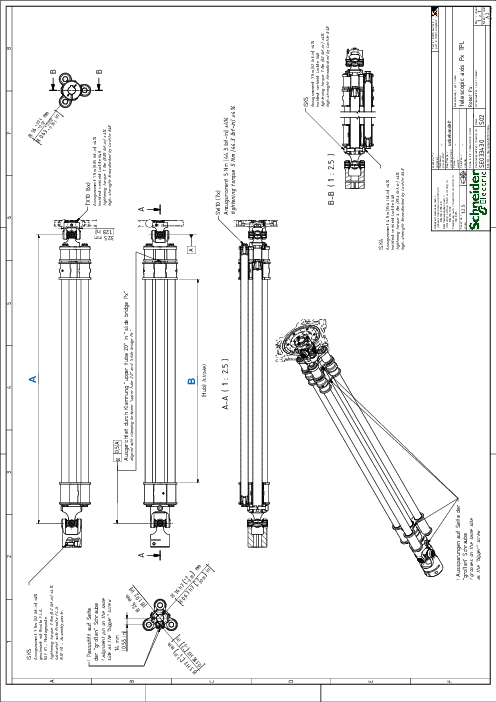

# Detail Drawing of the Telescopic Axis

| Dimen-sion | Description | Unit | Robot type | | | | | | | | |
| --- | --- | --- | --- | --- | --- | --- | --- | --- | --- | --- | --- |
| VRKP0 | VRKP0•••••••E00 | VRKP1 | VRKP1•••••••E00 | VRKP2 | VRKP4 | VRKP5 | VRKP6 | VRKP6•••••••E00 |
| A | Minimum length | mm  (in) | 326.8  (12.9) | 381.8  (15) | 390.2  (15.4) | 444  (17.5) | 458.4  (18) | 610.4  (24) | 686.4  (27) | 766.4  (30.2) | 842.4  (33) |
| B | Stroke | mm  (in) | 147  (5.8) | 202  (8) | 210.4  (8.3) | 264.2  (10.4) | 278.6  (11) | 430.6  (17) | 506.6  (20) | 586.6  (23) | 662.6  (26) |

EIO0000002173.14