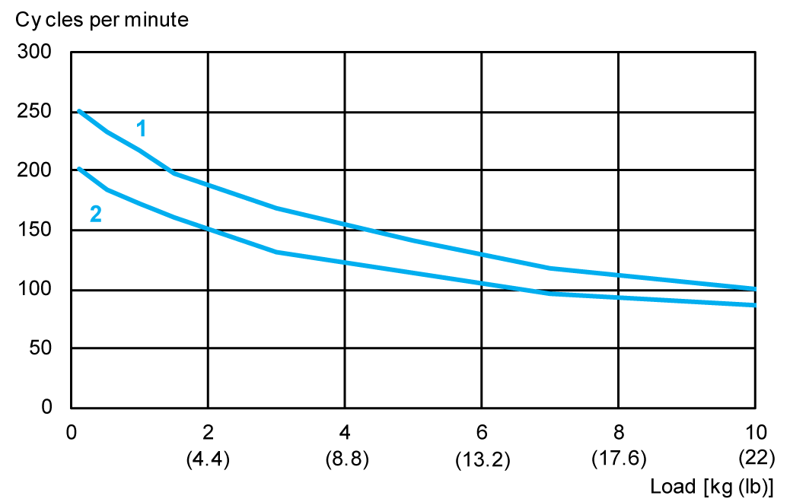
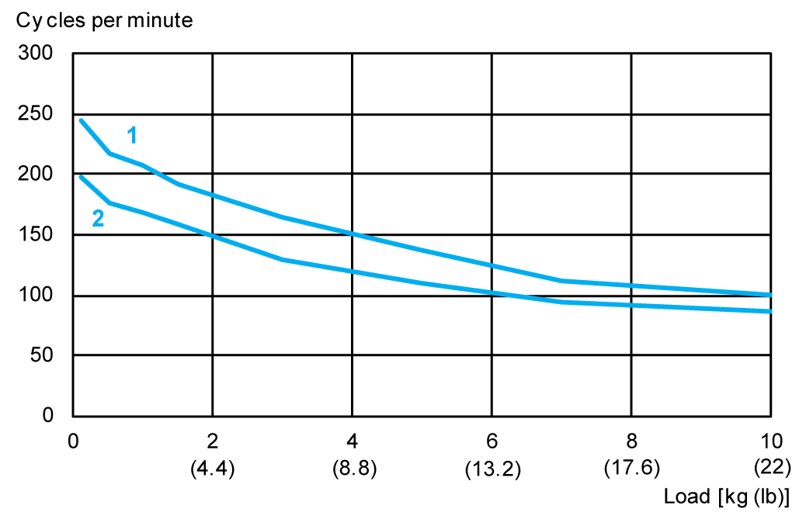
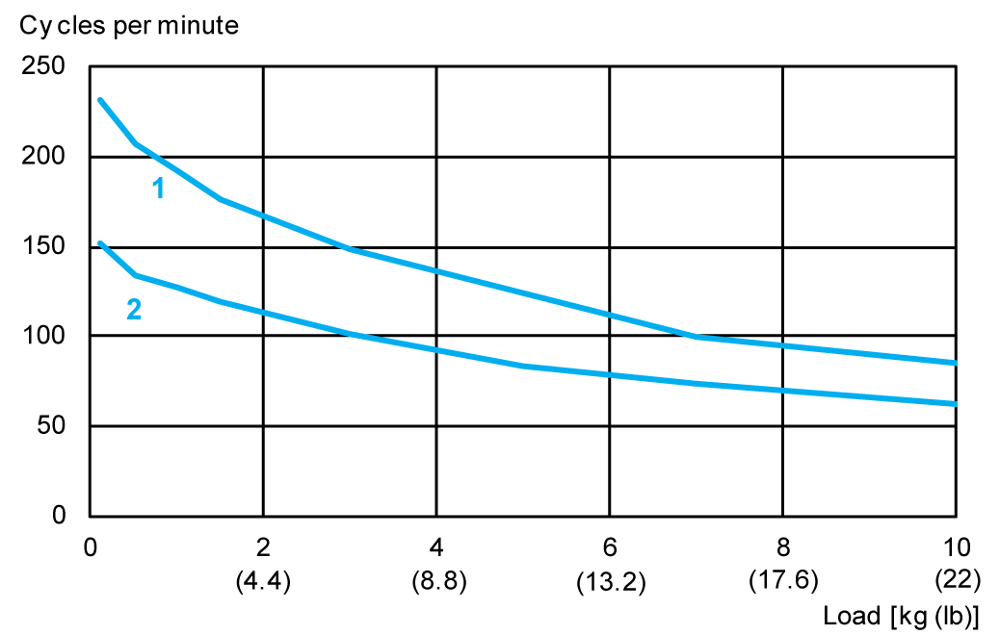
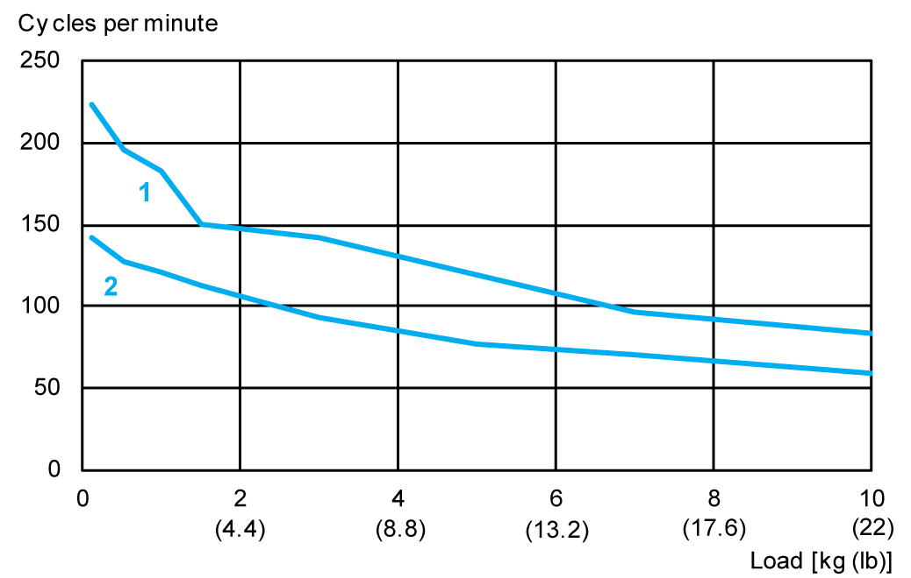
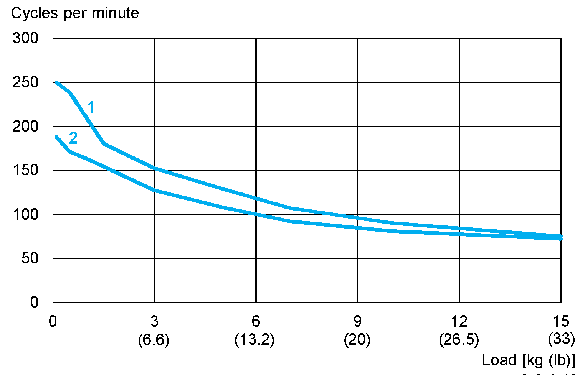
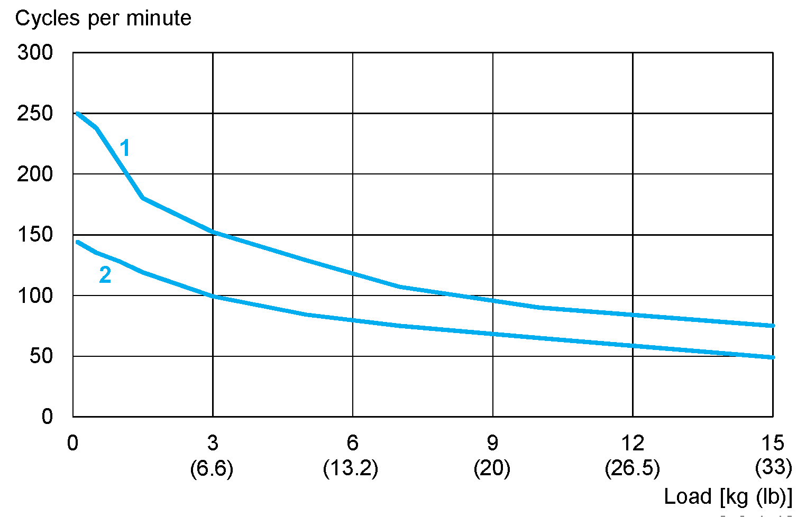
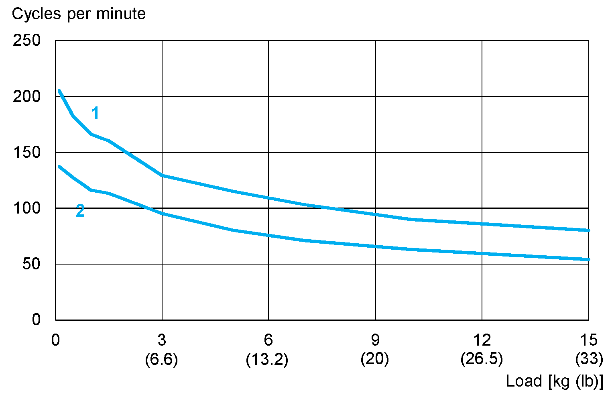
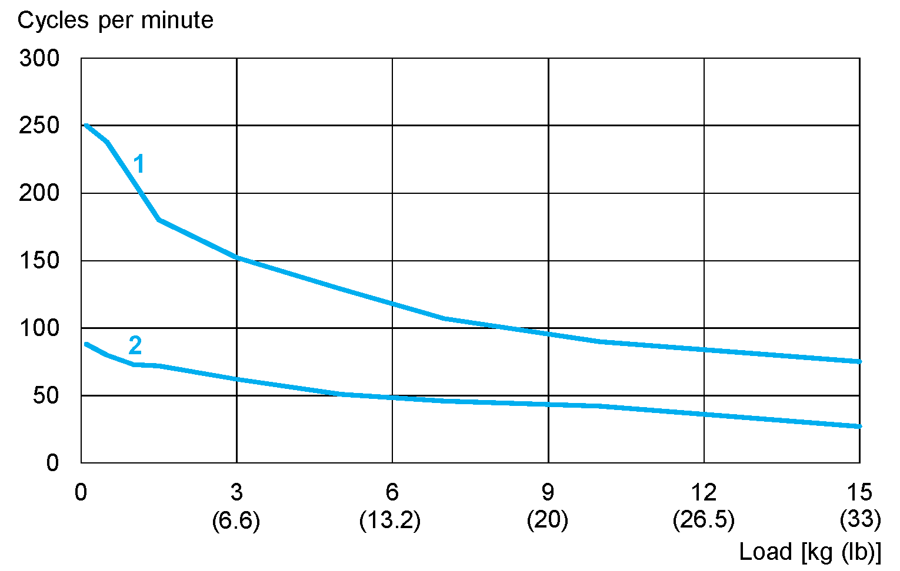

# Typical Cycle Time

## Robot Path (pick-place-pick):

## Cycle Times of Robot VRKP0

The following measurements are performed at an ambient temperature of 20 °C (68 °F) with a PacDrive 3 and use the `SchneiderElectricRobotics` library.

| Path Z1 x Y x Z2 in mm (in) | Load [kg (lb)] | Cycle times [s](1) | Cycles per minute |
| --- | --- | --- | --- |
| 15 x 200 x 15 (0.59 x 7.9 x 0.59) | 0.1 (0.22) | 0.24 | 250 |
| 0.5 (1.1) | 0.258 | 232 |
| 1.0 (2.2) | 0.276 | 217 |
| 1.5 (3.3) | 0.305 | 197 |
| 3.0 (6.6) | 0.355 | 169 |
| 5.0 (11) | 0.424 | 141 |
| 7.0 (15.4) | 0.515 | 117 |
| 10.0 (22) | 0.593 | 101 |
| 25 x 305 x 25 (0.98 x 12 x 0.98) | 0.1 (0.22) | 0.297 | 202 |
| 0.5 (1.1) | 0.327 | 184 |
| 1.0 (2.2) | 0.348 | 173 |
| 1.5 (3.3) | 0.376 | 160 |
| 3.0 (6.6) | 0.455 | 132 |
| 5.0 (11) | 0.528 | 114 |
| 7.0 (15.4) | 0.628 | 96 |
| 10.0 (22) | 0.695 | 86 |
| (1) Cycle times contain the back and forth motion. A position is considered as reached when the robot remains permanently in a window of +/-0.25 mm (0.0098 in) around the target position. | | | |

**1** 15 x 200 x 15 mm (0.59 x 7.9 x 0.59 in)

**2** 25 x 305 x 25 mm (0.98 x 12 x 0.98 in)

## Cycle Times of Robot VRKP0•••••••E00

The following measurements are performed at an ambient temperature of 20 °C (68 °F) with a PacDrive 3 and use the `SchneiderElectricRobotics` library.

| Path Z1 x Y x Z2 in mm (in) | Load [kg (lb)] | Cycle times [s](1) | Cycles per minute |
| --- | --- | --- | --- |
| 15 x 200 x 15 (0.59 x 7.9 x 0.59) | 0.1 (0.22) | 0.246 | 244 |
| 0.5 (1.1) | 0.275 | 218 |
| 1.0 (2.2) | 0.290 | 207 |
| 1.5 (3.3) | 0.312 | 192 |
| 3.0 (6.6) | 0.364 | 165 |
| 5.0 (11) | 0.439 | 137 |
| 7.0 (15.4) | 0.538 | 112 |
| 10.0 (22) | 0.595 | 101 |
| 25 x 305 x 25 (0.98 x 12 x 0.98) | 0.1 (0.22) | 0.302 | 198 |
| 0.5 (1.1) | 0.340 | 176 |
| 1.0 (2.2) | 0.356 | 169 |
| 1.5 (3.3) | 0.380 | 158 |
| 3.0 (6.6) | 0.464 | 129 |
| 5.0 (11) | 0.548 | 109 |
| 7.0 (15.4) | 0.631 | 95 |
| 10.0 (22) | 0.695 | 86 |
| (1) Cycle times contain the back and forth motion. A position is considered as reached when the robot remains permanently in a window of +/-0.25 mm (0.0098 in) around the target position. | | | |

**1** 15 x 200 x 15 mm (0.59 x 7.9 x 0.59 in)

**2** 25 x 305 x 25 mm (0.98 x 12 x 0.98 in)

## Cycle Times of Robot VRKP1

The following measurements are performed at an ambient temperature of 20 °C (68 °F) with a PacDrive 3 and use the `SchneiderElectricRobotics` library.

| Path Z1 x Y x Z2 in mm (in) | Load [kg (lb)] | Cycle times [s](1) | Cycles per minute |
| --- | --- | --- | --- |
| 15 x 200 x 15 (0.59 x 7.9 x 0.59) | 0.1 (0.22) | 0.258 | 232 |
| 0.5 (1.1) | 0.290 | 207 |
| 1.0 (2.2) | 0.313 | 192 |
| 1.5 (3.3) | 0.340 | 176 |
| 3.0 (6.6) | 0.405 | 148 |
| 5.0 (11) | 0.483 | 124 |
| 7.0 (15.4) | 0.607 | 99 |
| 10.0 (22) | 0.708 | 85 |
| 25 x 305 x 25 (0.98 x 12 x 0.98) | 0.1 (0.22) | 0.313 | 192 |
| 0.5 (1.1) | 0.352 | 171 |
| 1.0 (2.2) | 0.397 | 151 |
| 1.5 (3.3) | 0.426 | 141 |
| 3.0 (6.6) | 0.502 | 120 |
| 5.0 (11) | 0.618 | 97 |
| 7.0 (15.4) | 0.732 | 82 |
| 10.0 (22) | 0.817 | 73 |
| 70 x 400 x 70 (2.76 x 15.7 x 2.76) | 0.1 (0.22) | 0.396 | 152 |
| 0.5 (1.1) | 0.447 | 134 |
| 1.0 (2.2) | 0.470 | 128 |
| 1.5 (3.3) | 0.503 | 119 |
| 3.0 (6.6) | 0.592 | 101 |
| 5.0 (11) | 0.719 | 83 |
| 7.0 (15.4) | 0.825 | 73 |
| 10.0 (22) | 0.964 | 62 |
| (1) Cycle times contain the back and forth motion. A position is considered as reached when the robot remains permanently in a window of +/-0.25 mm (0.0098 in) around the target position. | | | |

**1** 15 x 200 x 15 mm (0.59 x 7.9 x 0.59 in)

**2** 70 x 400 x 70 mm (2.76 x 15.7 x 2.76 in)

## Cycle Times of Robot VRKP1•••••••E00

The following measurements are performed at an ambient temperature of 20 °C (68 °F) with a PacDrive 3 and use the `SchneiderElectricRobotics` library.

| Path Z1 x Y x Z2 in mm (in) | Load [kg (lb)] | Cycle times [s](1) | Cycles per minute |
| --- | --- | --- | --- |
| 15 x 200 x 15 (0.59 x 7.9 x 0.59) | 0.1 (0.22) | 0.269 | 223 |
| 0.5 (1.1) | 0.306 | 196 |
| 1.0 (2.2) | 0.330 | 182 |
| 1.5 (3.3) | 0.400 | 150 |
| 3.0 (6.6) | 0.422 | 142 |
| 5.0 (11) | 0.505 | 119 |
| 7.0 (15.4) | 0.616 | 97 |
| 10.0 (22) | 0.719 | 83 |
| 25 x 305 x 25 (0.98 x 12 x 0.98) | 0.1 (0.22) | 0.329 | 183 |
| 0.5 (1.1) | 0.385 | 156 |
| 1.0 (2.2) | 0.426 | 141 |
| 1.5 (3.3) | 0.444 | 135 |
| 3.0 (6.6) | 0.532 | 113 |
| 5.0 (11) | 0.629 | 95 |
| 7.0 (15.4) | 0.741 | 81 |
| 10.0 (22) | 0.841 | 71 |
| 70 x 400 x 70 (2.76 x 15.7 x 2.76) | 0.1 (0.22) | 0.423 | 142 |
| 0.5 (1.1) | 0.469 | 128 |
| 1.0 (2.2) | 0.498 | 121 |
| 1.5 (3.3) | 0.536 | 112 |
| 3.0 (6.6) | 0.644 | 93 |
| 5.0 (11) | 0.775 | 77 |
| 7.0 (15.4) | 0.845 | 71 |
| 10.0 (22) | 1.019 | 59 |
| (1) Cycle times contain the back and forth motion. A position is considered as reached when the robot remains permanently in a window of +/-0.25 mm (0.0098 in) around the target position. | | | |

**1** 15 x 200 x 15 mm (0.59 x 7.9 x 0.59 in)

**2** 70 x 400 x 70 mm (2.76 x 15.7 x 2.76 in)

## Cycle Times of Robot VRKP2

The following measurements are performed at an ambient temperature of 20 °C (68 °F) with a PacDrive 3 and use the `SchneiderElectricRobotics` library.

| Path Z1 x Y x Z2 in mm (in) | Load [kg (lb)] | Cycle times [s](1) | Cycles per minute |
| --- | --- | --- | --- |
| 25 x 305 x 25 (0.98 x 12 x 0.98) | 0.1 (0.22) | 0.24 | 250 |
| 0.5 (1.1) | 0.252 | 238 |
| 1.0 (2.2) | 0.287 | 209 |
| 1.5 (3.3) | 0.333 | 180 |
| 3.0 (6.6) | 0.396 | 152 |
| 5.0 (11) | 0.464 | 129 |
| 7.0 (15.4) | 0.56 | 107 |
| 10.0 (22) | 0.665 | 90 |
| 15.0 (33) | 0.801 | 75 |
| 70 x 400 x 70 (2.76 x 15.7 x 2.76 | 0.1 (0.22) | 0.32 | 188 |
| 0.5 (1.1) | 0.35 | 171 |
| 1.0 (2.2) | 0.369 | 163 |
| 1.5 (3.3) | 0.39 | 154 |
| 3.0 (6.6) | 0.473 | 127 |
| 5.0 (11) | 0.556 | 108 |
| 7.0 (15.4) | 0.652 | 92 |
| 10.0 (22) | 0.743 | 81 |
| 15.0 (33) | 0.853 | 70 |
| (1) Cycle times contain the back and forth motion. A position is considered as reached when the robot remains permanently in a window of +/-0.25 mm (0.0098 in) around the target position. | | | |

**1** 25 x 305 x 25 mm (0.98 x 12 x 0.98 in)

**2** 70 x 400 x 70 mm (2.76 x 15.7 x 2.76 in)

## Cycle Times of Robot VRKP4

The following measurements are performed at an ambient temperature of 20 °C (68 °F) with a PacDrive 3 and use the `SchneiderElectricRobotics` library.

| Path Z1 x Y x Z2 in mm (in) | Load [kg (lb)] | Cycle times [s](1) | Cycles per minute |
| --- | --- | --- | --- |
| 25 x 305 x 25 (0.98 x 12 x 0.98) | 0.1 (0.22) | 0.288 | 208 |
| 0.5 (1.1) | 0.32 | 188 |
| 1.0 (2.2) | 0.325 | 185 |
| 1.5 (3.3) | 0.355 | 169 |
| 3.0 (6.6) | 0.424 | 142 |
| 5.0 (11) | 0.497 | 121 |
| 7.0 (15.4) | 0.537 | 112 |
| 10.0 (22) | 0.659 | 91 |
| 15.0 (33) | 0.924 | 65 |
| 70 x 400 x 70 (2.76 x 15.7 x 2.76) | 0.1 (0.22) | 0.325 | 185 |
| 0.5 (1.1) | 0.362 | 166 |
| 1.0 (2.2) | 0.375 | 160 |
| 1.5 (3.3) | 0.401 | 150 |
| 3.0 (6.6) | 0.471 | 127 |
| 5.0 (11) | 0.557 | 108 |
| 7.0 (15.4) | 0.617 | 97 |
| 10.0 (22) | 0.701 | 86 |
| 15.0 (33) | 0.985 | 61 |
| 90 x 700 x 90 (3.54 x 27.6 x 3.54) | 0.1 (0.22) | 0.418 | 144 |
| 0.5 (1.1) | 0.444 | 135 |
| 1.0 (2.2) | 0.469 | 128 |
| 1.5 (3.3) | 0.506 | 119 |
| 3.0 (6.6) | 0.607 | 99 |
| 5.0 (11) | 0.713 | 84 |
| 7.0 (15.4) | 0.803 | 75 |
| 10.0 (22) | 0.925 | 65 |
| 15.0 (33) | 1.223 | 49 |
| (1) Cycle times contain the back and forth motion. A position is considered as reached when the robot remains permanently in a window of +/-0.25 mm (0.0098 in) around the target position. | | | |

**1** 25 x 305 x 25 mm (0.98 x 12 x 0.98 in)

**2** 90 x 700 x 90 mm (3.54 x 27.6 x 3.54 in)

## Cycle Times of Robot VRKP5

The following measurements are performed at an ambient temperature of 20 °C (68 °F) with a PacDrive 3 and use the `SchneiderElectricRobotics` library.

| Path Z1 x Y x Z2 in mm (in) | Load [kg (lb)] | Cycle times [s](1) | Cycles per minute |
| --- | --- | --- | --- |
| 25 x 305 x 25 (0.98 x 12 x 0.98) | 0.1 (0.22) | 0.292 | 205 |
| 0.5 (1.1) | 0.330 | 182 |
| 1.0 (2.2) | 0.362 | 166 |
| 1.5 (3.3) | 0.374 | 160 |
| 3.0 (6.6) | 0.466 | 129 |
| 5.0 (11) | 0.520 | 115 |
| 7.0 (15.4) | 0.584 | 103 |
| 10.0 (22) | 0.668 | 90 |
| 15.0 (33) | 0.754 | 80 |
| 70 x 400 x 70 (2.76 x 15.7 x 2.76) | 0.1 (0.22) | 0.340 | 176 |
| 0.5 (1.1) | 0.366 | 164 |
| 1.0 (2.2) | 0.400 | 150 |
| 1.5 (3.3) | 0.420 | 143 |
| 3.0 (6.6) | 0.490 | 122 |
| 5.0 (11) | 0.584 | 103 |
| 7.0 (15.4) | 0.622 | 97 |
| 10.0 (22) | 0.732 | 82 |
| 15.0 (33) | 0.926 | 65 |
| 90 x 700 x 90 (3.54 x 27.6 x 3.54) | 0.1 (0.22) | 0.438 | 137 |
| 0.5 (1.1) | 0.472 | 127 |
| 1.0 (2.2) | 0.518 | 116 |
| 1.5 (3.3) | 0.530 | 113 |
| 3.0 (6.6) | 0.632 | 95 |
| 5.0 (11) | 0.750 | 80 |
| 7.0 (15.4) | 0.843 | 71 |
| 10.0 (22) | 0.956 | 63 |
| 15.0 (33) | 1.102 | 54 |
| (1) Cycle times contain the back and forth motion. A position is considered as reached when the robot remains permanently in a window of +/-0.25 mm (0.0098 in) around the target position. | | | |

**1** 25 x 305 x 25 mm (0.98 x 12 x 0.98 in)

**2** 90 x 700 x 90 mm (3.54 x 27.6 x 3.54 in)

## Cycle Times of Robot VRKP6

The following measurements are performed at an ambient temperature of 20 °C (68 °F) with a PacDrive 3 and use the `SchneiderElectricRobotics` library.

| Path Z1 x Y x Z2 in mm (in) | Load [kg (lb)] | Cycle times [s](1) | Cycles per minute |
| --- | --- | --- | --- |
| 25 x 305 x 25 (0.98 x 12 x 0.98) | 0.1 (0.22) | 0.333 | 180 |
| 0.5 (1.1) | 0.368 | 163 |
| 1.0 (2.2) | 0.405 | 148 |
| 1.5 (3.3) | 0.465 | 129 |
| 3.0 (6.6) | 0.499 | 120 |
| 5.0 (11) | 0.545 | 110 |
| 7.0 (15.4) | 0.595 | 101 |
| 10.0 (22) | 0.695 | 86 |
| 15.0 (33)(2) | 0.785 | 76 |
| 70 x 400 x 70 (2.76 x 15.7 x 2.76) | 0.1 (0.22) | 0.375 | 160 |
| 0.5 (1.1) | 0.400 | 150 |
| 1.0 (2.2) | 0.432 | 139 |
| 1.5 (3.3) | 0.449 | 134 |
| 3.0 (6.6) | 0.512 | 117 |
| 5.0 (11) | 0.595 | 101 |
| 7.0 (15.4) | 0.724 | 83 |
| 10.0 (22) | 0.811 | 74 |
| 15.0 (33)(2) | 0.986 | 61 |
| 90 x 700 x 90 (3.54 x 27.6 x 3.54) | 0.1 (0.22) | 0.509 | 118 |
| 0.5 (1.1) | 0.523 | 115 |
| 1.0 (2.2) | 0.564 | 106 |
| 1.5 (3.3) | 0.583 | 103 |
| 3.0 (6.6) | 0.707 | 85 |
| 5.0 (11) | 0.799 | 75 |
| 7.0 (15.4) | 0.899 | 67 |
| 10.0 (22) | 0.985 | 61 |
| 15.0 (33)(2) | 1.274 | 47 |
| 110 x 1300 x 110 (4.3 x 51 x 4.3) | 0.1 (0.22) | 0.685 | 88 |
| 0.5 (1.1) | 0.749 | 80 |
| 1.0 (2.2) | 0.819 | 73 |
| 1.5 (3.3) | 0.835 | 72 |
| 3.0 (6.6) | 0.963 | 62 |
| 5.0 (11) | 1.170 | 51 |
| 7.0 (15.4) | 1.314 | 46 |
| 10.0 (22) | 1.436 | 42 |
| 15.0 (33)(2) | 2.250 | 27 |
| (1) Cycle times contain the back and forth motion. A position is considered as reached when the robot remains permanently in a window of +/-0.25 mm (0.0098 in) around the target position.  (2) Loads up to 10 kg (22 lb). Heavier payloads of up to 15 kg (33 lb) upon request. If required, contact your local Schneider Electric service representative. | | | |

**1** 25 x 305 x 25 mm (0.98 x 12 x 0.98 in)

**2** 110 x 1300 x 110 mm (4.3 x 51 x 4.3 in)

EIO0000002173.14